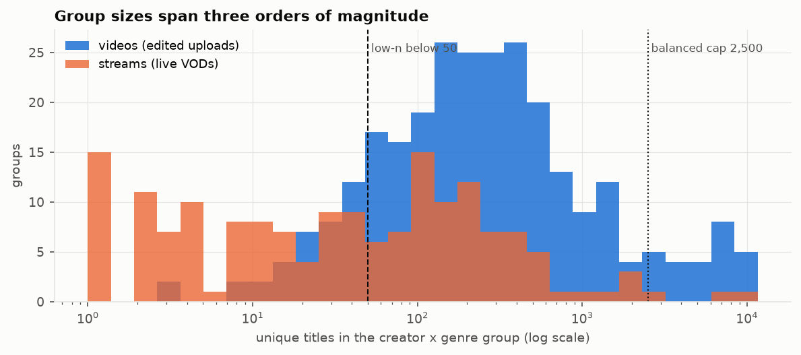
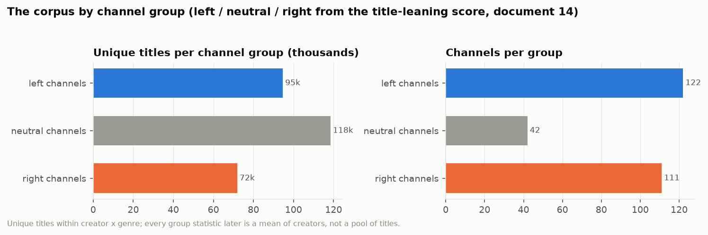

# 1. The corpus, what was normalized, and the creator table

**The question.** What exactly is being analyzed, and what had to be done to it before any style measure means anything?

## The finding in one paragraph

The corpus is 293,697 titles from 275 creators, but it is wildly uneven: four Indian news channels (Firstpost, ANI, Times Now, Times of India) hold 64,520 of them, the median creator x genre has 144 titles and the largest has 11,623. 8,684 rows (3.0 %) are verbatim repeats within a creator x genre, almost all live-broadcast loops on news stream tabs. So three rules run through everything downstream: edited uploads (`videos`) and live VODs (`streams`) are never pooled; a creator x genre with fewer than 50 unique titles is reported but never ranked (128 of 442 groups); and any statistic that pools titles uses a creator-balanced subset capped at 2,500 titles per creator x genre (183,190 titles), while corpus- and group-level figures are means of creator-level values.

## Size by genre

| genre | groups | rows | unique | balanced | low_n | median_size | max_size |
|---|---|---|---|---|---|---|---|
| streams | 167 | 50028 | 42484 | 31470 | 90 | 42 | 8485 |
| videos | 275 | 243669 | 242529 | 151720 | 38 | 234 | 11623 |

The `streams` genre is small and thin: 90 of its 167 groups are low-n, so stream-level results in the later documents rest on roughly 77 creators.

*Creator x genre group sizes on a log scale, with the low-n line (50) and the balanced cap (2,500).*

## What was stripped from titles, and why it matters

Titles carry brand furniture that would otherwise dominate any vocabulary-based measure: "| BBC News" on 1,698 BBC titles, "Ep. 1837"-style episode numbers on the Daily Wire shows, date stamps on RSBN and Newsmax streams, "N18G" on Firstpost. The rule was mechanical and per creator: any delimited leading or trailing segment (or colon label, bracket tag, hashtag) that occurs in more than 20 % of that creator's titles is a brand pattern and is removed; episode numbers and date stamps are removed from the edges regardless. Generic format labels (LIVE, BREAKING, WATCH) are never stripped because they are themselves a style choice measured later. 99 patterns were stripped across 81 creator x genre groups; 243 titles consisted of nothing but brand text and were kept as they were. The full list is `stripped_patterns.csv`; the fifteen most frequent:

| creator | genre | kind | pattern | count | share | example |
|---|---|---|---|---|---|---|
| @Firstpost | videos | suffix | n#g | 3239 | 0.34 | N18G |
| @Firstpost | streams | suffix | n#g | 1757 | 0.21 | N18G |
| @BBCNews | videos | suffix | bbc news | 1698 | 0.72 | BBC News |
| @thehill | videos | suffix | rising | 1586 | 0.39 | RISING |
| @SecularTalk | videos | suffix | the kyle kulinski show | 990 | 0.72 | The Kyle Kulinski Show |
| @NewsmaxTV | streams | bracket | #/#/# | 281 | 0.73 | 9/11/2026 |
| @TheBrianKilmeadeShow | videos | suffix | brian kilmeade show | 253 | 0.72 | Brian Kilmeade Show |
| @HasanReactionsfanTwo | videos | suffix | hasanabi reacts | 253 | 0.79 | Hasanabi Reacts |
| @deanwithrs | streams | suffix | debating maga | 244 | 0.97 | Debating MAGA. |
| @NBCNews | streams | suffix | nbc news | 225 | 0.64 | NBC News |
| @TheJoyReidShow | videos | suffix | the joy reid show | 224 | 0.96 | The Joy Reid Show |
| @ABCNews | streams | prefix | live: abc news live | 216 | 0.39 | LIVE: ABC News Live |
| @ABCNews | streams | suffix | abc news | 216 | 0.39 | ABC News |
| @TheDonLemonShow | videos | prefix | lemon drop | 206 | 0.59 | LEMON DROP |
| @DailyDenims | videos | colon | denims | 200 | 0.93 | DENIMS |

**Check that it worked.** If stripping removed the show-brand head of each creator's vocabulary, the creator-level Zipf exponent should fall (the most frequent tokens were the brand) and the top-token share should drop most for show-branded channels. Both happened: the mean creator-level Zipf exponent went from 0.797 (raw) to 0.780 (normalized), and the share of the single most frequent token fell most for Joe Rogan (from 14 % to 4 %: "Joe Rogan Experience #"), Denims, The Economist and the Hasan fan channels. The pooled corpus exponent barely moves (the brand tokens are a small share of a 189k-title pool), which is exactly why the report uses creator-level figures. Document 7 takes Zipf's law further.

## The creator table, and the one grouping used everywhere

`creators.csv` holds one row per creator: channel name, platform, `organisation` and `clipper`, subscribers, title counts and a short note. `organisation` groups sister channels of one outlet (Fox News / Fox News Clips, Timcast x3, NYT x4 incl. Ezra Klein, TYT / The Damage Report / Rebel HQ, MeidasTouch / Legal AF / Katie Phang / Michael Cohen, Daily Wire x4, Blaze Media x2, and so on: 18 organizations with more than one channel); same-organization cross-posts (TYT and The Damage Report share 913 titles verbatim) are removed from every similarity calculation. `clipper` marks the 11 channels whose titles are written by fans or an editing team (the Hasan, Destiny and Vaush clip channels, Fox News Clips, Lauren Chen Clips, Candace Clips, Denims, Asmongold TV, the Hasan VOD channel); they are kept as their own group so a fan editor's style is never attributed to the creator.

No channel is assigned a category by hand. The one between-channel grouping in this report is the **channel group** of document 14: a frontier model labeled a sample of each channel's titles left / right / neither from the title text alone, each channel's score is (right − left) / titles, and the score sorts the channels into left (below −0.05), neutral and right (above +0.05):

*Unique titles and channels per channel group.*

| group | channels | unique_titles |
|---|---|---|
| left channels | 122 | 94641 |
| neutral channels | 42 | 118472 |
| right channels | 111 | 71900 |

The group is a description of how a channel's titles read, produced by the same measurement as everything else here; it is not an editorial judgment about the channel, and document 14 gives its reliability (split-half Spearman of the score 0.96) and its limits. Every "by group" table in documents 2-13 is a mean or median over the ranked channels of a group, never a pool of their titles.

Files: `creator_genre_summary.csv`, `stripped_patterns.csv`, `zipf_check.csv`, `zipf_check_creators.csv`, `creators.csv`, `leaning_by_creator.csv`.
