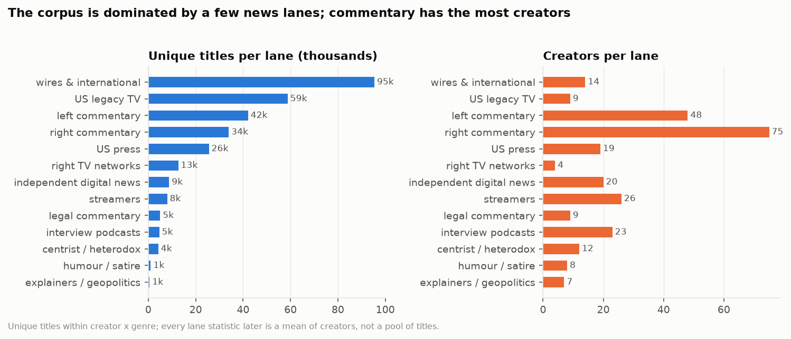

# 1. The corpus, what was normalised, and the lanes

**The question.** What exactly is being analysed, and what had to be done to it before any style measure means anything?

## The finding in one paragraph

The corpus is 309,596 titles from 274 creators, but it is wildly uneven: four Indian news channels (Firstpost, ANI, Times Now, Times of India) hold 68,348 of them, the median creator x genre has 152 titles and the largest has 12,279. 9,176 rows (3.0 %) are verbatim repeats within a creator x genre, almost all live-broadcast loops on news stream tabs. So three rules run through everything downstream: edited uploads (`videos`) and live VODs (`streams`) are never pooled; a creator x genre with fewer than 50 unique titles is reported but never ranked (124 of 442 groups); and any statistic that pools titles uses a creator-balanced subset capped at 2,500 titles per creator x genre (189,240 titles), while corpus- and lane-level figures are means of creator-level values.

## Size by genre

*Unique titles and creators per lane. A few news lanes hold most titles; commentary holds most creators.*

| genre | groups | rows | unique | balanced | low_n | median_size | max_size |
|---|---|---|---|---|---|---|---|
| streams | 168 | 52699 | 44716 | 32656 | 89 | 42 | 8975 |
| videos | 274 | 256897 | 255704 | 156584 | 35 | 247 | 12279 |

The `streams` genre is small and thin: 89 of its 168 groups are low-n, so stream-level results in the later documents rest on roughly 79 creators.

*Creator x genre group sizes on a log scale, with the low-n line (50) and the balanced cap (2,500).*

## What was stripped from titles, and why it matters

Titles carry brand furniture that would otherwise dominate any vocabulary-based measure: "| BBC News" on 1,768 BBC titles, "Ep. 1837"-style episode numbers on the Daily Wire shows, date stamps on RSBN and Newsmax streams, "N18G" on Firstpost. The rule was mechanical and per creator: any delimited leading or trailing segment (or colon label, bracket tag, hashtag) that occurs in more than 20 % of that creator's titles is a brand pattern and is removed; episode numbers and date stamps are removed from the edges regardless. Generic format labels (LIVE, BREAKING, WATCH) are never stripped because they are themselves a style choice measured later. 103 patterns were stripped across 85 creator x genre groups; 261 titles consisted of nothing but brand text and were kept as they were. The full list is `stripped_patterns.csv`; the fifteen most frequent:

| creator | genre | kind | pattern | count | share | example |
|---|---|---|---|---|---|---|
| @Firstpost | videos | suffix | n#g | 3523 | 0.35 | N18G |
| @Firstpost | streams | suffix | n#g | 1959 | 0.22 | N18G |
| @TimesNowWorld | videos | suffix | times now world | 1807 | 0.20 | Times Now World |
| @BBCNews | videos | suffix | bbc news | 1768 | 0.72 | BBC News |
| @thehill | videos | suffix | rising | 1669 | 0.39 | RISING |
| @SecularTalk | videos | suffix | the kyle kulinski show | 1065 | 0.73 | The Kyle Kulinski Show |
| @NewsmaxTV | streams | bracket | #/#/# | 291 | 0.73 | 9/11/2026 |
| @HasanReactionsfanTwo | videos | suffix | hasanabi reacts | 268 | 0.79 | Hasanabi Reacts |
| @deanwithrs | streams | suffix | debating maga | 258 | 0.97 | Debating MAGA. |
| @TheBrianKilmeadeShow | videos | suffix | brian kilmeade show | 253 | 0.72 | Brian Kilmeade Show |
| @NBCNews | streams | suffix | nbc news | 234 | 0.64 | NBC News |
| @ABCNews | streams | prefix | live: abc news live | 232 | 0.39 | LIVE: ABC News Live |
| @ABCNews | streams | suffix | abc news | 232 | 0.39 | ABC News |
| @TheJoyReidShow | videos | suffix | the joy reid show | 228 | 0.96 | The Joy Reid Show |
| @TheDonLemonShow | videos | prefix | lemon drop | 220 | 0.60 | LEMON DROP |

**Check that it worked.** If stripping removed the show-brand head of each creator's vocabulary, the creator-level Zipf exponent should fall (the most frequent tokens were the brand) and the top-token share should drop most for show-branded channels. Both happened: the mean creator-level Zipf exponent went from 0.799 (raw) to 0.781 (normalised), and the share of the single most frequent token fell most for Joe Rogan (from 14 % to 4 %: "Joe Rogan Experience #"), Denims, The Economist and the Hasan fan channels. The pooled corpus exponent barely moves (the brand tokens are a small share of a 189k-title pool), which is exactly why the report uses creator-level figures.

## Lanes: a proposal, not a fact

Every between-group comparison uses a lane assignment made from channel names, descriptions and a sample of titles. It is a proposal for correction (`lanes.csv`, column `status = proposed`): the nine lanes asked for plus four the corpus needed (right TV networks; US print/digital press as distinct from wires; centrist/heterodox; explainers/geopolitics).

| lane | creators | clippers |
|---|---|---|
| centrist / heterodox | 12 | 0 |
| explainers / geopolitics | 7 | 0 |
| humour / satire | 8 | 0 |
| independent digital news | 20 | 0 |
| interview podcasts | 23 | 0 |
| left commentary | 48 | 0 |
| legal commentary | 9 | 0 |
| right commentary | 75 | 2 |
| right TV networks | 4 | 0 |
| streamers | 26 | 8 |
| US legacy TV | 9 | 1 |
| US press | 19 | 0 |
| wires & international | 14 | 0 |

`organisation` groups sister channels of one outlet (Fox News / Fox News Clips, Timcast x3, NYT x4 incl. Ezra Klein, TYT / The Damage Report / Rebel HQ, MeidasTouch / Legal AF / Katie Phang / Michael Cohen, Daily Wire x4, Blaze Media x2, and so on: 18 organisations with more than one channel). `clipper` marks the 11 channels whose titles are written by fans or an editing team (the Hasan, Destiny and Vaush clip channels, Fox News Clips, Lauren Chen Clips, Candace Clips, Denims, Asmongold TV, the Hasan VOD channel); they are kept as their own group so a fan editor's style is never attributed to the creator. Same-organisation cross-posts (TYT and The Damage Report share 913 titles verbatim) are removed from every similarity calculation.

**Lane-dependent results** (lane medians, lane cohesion, ARI against lanes, lane-level drift, within-lane correlations) will change when the CSV is corrected; re-run from `factors`.

Files: `creator_genre_summary.csv`, `stripped_patterns.csv`, `zipf_check.csv`, `zipf_check_creators.csv`, `lanes.csv`.
