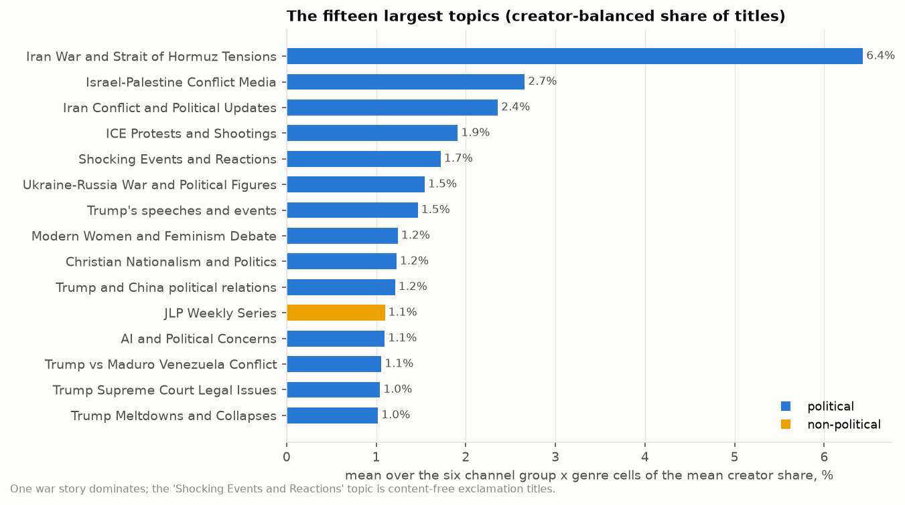
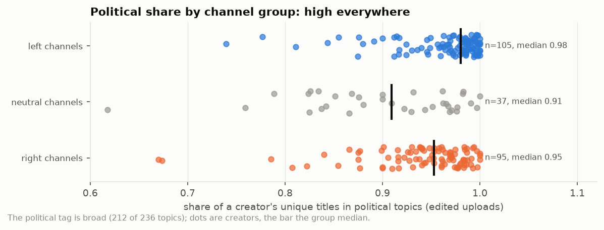
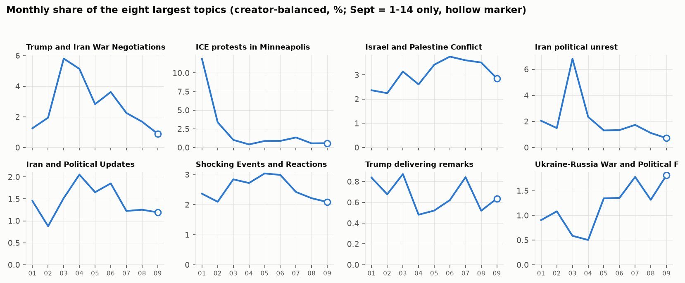

# 2. Topics: what they talk about

**The question.** What stories fill the titles, who covers what, and how much of the corpus is politics at all? The topic assignment is also the control variable for every style result, so it has to be sound.

## The finding in one paragraph

A BERTopic model fitted on a 100,041-title creator-stratified sample found 236 topics; every title was then assigned to its nearest topic centroid (85% agreement with HDBSCAN's own labels on cluster members, 13% weak assignments). One story dominates 2026: the Iran war and the Strait of Hormuz, 27,609 unique titles across 227 of 274 creators, with a second energy-markets topic on the same war. 11 of the twelve largest topics are each shared by 100 or more of the 274 creators. That is the central fact for everything after this document: the whole landscape covered the same stories, so raw vocabulary similarity between two channels mostly measures the news cycle, not their style. It also shows in the clustering: creators grouped by topic mix do not line up with the left / neutral / right channel groups (adjusted Rand index 0.010 for edited uploads).

## The largest topics (creator-balanced share)

*The fifteen largest topics by creator-balanced share; blue = political, yellow = non-political.*

| topic_id | label | political | balanced_share | n_unique_all | n_creators | top_terms |
|---|---|---|---|---|---|---|
| 0 | Iran War and Strait of Hormuz Tensions | yes | 0.064 | 27609 | 227 | strait hormuz, strait, hormuz, irans, iranian, iran iran, tehran, war iran, bases, iran strikes |
| 2 | Israel-Palestine Conflict Media | yes | 0.027 | 6035 | 195 | gaza, palestine, palestinian, israeli, netanyahu, israels, west bank, jews, palestinians, jewish |
| 59 | Iran Conflict and Political Updates | yes | 0.024 | 1358 | 124 | joins, renner, ac, fail, reveal, iran hits, sus, durk, jamm, larry johnson |
| 3 | ICE Protests and Shootings | yes | 0.019 | 5189 | 210 | ice shooting, ice, ice agent, antiice, ice agents, minneapolis ice, minneapolis, agents, agent, protesters |
| 1 | Shocking Events and Reactions | yes | 0.017 | 3996 | 171 | fing, holy, happening, theyre, holy sht, fck, im, fking, genuinely, fcked |
| 4 | Ukraine-Russia War and Political Figures | yes | 0.015 | 9808 | 134 | ukraine, russia, putin, putins, zelensky, russian, ukraine war, zelenskyy, russias, moscow |
| 40 | Trump's speeches and events | yes | 0.015 | 1944 | 84 | trump delivers, delivers remarks, trump speaks, davos, remarks, world economic, economic forum, delivers, las vegas, ... |
| 13 | Modern Women and Feminism Debate | yes | 0.012 | 1346 | 170 | dating, women, feminism, modern women, men, modern, marriage, men women, divorce, pill |
| 22 | Christian Nationalism and Politics | yes | 0.012 | 1518 | 171 | jesus, christian, god, nationalism, christ, christianity, faith, bible, pastor, gospel |
| 6 | Trump and China political relations | yes | 0.012 | 4790 | 165 | xi, china, chinas, taiwan, jiang, jinping, xi jinping, chinese, beijing, professor jiang |
| 98 | JLP Weekly Series | no | 0.011 | 1243 | 182 | jlp wed, jlp, wed, jlp thu, thu, jlp mon, mon, jlp tue, tue, jlp fri |
| 9 | AI and Political Concerns | yes | 0.011 | 3547 | 187 | ai, anthropic, bubble, artificial, researcher, models, humans, ai slop, sanders, bernie sanders |

`balanced_share` is the mean over the six channel group x genre cells of the mean creator share, so a topic that four Indian channels post 8,000 times does not outrank one that 200 channels each post a few times (a topic that is large in the thin stream cells can rank above its upload count, as topic 59 does). The "Shocking Events and Reactions" topic is not a story: it is the cluster of content-free exclamations ("HOLY SH*T", "THIS IS INSANE..") that streamers and commentators use as titles, and it is the seed of the shared-title finding in document 5.

## Political or not

*Political share of a creator's titles, by channel group (dots = creators, bar = median).*

212 of 236 topics were tagged political by the labeling model (politics, government, elections, war, courts, political figures, the culture war); the 24 non-political topics are crime trials (Nancy Guthrie, Lindsay Clancy, the Brown University shooting), weather and disasters, sport (World Cup, MMA), tech and business, and a few channel-specific series. The tagging is generous, and the political share of a creator's unique titles is therefore high everywhere. The neutral channels, whose titles the judge mostly read as "neither", are also the ones with the most non-political subjects (crime, weather, sport, tech: the news outlets); the left and right groups are political almost throughout:

| group | mean political share | median political share | n_creators |
|---|---|---|---|
| left channels | 0.95 | 0.97 | 105 |
| neutral channels | 0.87 | 0.91 | 38 |
| right channels | 0.92 | 0.94 | 96 |

Document 5 repeats the whole landscape analysis on political titles only; the conclusions do not change.

## Topic share by channel group (top 4 per group, edited uploads)

| group | label | mean_creator_share | n_creators |
|---|---|---|---|
| left channels | Iran War and Strait of Hormuz Tensions | 0.065 | 105 |
| left channels | Israel-Palestine Conflict Media | 0.046 | 105 |
| left channels | Trump Meltdowns and Collapses | 0.029 | 105 |
| left channels | ICE Protests and Shootings | 0.024 | 105 |
| neutral channels | Iran War and Strait of Hormuz Tensions | 0.069 | 38 |
| neutral channels | Israel-Palestine Conflict Media | 0.044 | 38 |
| neutral channels | Tech Business and Startups | 0.038 | 38 |
| neutral channels | AI and Political Concerns | 0.033 | 38 |
| right channels | Shocking Events and Reactions | 0.044 | 96 |
| right channels | Iran War and Strait of Hormuz Tensions | 0.037 | 96 |
| right channels | Modern Women and Feminism Debate | 0.027 | 96 |
| right channels | Christian Nationalism and Politics | 0.021 | 96 |

The war story leads in the left channels and neutral channels; the right channels put "Shocking Events and Reactions" first, with the war second. Beyond it the groups' attention differs at the margin rather than in kind: what separates them in document 14 is the wording about the shared subjects, not the subjects.

## The month-by-month story

*Monthly creator-balanced share of the eight largest topics; the hollow marker is the half month of September.*

For each month the topics that rose most against their own nine-month mean (creator-balanced), with the entities named in that month's titles:

| month | label | z_vs_own_months | share_month | top_entities |
|---|---|---|---|---|
| 2026-01 | Christmas and Trump | 2.660 | 0.016 | Trump (26); Bethlehem (17); US (17); Santa (15); America (15) |
| 2026-01 | Bondi Beach Terror Attack | 2.660 | 0.011 | Australia (155); Bondi Beach (150); Bondi (55); Sydney (39); REUTERS (35) |
| 2026-02 | Super Bowl Halftime Show Controversy | 2.660 | 0.011 | Bad Bunny (43); NFL (22); Kid Rock (9); Grammys (7); Patriots (6) |
| 2026-02 | Alex Pretti Shooting and Federal Agents | 2.660 | 0.011 | Alex Pretti (196); Minneapolis (60); Minnesota (16); DHS (13); Border Patrol (10) |
| 2026-03 | Prince Andrew Epstein Arrest | 2.650 | 0.007 | Prince Andrew (70); Andrew (68); UK (44); Andrew Mountbatten-Windsor (33); Epstein (15) |
| 2026-03 | Supreme Court and Trump Tariffs | 2.650 | 0.013 | Trump (201); Supreme Court (150); US (36); US Supreme Court (16); Vantage (11) |
| 2026-04 | Joe Kent Resignation and Iran War Scandal | 2.660 | 0.011 | Joe Kent (93); Iran (31); Trump (17); Israel (11); FBI (10) |
| 2026-04 | No Kings Protests Movement | 2.650 | 0.010 | Trump (21); Kings (15); US (12); Donald Trump (7); New York (4) |
| 2026-05 | White House Correspondents Dinner Shooting | 2.660 | 0.020 | White House (167); Trump (133); White House Correspondents' Dinner (68); Cole Allen (26); US (20) |
| 2026-05 | King Charles III and Trump interactions | 2.660 | 0.007 | US (96); Trump (73); Charles III (66); King Charles (63); UK (63) |
| 2026-06 | Thomas Massie political defeat | 2.630 | 0.009 | Thomas Massie (76); Trump (37); Massie (35); Kentucky (32); Ed Gallrein (13) |
| 2026-06 | Karmelo Anthony Trial Verdict | 2.590 | 0.018 | Karmelo Anthony (114); Austin Metcalf (11); Karmelo (9); Luigi Mangione (9); Karmelo Anthony Trial (8) |
| 2026-07 | America's 250th Anniversary and Founding History | 2.610 | 0.024 | America (184); US (36); Trump (22); U.S (13); New York (12) |
| 2026-07 | JD Vance and Iran negotiations | 2.510 | 0.009 | Iran (219); US (88); JD Vance (87); Switzerland (52); Vance (32) |
| 2026-08 | Fauci Senate Testimony Controversy | 2.650 | 0.016 | Fauci (200); Senate (72); Rand Paul (50); Anthony Fauci (44); Congress (24) |
| 2026-08 | Todd Blanche Attorney General Confirmation | 2.580 | 0.011 | Todd Blanche (153); Blanche (145); Trump (82); AG (59); Senate (56) |
| 2026-09 | 9/11 Remembered 25 Years Later | 2.660 | 0.024 | Pentagon (38); America (22); Trump (21); Mamdani (19); New York (19) |
| 2026-09 | Nepal Floods and Rescue Efforts | 2.650 | 0.009 | Nepal (277); China (49); Nepal Floods (40); India (31); Nepal-Tibet (27) |

Read left to right and 2026 tells itself: the Bondi Beach attack and a Trump Christmas in January; the Don Lemon arrest and the Alex Pretti shooting in February; the State of the Union and the tariff case in March; the Joe Kent resignation, the Artemis II mission and the No Kings protests in April; the Correspondents' Dinner shooting in May; the Massie primary and the Karmelo Anthony verdict in June; the 250th anniversary in July; the Fauci testimony and the Blanche confirmation in August; 9/11 at 25 and Nepal's floods in September (a half month). The full list with three example titles each is `topic_spikes.csv`.

## Caveats

- The topic labels and the political flag come from a local 14B model reading the top terms and eight example titles; the labels are readable but a few are odd ("Hasanabi Reacts to Hasan" is a fan-channel formula, not a subject) and the political flag errs towards "political". Both live in `topic_labels.csv` and can be edited; the political-only analyses re-run from `landscape`.
- 32% of the fit sample were HDBSCAN outliers; nearest-centroid assignment gives them a topic anyway, and 13% of all titles sit below the 10th-percentile similarity of genuine members. Those weak assignments are flagged per title in `topics.csv`.
- Channel groups are the left / neutral / right groups of document 14: each channel's score = (right − left) / titles over its sampled titles as labeled by the judge, sorted at ±0.05. A channel's group says how its *titles* read, not what its host believes.

Files: `topics.csv` (title -> topic), `topic_labels.csv`, `creator_topic_mix.csv`, `topic_by_group.csv`, `topic_timeline.csv`, `topic_spikes.csv`, `creator_political_share.csv`.
