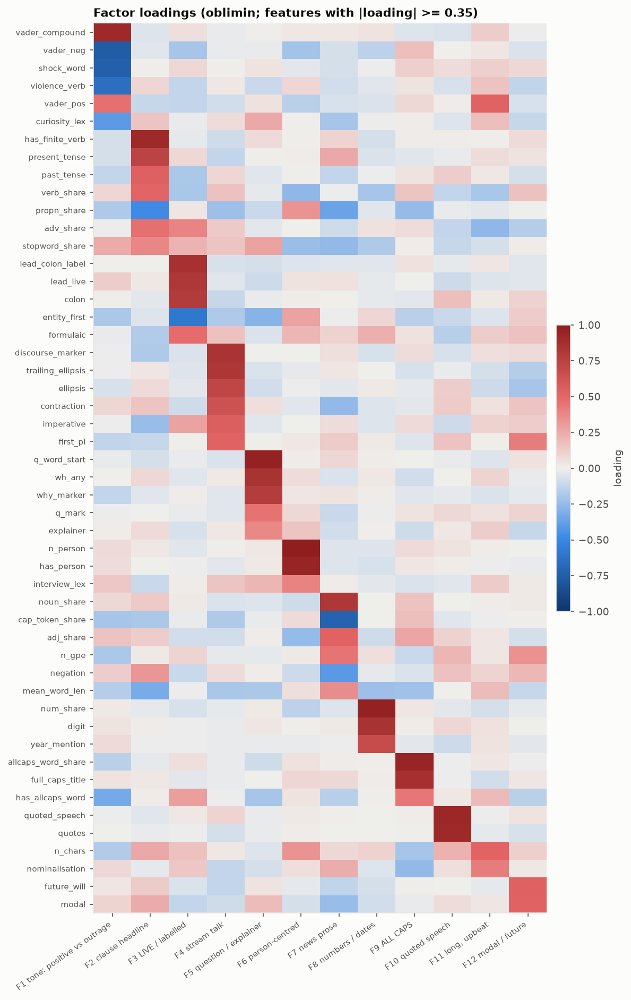
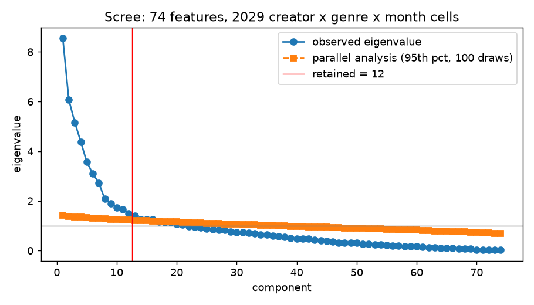
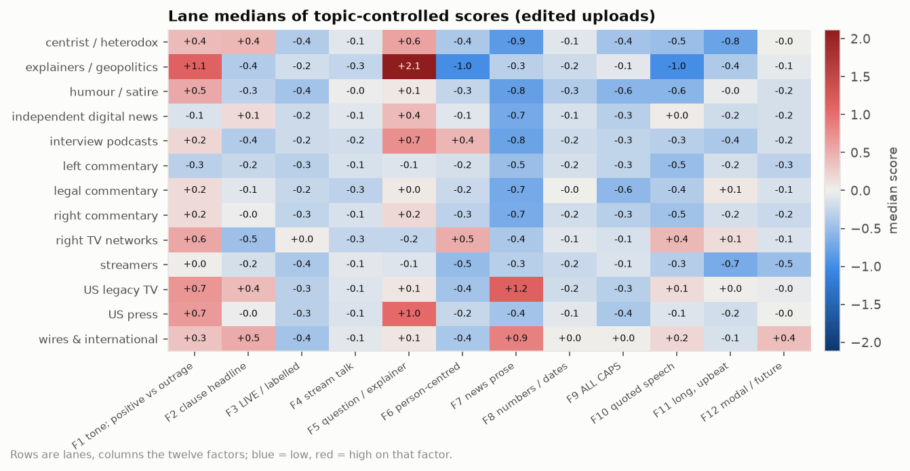
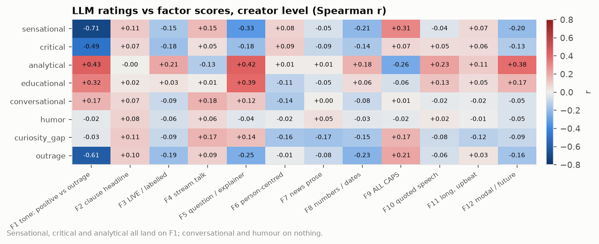
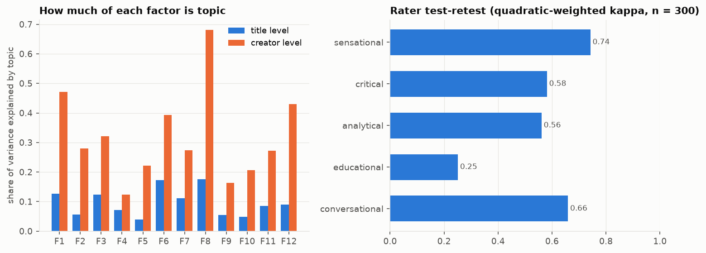

# 3. The style dimensions: how they title

**The question.** Along which dimensions do titles actually vary, where does each creator sit, and do those dimensions match the labels people reach for (Sensational, Critical, Analytical, Educational, Conversational, Humour)?

## The finding in one paragraph

Exploratory factor analysis of 74 title-level style features, aggregated to 2,029 creator x genre x month cells, retains 12 factors (parallel analysis suggested 16, capped at 12 for interpretability; KMO 0.73; 47% of variance). The factors are not the six candidate labels. One factor is *tone*: positive, upbeat wording at one end and outrage vocabulary (shock words, "slams / destroys / exposed", negative sentiment) at the other, and it absorbs three of the candidates at once: the LLM's Sensational, Critical and Analytical ratings all correlate with this single factor (creator-level Spearman -0.71, -0.49, +0.43). Everything else the factors pick up is *structural*: whether a title is a clause or a noun phrase, whether it wears a LIVE/BREAKING label, whether it talks like a stream chat, asks a question, names a person, reads as news prose, carries numbers, shouts in capitals, or quotes someone. Educational maps only partly onto the question/explainer factor (+0.39); Conversational (+0.18) and Humour (+0.08) do not appear as dimensions at all.

## The twelve factors

*Factor loadings: which title features define each factor (only features loading at 0.35 or more are shown).*

Each factor is named from its loadings (name, share of variance, the features that load on it, and the creators at each extreme after topic control, edited uploads only):

| factor | name | variance | loads on | highest creators (videos) | lowest |
|---|---|---|---|---|---|
| F1 | Positive tone vs outrage (shock words, violence verbs, negative sentiment) | 5.3% | vader_compound (+0.91), vader_pos (+0.47); against: vader_neg (-0.76), shock_word (-0.74), violence_verb (-0.64) | @CoreyGilShusterAskProject, @NPR, @turningpointusa, @POLITICO | @DannyHaiphongYT, @BlackConservativePerspective, @katiephangnews, @DoubleDownNews |
| F2 | Clause headline vs noun-phrase (finite verbs, tense) | 4.8% | has_finite_verb (+0.91), present_tense (+0.74), past_tense (+0.54), verb_share (+0.51), adv_share (+0.46); against: p... | @moreperfectunion, @Tim_Black, @CoreyGilShusterAskProject, @MattWalsh | @joerogan, @FleccasTalks, @TimDillonShow, @BelleRanch |
| F3 | Labelled live/formulaic headline (LIVE:, BREAKING:, colon labels) | 4.7% | lead_colon_label (+0.85), lead_live (+0.82), colon (+0.79), formulaic (+0.48); against: entity_first (-0.59) | @RSBN, @aaronparnas1, @TimesNowWorld, @DailyDenims | @DylanBurnsLIVE, @ANINewsIndia, @thewarningwithsteveschmidt, @lovettorleaveitpodcast |
| F4 | Conversational stream talk (chat, ellipsis, contractions, imperatives, we) | 4.6% | discourse_marker (+0.84), trailing_ellipsis (+0.82), ellipsis (+0.71), contraction (+0.65), imperative (+0.55) | @BelleRanch, @AsmonTV, @bennyjohnson, https://rumble.com/c/russellbrand | @thewarningwithsteveschmidt, @ActualJusticeWarrior, @FleccasTalks, @OutKick |
| F5 | Question and explainer framing (why, what, ?) | 4.5% | q_word_start (+0.95), wh_any (+0.85), why_marker (+0.79), q_mark (+0.46) | @TheEconomist, @wsj, @nationalreview, @TheDailyBeast | @AndWeKnowOfficial-o9b, @CashJordan, @BlackConservativePerspective, @ActualJusticeWarrior |
| F6 | Person-centred (named people) | 4.3% | n_person (+0.99), has_person (+0.94) | @BadFaithPodcast, @DannyHaiphongYT, @JamarlThomas, @fastpoliticspodcast | @CoreyGilShusterAskProject, @GeopoliticalEconomyReport, @moreperfectunion, @dineshdsouza |
| F7 | Descriptive news prose vs title-case (nouns, adjectives, places) | 4.2% | noun_share (+0.81), adj_share (+0.52), n_gpe (+0.45); against: cap_token_share (-0.72), negation (-0.41) | @aljazeeraenglish, @Reuters, @CBSNews, @USATODAY | @moreperfectunion, @DrSteveTurleyTV, @jlptalk, @DoubleDownNews |
| F8 | Numeric and dated (digits, years) | 3.7% | num_share (+0.95), digit (+0.85), year_mention (+0.68) | @HasanAbiVODs3, @60minutes, @Firstpost, @Forbes | @PoliticsGirl, @triggerpod, @TheEconomist, @UnHerd |
| F9 | ALL-CAPS shouting | 3.4% | allcaps_word_share (+0.94), full_caps_title (+0.86), has_allcaps_word (+0.44) | @JacksonHinkleOfficial, @FleccasTalks, @AndWeKnowOfficial-o9b, @katiephangnews | @joerogan, @JackCocchiarellaShow, @TheHumanistReport, @TheDailyBeast |
| F10 | Quoted speech | 3.2% | quoted_speech (+0.93), quotes (+0.91) | @PiersMorganUncensored, @timesofindia, @jlptalk, @CashJordan | @DrSteveTurleyTV, @ZeihanonGeopolitics, @PartOfTheProblem, @SabbySabs |
| F11 | Long, upbeat, abstract (length, positive words, nominalisations) | 2.5% | vader_pos (+0.53), n_chars (+0.52), nominalisation (+0.42) | @AndWeKnowOfficial-o9b, https://rumble.com/c/BannonsWarRoom, @BlackConservativePerspective, @DrSteveTurleyTV | @SydneyWatson, @thewarningwithsteveschmidt, @PartOfTheProblem, @joerogan |
| F12 | Modal and future speculation (will, could, we) | 2.3% | future_will (+0.54), modal (+0.53), first_pl (+0.42) | @moreperfectunion, @thewarningwithsteveschmidt, @BelleRanch, @CoreyGilShusterAskProject | @AsmonTV, @destinyhqclips, @bennyjohnson, @SydneyWatson |

*Scree plot: observed eigenvalues against the parallel-analysis threshold; the vertical line marks the twelve retained factors.*

How to read a creator's position: the profile cards give each score as a percentile rank among ranked creators of the same genre, with the lane median beside it. A creator at the 95th percentile on F9 titles in ALL CAPS more than 95 % of comparable channels.

## Which lanes sit where (median topic-controlled score, edited uploads, selected factors)

*Lane medians of the topic-controlled scores, all twelve factors.*

| lane | n | F1 | F2 | F3 | F4 | F5 | F6 | F7 | F9 |
|---|---|---|---|---|---|---|---|---|---|
| centrist / heterodox | 10 | 0.40 | 0.42 | -0.35 | -0.08 | 0.59 | -0.38 | -0.85 | -0.44 |
| explainers / geopolitics | 3 | 1.14 | -0.36 | -0.17 | -0.26 | 2.12 | -0.99 | -0.31 | -0.08 |
| humour / satire | 6 | 0.55 | -0.29 | -0.44 | -0.03 | 0.05 | -0.25 | -0.80 | -0.59 |
| independent digital news | 19 | -0.12 | 0.15 | -0.21 | -0.10 | 0.41 | -0.09 | -0.71 | -0.32 |
| interview podcasts | 19 | 0.19 | -0.36 | -0.21 | -0.17 | 0.73 | 0.44 | -0.77 | -0.27 |
| left commentary | 40 | -0.31 | -0.24 | -0.31 | -0.15 | -0.11 | -0.16 | -0.49 | -0.27 |
| legal commentary | 8 | 0.16 | -0.09 | -0.24 | -0.29 | 0.04 | -0.22 | -0.70 | -0.56 |
| right commentary | 69 | 0.16 | -0.03 | -0.28 | -0.14 | 0.18 | -0.30 | -0.69 | -0.33 |
| right TV networks | 4 | 0.55 | -0.48 | 0.03 | -0.26 | -0.25 | 0.50 | -0.39 | -0.14 |
| streamers | 23 | 0.01 | -0.16 | -0.38 | -0.08 | -0.11 | -0.52 | -0.32 | -0.13 |
| US legacy TV | 9 | 0.69 | 0.39 | -0.31 | -0.11 | 0.07 | -0.44 | 1.16 | -0.32 |
| US press | 18 | 0.66 | -0.02 | -0.31 | -0.12 | 1.03 | -0.25 | -0.44 | -0.39 |
| wires & international | 11 | 0.34 | 0.53 | -0.43 | -0.08 | 0.08 | -0.41 | 0.85 | 0.02 |

The tone factor (F1) already separates the landscape's temperaments: left commentary is the most outrage-toned lane, legacy TV and the US press the most positive/neutral; the legacy wires and TV score high on F2 (clause headlines with a finite verb: "Houthis claim major advance") and F7 (descriptive news prose in sentence case), commentary lanes low. Question framing (F5) belongs to the press and the explainers; person-centred titles (F6) to interview podcasts and right TV.

## Do the candidate labels survive?

*Creator-level correlation between each LLM rating and each factor score.*

| candidate | best_factor | creator_level_r | second_factor | second_r | verdict |
|---|---|---|---|---|---|
| Sensational | F1 | -0.71 | F5 | -0.33 | merged: Sensational, Critical, Analytical/Informational |
| Critical | F1 | -0.49 | F5 | -0.18 | merged: Sensational, Critical, Analytical/Informational |
| Analytical/Informational | F1 | 0.43 | F5 | 0.42 | merged: Sensational, Critical, Analytical/Informational |
| Educational | F5 | 0.39 | F1 | 0.32 | partial |
| Conversational | F4 | 0.18 | F1 | 0.17 | absent |
| Humor | F2 | 0.08 | F4 | 0.06 | absent |

Full creator-level correlation matrix (LLM rating aggregated to creator x genre, n = 318 groups with at least five rated titles, against the raw factor score):

| llm | F1 | F2 | F3 | F4 | F5 | F6 | F7 | F8 | F9 | F10 | F11 | F12 |
|---|---|---|---|---|---|---|---|---|---|---|---|---|
| analytical | 0.43 | -0.00 | 0.21 | -0.13 | 0.42 | 0.01 | 0.01 | 0.18 | -0.26 | 0.23 | 0.11 | 0.38 |
| conversational | 0.17 | 0.07 | -0.09 | 0.18 | 0.12 | -0.14 | 0.00 | -0.08 | 0.01 | -0.02 | -0.02 | -0.05 |
| critical | -0.49 | 0.07 | -0.18 | 0.05 | -0.18 | 0.09 | -0.09 | -0.14 | 0.07 | 0.05 | 0.06 | -0.13 |
| curiosity_gap | -0.03 | 0.11 | -0.09 | 0.17 | 0.14 | -0.16 | -0.17 | -0.15 | 0.17 | -0.08 | -0.12 | -0.09 |
| educational | 0.32 | 0.02 | 0.03 | 0.01 | 0.39 | -0.11 | -0.05 | 0.06 | -0.06 | 0.13 | 0.05 | 0.17 |
| humor | -0.02 | 0.08 | -0.06 | 0.06 | -0.04 | -0.02 | 0.05 | -0.03 | -0.02 | 0.02 | -0.01 | -0.05 |
| outrage | -0.61 | 0.10 | -0.19 | 0.09 | -0.25 | -0.01 | -0.08 | -0.23 | 0.21 | -0.06 | 0.03 | -0.16 |
| sensational | -0.71 | 0.11 | -0.15 | 0.15 | -0.33 | 0.08 | -0.05 | -0.21 | 0.31 | -0.04 | 0.07 | -0.20 |

Three things to take from it. Sensational and Critical are the same thing as far as titles are concerned: a title that attacks is a title that shouts. Analytical is the *absence* of that (the positive pole of F1 plus the question factor), not a dimension of its own. And the model that rated the titles agrees with itself only moderately: on 300 titles rated twice in different batches, quadratic-weighted kappa is 0.74 for sensational, 0.58 critical, 0.56 analytical, 0.66 conversational and only 0.25 educational, so the validation is trustworthy for tone and weak for the rest.

## How much of a creator's style is just its topics?

*Left: share of each factor's variance explained by topic at the title and creator level. Right: the rater's test-retest reliability per dimension.*

The scores above are topic-controlled: each title's score minus the mean score of its topic (estimated on the balanced subset), averaged per creator. Topic explains between 4% and 18% of the title-level variance of a factor, most for numbers/dates (F8) and person-centred titles (F6), least for questions (F5) and capitals (F9). At the creator level the raw and controlled scores correlate at 0.80-0.98: what a channel covers moves its score a little, how it titles moves it a lot. `dimensions.csv` carries raw, controlled and the topic-expected component side by side, and `dimensions_by_topic.csv` gives each creator's scores inside the five largest shared topics.

| factor | auto_name | title_level_r2_topic | creator_level_r2_topic | creator_level_corr_raw_controlled |
|---|---|---|---|---|
| F1 | +vader_compound -vader_neg -shock_word -violence_verb | 0.13 | 0.47 | 0.94 |
| F2 | +has_finite_verb +present_tense +past_tense +verb_share | 0.06 | 0.28 | 0.95 |
| F3 | +lead_colon_label +lead_live +colon -entity_first | 0.12 | 0.32 | 0.97 |
| F4 | +discourse_marker +trailing_ellipsis +ellipsis +contraction | 0.07 | 0.12 | 0.98 |
| F5 | +q_word_start +wh_any +why_marker +q_mark | 0.04 | 0.22 | 0.98 |
| F6 | +n_person +has_person | 0.17 | 0.39 | 0.95 |
| F7 | +noun_share -cap_token_share +adj_share +n_gpe | 0.11 | 0.27 | 0.96 |
| F8 | +num_share +digit +year_mention | 0.18 | 0.68 | 0.80 |
| F9 | +allcaps_word_share +full_caps_title +has_allcaps_word | 0.05 | 0.16 | 0.98 |
| F10 | +quoted_speech +quotes | 0.05 | 0.21 | 0.96 |
| F11 | +vader_pos +n_chars +nominalisation | 0.09 | 0.27 | 0.96 |
| F12 | +future_will +modal +first_pl | 0.09 | 0.43 | 0.90 |

## Lexical diversity and formulaicity (creator-level, not in the factor model)

Heaps' exponent on 20 subsamples of 1,500 tokens ranks creators by how fast their vocabulary grows: lowest (most repetitive) are the daily left-commentary channels (Harry Sisson, Pondering Politics, Luke Beasley, Jack Cocchiarella, Brian Tyler Cohen, 0.71-0.73), highest are the news outlets and long-title commentators (NY Post, Reuters, Fox News Clips, 0.87-0.88). The ranking is stable across subsample sizes (rank correlation 0.90-0.98 between 1,000, 1,500 and 3,000 tokens; `lexical_diversity_sensitivity.csv`). Formulaicity, the share of a creator's titles whose leading or trailing three-word template recurs in three or more of its other titles, is near 100 % for Belle of the Ranch ("Let's talk about ...") and the Hasan VOD channel, and above 85 % for Steve Turley, Joe Rogan, Firstpost and RSBN.

## Caveats

- The factor model is fitted on monthly cells so that each creator contributes at most nine rows. The cell threshold (15 unique titles) and the cap of 12 factors are choices; the smaller factors (F10-F12 carry 2-3 % of variance each) are the ones most exposed to them, and the sensitivity has not been tested here.
- The candidate-label test depends on a local 14B rater with modest reliability; a stronger rater could raise the Educational and Conversational correlations. It cannot create a Humour dimension: the rater found humour in 0.4 % of titles, so there is nothing to correlate.

Files: `features.csv`, `features_creator.csv`, `feature_definitions.csv`, `factor_loadings.csv`, `scree.csv` / `scree.png`, `efa_summary.json`, `dimensions.csv`, `dimensions_monthly.csv`, `dimensions_by_topic.csv`, `topic_control_summary.csv`, `labels.csv`, `validation_*.csv`.
