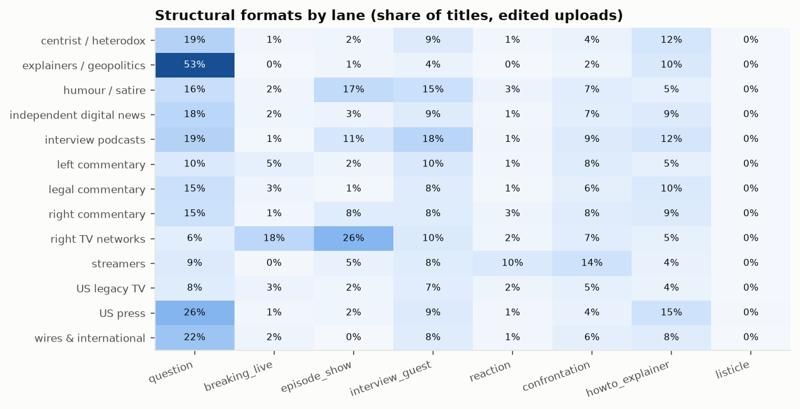
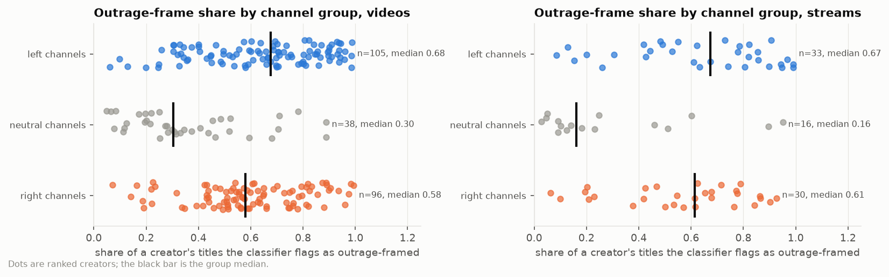

# 4. Formats and hooks

**The question.** Which structural formats do creators use (questions, LIVE labels, episode numbering, guests, reactions, confrontations, listicles, explainers), and which semantic hooks (curiosity gap, outrage frame, humor)?

## The finding in one paragraph

The outrage frame is the landscape's default hook, not a niche device. The rating model flagged 57 % of a 3,000-title creator-stratified sample as framing their subject as outrageous, scandalous or threatening, and a classifier trained on those labels reproduces the judgment well on held-out titles (accuracy 0.76, AUC 0.84, kappa 0.52). Applied to every title, it covers 64 % of the average left channel's edited uploads, 60 % of the average right channel's and 36 % of the average neutral channel's: the frame belongs to partisan titling on both sides, and the neutral group, which is mostly news outlets, uses it least. The two other hooks could not be measured: the rater found a curiosity gap in 2.1 % of titles and humor in 0.4 %, far too few positives to learn from (held-out F1 0.18 and 0.00). Treat both as *unmeasured*, not absent (see document 8).

## Formats by channel group (share of a creator's titles, mean over creators; edited uploads)

*Structural formats by channel group, edited uploads.*

| group | n_creators | question | breaking_live | episode_show | interview_guest | reaction | confrontation | listicle | howto_explainer |
|---|---|---|---|---|---|---|---|---|---|
| left channels | 105.00 | 0.16 | 0.03 | 0.03 | 0.10 | 0.03 | 0.08 | 0.00 | 0.08 |
| neutral channels | 38.00 | 0.16 | 0.01 | 0.07 | 0.12 | 0.02 | 0.07 | 0.00 | 0.07 |
| right channels | 96.00 | 0.16 | 0.02 | 0.08 | 0.08 | 0.02 | 0.08 | 0.00 | 0.09 |

Questions run at the same rate in all three groups; episode numbering and how-to / explainer wording are a little more common on the right, guest formats a little more in the neutral and left groups (12 %, 10 %, 8 % on the right), and none of the structural formats separates the groups the way the outrage hook does. Live VODs look different again: LIVE/BREAKING labels sit on 52 % of the neutral group's stream titles (the wires' rolling broadcasts), confrontation on 15 % of the left group's (the debate streamers):

| group | n_creators | question | breaking_live | episode_show | interview_guest | confrontation | outrage |
|---|---|---|---|---|---|---|---|
| left channels | 33.00 | 0.11 | 0.17 | 0.06 | 0.18 | 0.15 | 0.63 |
| neutral channels | 16.00 | 0.05 | 0.52 | 0.02 | 0.13 | 0.07 | 0.30 |
| right channels | 30.00 | 0.14 | 0.19 | 0.26 | 0.14 | 0.09 | 0.56 |

## The outrage hook by channel group (edited uploads)

*Outrage-frame share by channel group, edited uploads (left) and live VODs (right); dots are creators, the bar is the group median.*

| group | n_creators | median | q25 | q75 | min | max |
|---|---|---|---|---|---|---|
| left channels | 105 | 0.68 | 0.47 | 0.82 | 0.06 | 0.99 |
| neutral channels | 38 | 0.30 | 0.20 | 0.48 | 0.05 | 0.89 |
| right channels | 96 | 0.58 | 0.48 | 0.76 | 0.07 | 0.99 |

Within every group the creator-to-creator spread is wide (the quartiles above): the group is a weak predictor of any one channel. The gradient across groups is the same one the tone factor of the style model finds, measured a second way; the two measures are not independent (the classifier sees the same words the lexicon counts), but they were built from different sources, the tone factor from word lists and sentiment, the hook from a model reading whole titles.

## Examples (corpus-wide, three per category)

| category | creator | title |
|---|---|---|
| question | @ABCNews | How Sysco acquiring Restaurant Depot could shake up the food industry |
| question | @nytimes | How Americans Are Struggling With Rising Healthcare Costs |
| question | @SkyNews | Is Trump about to bring down NATO? \| Trump100 |
| breaking_live | @StatusCoup | BREAKING: LIVE ICE Protests as Lawsuit Filed to SHUT DOWN Delaney Hall ICE Prison |
| breaking_live | @TimesNowWorld | FRANCE WILDFIRE LIVE \| Mega-Fire 4x Size Of Paris Out Of Control Near Bordeaux \| TIMES NOW WORLD |
| breaking_live | @Firstpost | LIVE: 'US Aims For $1.5 Trillion Defence Budget,' Says Hegseth at NATO Defence Ministers' Meet |
| episode_show | @markets | Micron Earnings Spark Global Tech Rebound \| Daybreak Europe 6/25/2026 |
| episode_show | @TheDamageReport | The Damage Report: April 20, 2026 |
| episode_show | @ABCNews | Vance Warns Pope To "Be Careful" On Theology - What You Need To Know - April 15th, 2026 |
| interview_guest | @underthedesknews | FULL TOP STORY: Sen. Graham Conspired w/ Israel to DESTROY the International Criminal Court |
| interview_guest | @NBCNews | Father reunites with five daughters after months overseas |
| interview_guest | @timesofindia | ‘Taco Welcome’: Barred From US, Iran Football Boss Joins Emotional Mexico Crowd \| FIFA World Cup |
| reaction | @Firstpost | US-Iran War Ceasefire LIVE: Iranians and Americans Reacts to Trump's Ceasefire Announcement \| N18G |
| reaction | @wethefifth | Media Insiders React to the Scott Pelley 60 Minutes Drama - The Fifth Column |
| reaction | @msnow | 'This is about Trump': Elections expert reacts to Virginia redistricting measure passing |
| confrontation | @Firstpost | Red Fort Attack LIVE: Pakistan's Terror Lies Busted As JeM’s Hand Emerge in Lal Qila Blast |
| confrontation | @timesofindia | '5th Time You Blinked': Reporter Grills Trump On Iran U-Turn; Shock 'I Don't Know' Reply Follows |
| confrontation | @PTLRadioShow | MAGA Callers Accuse Brian Shapiro Of Lying… Then Get Fact-Checked |
| listicle | @Firstpost | US-Iran War Top 5 Developments: Tehran Claims Drone Attack Amid Hormuz Tensions \| Firstpost Live |
| listicle | @TheMajorityReport | 39 Times Trump Claimed An Iran Deal Was Imminent |
| listicle | @NewsNation | An MLB opening day preview, plus March Madness Sweet 16 predictions \| Morning in America |
| howto_explainer | @JackCocchiarellaShow | Fox Host Suffers Emotional Breakdown As Trump Loses Senate |
| howto_explainer | @AssociatedPress | AP reporter breaks down Supreme Court ruling striking down Trump’s tariffs |
| howto_explainer | @RealAmericasVoice | 9/11 Widow Terry Strada REVEALS What Happened After Her Husband’s FINAL Call |
| curiosity_gap | @LukeBeasley | Actually, what the f*** just happened?! |
| curiosity_gap | https://rumble.com/c/russellbrand | They don't want you knowing this... |
| curiosity_gap | @AsmonTV | Holy sh*t.. How is this real? |
| outrage | @timesofindia | ‘Humiliated’ Trump Fires EXPLOSIVE WARNING To Canada In Extreme Meltdown \| ‘NO MORE BENEFITS!’ |
| outrage | @LukeBeasley | SHOCK BREAKING: TRUMP S*X BOMBSHELL ERUPTS, PUBLIC MELTDOWN BACKFIRES! |
| outrage | @BlackConservativePerspective | Leftists PANIC As Wife EXPOSES Another HUMILIATING Scandal Against IMPLODING Communist Democrat! |
| humor | @TimcastIRL | THIS IS HILARIOUS |
| humor | @TimcastNews | THIS IS HILARIOUS |
| humor | @TheQuartering | THIS IS HILARIOUS |

## Do the rules agree with the model?

Formats are regexes on the raw title (the exact patterns are in `format_rules.csv`); the rater also gave each sampled title one format label. Where both apply:

| category | rule_positives | llm_positives | precision_rule_vs_llm | recall_rule_vs_llm | kappa |
|---|---|---|---|---|---|
| question | 424 | 58 | 0.10 | 0.74 | 0.15 |
| breaking_live | 251 | 268 | 0.81 | 0.76 | 0.77 |
| episode_show | 226 | 228 | 0.54 | 0.54 | 0.50 |
| interview_guest | 326 | 99 | 0.18 | 0.60 | 0.24 |
| reaction | 78 | 56 | 0.49 | 0.68 | 0.56 |
| confrontation | 239 | 98 | 0.20 | 0.50 | 0.26 |
| listicle | 3 | 4 | 0.67 | 0.50 | 0.57 |
| howto_explainer | 219 | 75 | 0.17 | 0.51 | 0.23 |

The rules fire far more often than the model's single label for interview_guest and howto_explainer (the rules count "with a name" and "why"; the model picks one dominant format per title), so the rule shares above are upper bounds for those two categories. Question, breaking/live and episode formats agree well.

Channel groups are the left / neutral / right groups of document 14: each channel's score = (right − left) / titles over its sampled titles as labeled by the judge, sorted at ±0.05. A channel's group says how its *titles* read, not what its host believes.

Files: `formats.parquet` (per title), `format_hook_shares.csv`, `format_examples.csv`, `format_rules.csv`, `format_agreement.csv`, `hook_classifier.json`.
