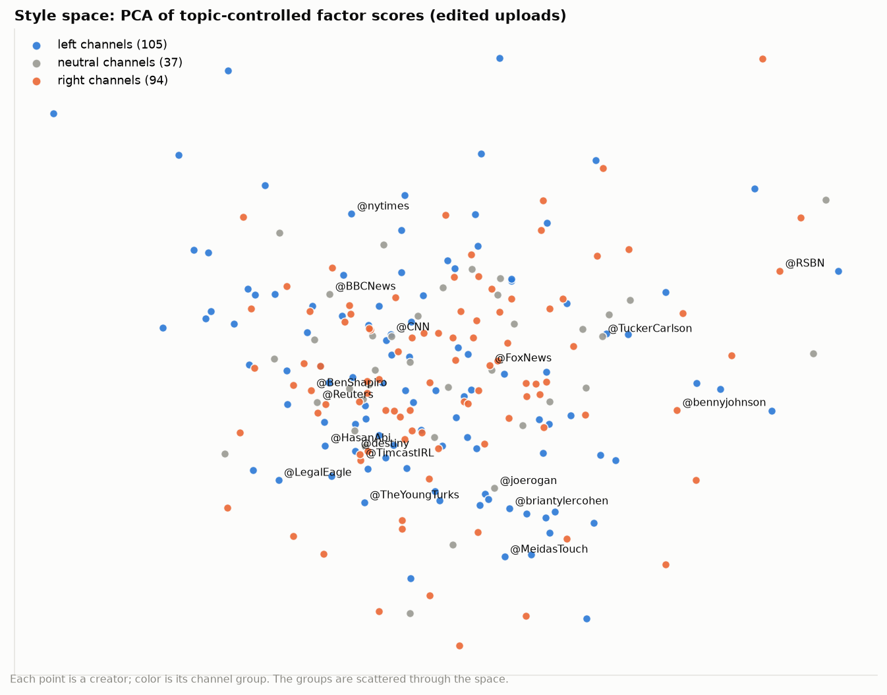
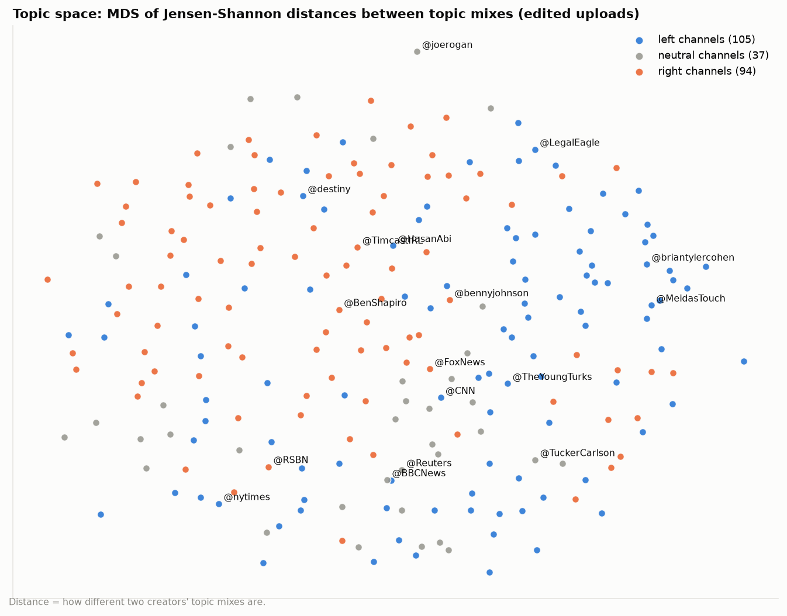
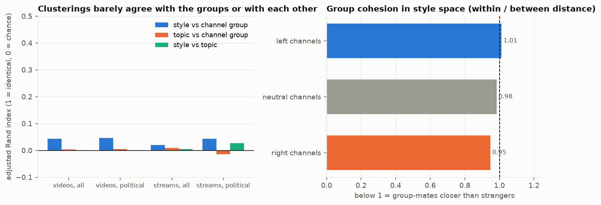
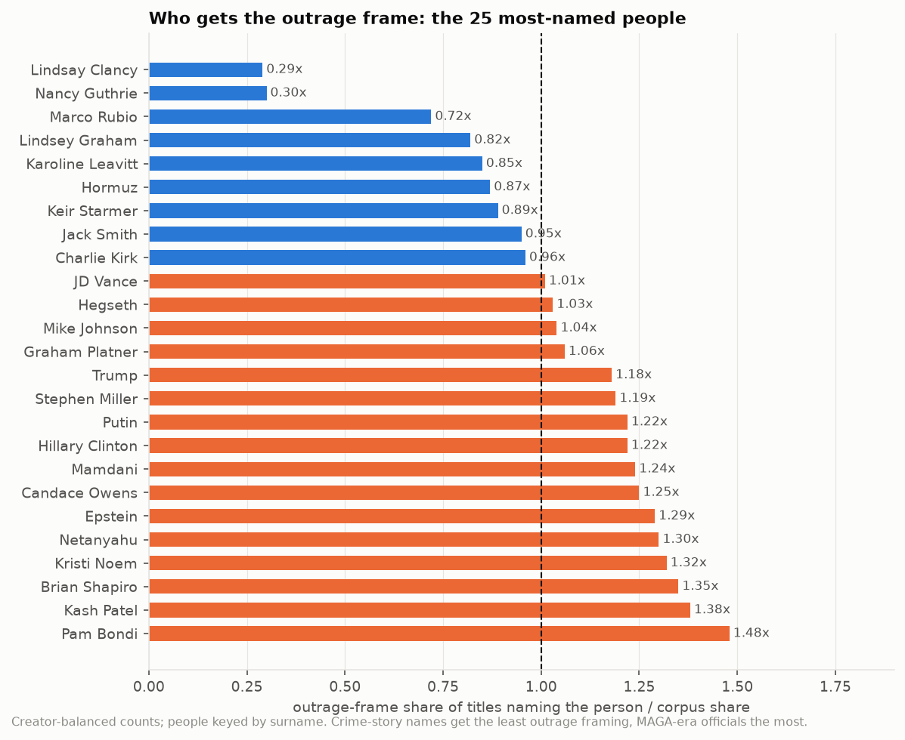
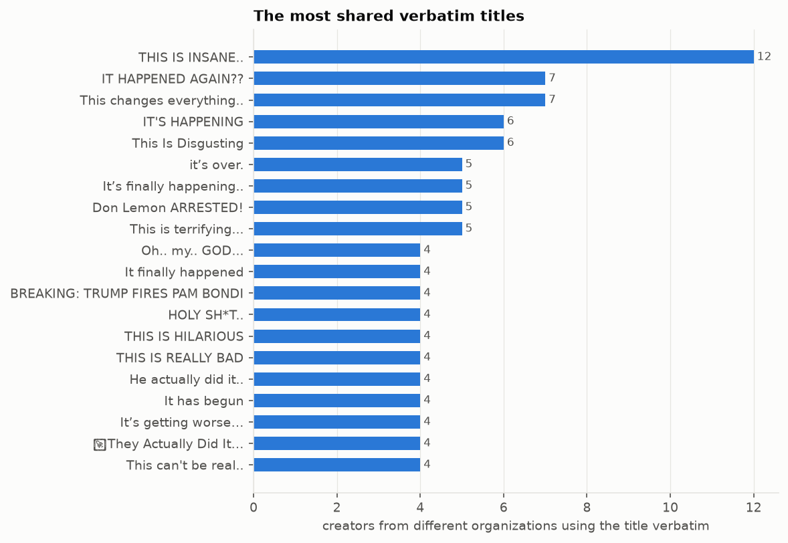

# 5. The landscape: who titles like whom

**The question.** Do channels whose titles read the same way politically (the left / neutral / right groups) share a *style*? Who are each creator's real neighbors in style, as opposed to in subject matter? Who gets named, and does the landscape converge on the same hooks?

## The finding in one paragraph

Political grouping predicts style almost not at all. Clustering creators in the twelve-dimensional, topic-controlled style space and comparing the clusters with the three channel groups gives an adjusted Rand index of 0.044 for edited uploads (0.046 on political titles only), and topic clusters do no better (0.004). No group holds together in style space: the tightest is right channels at a cohesion ratio of 0.95 (members 5% closer to each other than to everyone else), and the largest style cluster holds 64 creators from all three groups. So the useful unit is not the group but the five nearest style neighbors on each creator's card, and those cut across politics: for 52 % of the left and right channels the single nearest neighbor is in another group, and 88 % have a channel from the opposite side among their five (@HasanAbi (left) has @TimcastNews (right), @JustPearlyThings (right) among its five; @MeidasTouch (left) has @TheOfficerTatum (right) among its five; @FoxNews (right) has @msnow (left) among its five). The hooks converge too: 454 titles are used verbatim by creators from different organizations ("THIS IS INSANE.." by 12 creators across 3 groups), 38 % of them by channels in more than one group.

## Clusterings against the channel groups

*Style space: every ranked creator, colored by channel group. The interactive version, with names on hover and each creator's five neighbors, is on the HTML page.*

Style space: agglomerative (Ward) on z-scored topic-controlled factor scores. Topic space: average linkage on the Jensen-Shannon distance between creators' topic mixes. k chosen by silhouette; ARI = adjusted Rand index (1 = identical partitions, 0 = chance).

| genre | titles | n_creators | style_k | style_silhouette | topic_k | topic_silhouette | ari_style_vs_group | ari_topic_vs_group | ari_style_vs_topic |
|---|---|---|---|---|---|---|---|---|---|
| videos | all | 236 | 10 | 0.119 | 3 | 0.170 | 0.044 | 0.004 | 0.001 |
| videos | political | 229 | 10 | 0.131 | 3 | 0.180 | 0.046 | 0.005 | 0.001 |
| streams | all | 77 | 11 | 0.165 | 3 | 0.097 | 0.020 | 0.009 | 0.005 |
| streams | political | 76 | 9 | 0.162 | 4 | 0.069 | 0.043 | -0.014 | 0.027 |

The low silhouettes say the same thing from the other side: neither space has well-separated groups, the creators form a continuum.

*Topic space: MDS of the Jensen-Shannon distances between creators' topic mixes.*

*Left: adjusted Rand index of the clusterings against the channel groups and against each other. Right: group cohesion in style space.*

## Do the groups cohere in style? (edited uploads)

Mean distance in style space between members of a group, over the mean distance from members to everyone else; below 1 means group-mates are closer than strangers.

| group | n_creators | within_group_distance | between_group_distance | cohesion_ratio |
|---|---|---|---|---|
| left channels | 105 | 4.63 | 4.57 | 1.01 |
| neutral channels | 37 | 4.65 | 4.72 | 0.98 |
| right channels | 94 | 4.30 | 4.54 | 0.95 |

## Where group and style disagree

Every group is split across style clusters; the share of a group in its own largest style cluster:

| group | n_creators | n_style_clusters | largest_cluster_share |
|---|---|---|---|
| left channels | 105 | 10 | 0.32 |
| neutral channels | 37 | 9 | 0.30 |
| right channels | 94 | 8 | 0.34 |

Conversely, style clusters span groups: the two largest (64 and 52 creators) each mix left, neutral and right channels. Full membership lists: `disagreements_group_style.csv`, `style_clusters.csv`, `topic_clusters.csv`.

## Nearest style neighbors, a sample

| creator | group | five nearest in style |
|---|---|---|
| @HasanAbi | left | @Vaush [left], @TheVaushPit [left], @TimcastNews [right], @TheMichaelCohenShow [left], @JustPearlyThings [right] |
| @BenShapiro | right | @KimIversen [neutral], @StevenCrowder [right], @RealDanBongino [right], @AlexStein99 [right], @hutch [neutral] |
| @FoxNews | right | @FoxNewsChannelClips [right], @msnow [left], @RebelNewsOnline [right], @NBCNews [neutral], https://rumble.com/c/TheAl... |
| @MeidasTouch | left | @LegalAFMTN [left], @TheOfficerTatum [right], @deanwithrs [left], @adammockler [left], @katiephangnews [left] |
| @TuckerCarlson | neutral | @MyronGainesX [right], @RubinReport [right], https://rumble.com/c/GGreenwald [left], @lovettorleaveitpodcast [left], ... |
| @joerogan | neutral | @markets [neutral], @breakingpoints [left], @TheMajorityReport [left], @TheLincolnProject [left], @triggerpod [right] |
| @Reuters | neutral | @aljazeeraenglish [left], @CBSNews [neutral], @ABCNews [neutral], @AssociatedPress [neutral], @NBCNews [neutral] |
| @destiny | left | @TheLincolnProject [left], @TheMajorityReport [left], @hutch [neutral], @AlexStein99 [right], @LIVESNEAKO [neutral] |
| @bennyjohnson | right | @OfficialSaharTV [right], @BlazeTV [right], @DestinyDGGClips [right], @harryjsisson [left], @The_Crucible [right] |
| @CNN | left | @CBSNews [neutral], @SkyNews [left], @ABCNews [neutral], @NBCNews [neutral], @AssociatedPress [neutral] |

Neighbors are computed on titles with same-organization cross-posts removed and low-n creators excluded; every creator's five style and five topic neighbors are on its card and in `neighbours_style.csv` / `neighbours_topic.csv`. The maps on the HTML page (PCA of the style space, MDS of the topic space) show the same picture: the group colors are scattered through both.

## Organizations

Sister channels do share a house style: the four MeidasTouch Network channels sit together at the outrage end of the tone factor (organization score -0.93) and high on capitals; the three Timcast channels are the most capitalized organization (2.37 on F9); the four NYT channels and CBS sit at the positive/neutral end. Title-weighted organization scores (clippers excluded) are in `org_style.csv`.

## Who gets named

*Outrage-frame ratio for the 25 most-named people: orange above the corpus baseline, blue below.*

Counted on the creator-balanced subset; people keyed by surname, so "Kirk" pools Charlie and Erika Kirk and "Trump" pools every Trump. `share_by_group` is the share of each channel group's balanced titles that names the entity; `outrage_ratio` is the outrage-frame share of titles naming the entity over the corpus share.

| entity | n_titles_balanced | n_creators | share_by_group | outrage_share | outrage_ratio |
|---|---|---|---|---|---|
| Trump | 7277 | 197 | left (5.6%); neutral (3.7%); right (2.2%) | 0.67 | 1.18 |
| Hegseth | 1054 | 106 | left (0.8%); neutral (0.7%); right (0.2%) | 0.58 | 1.03 |
| Hormuz | 1041 | 85 | neutral (1.0%); left (0.5%); right (0.3%) | 0.49 | 0.87 |
| Putin | 888 | 62 | neutral (0.9%); left (0.5%); right (0.1%) | 0.69 | 1.22 |
| JD Vance | 858 | 120 | left (0.5%); neutral (0.5%); right (0.4%) | 0.57 | 1.01 |
| Charlie Kirk | 744 | 115 | right (0.8%); neutral (0.3%); left (0.2%) | 0.54 | 0.96 |
| Mamdani | 717 | 111 | right (0.7%); neutral (0.3%); left (0.2%) | 0.70 | 1.24 |
| Netanyahu | 708 | 109 | neutral (0.5%); left (0.5%); right (0.2%) | 0.73 | 1.30 |
| Lindsey Graham | 647 | 124 | left (0.4%); neutral (0.4%); right (0.4%) | 0.46 | 0.82 |
| Epstein | 624 | 108 | left (0.4%); neutral (0.4%); right (0.2%) | 0.73 | 1.29 |
| Nancy Guthrie | 579 | 33 | neutral (0.7%); right (0.4%); left (0.0%) | 0.17 | 0.30 |
| Kristi Noem | 536 | 103 | left (0.5%); neutral (0.2%); right (0.2%) | 0.74 | 1.32 |
| Brian Shapiro | 511 | 75 | left (0.5%); right (0.1%); neutral (0.1%) | 0.76 | 1.35 |
| Karoline Leavitt | 479 | 53 | left (0.3%); right (0.2%); neutral (0.2%) | 0.48 | 0.85 |
| Mike Johnson | 477 | 87 | left (0.3%); right (0.2%); neutral (0.2%) | 0.59 | 1.04 |

| entity | n_titles_balanced | n_creators | share_by_group | outrage_share | outrage_ratio |
|---|---|---|---|---|---|
| Trump | 8617 | 192 | left (7.1%); neutral (4.5%); right (2.0%) | 0.66 | 1.17 |
| White House | 1502 | 114 | neutral (1.2%); left (0.7%); right (0.7%) | 0.41 | 0.73 |
| GOP | 1462 | 105 | left (1.1%); right (0.7%); neutral (0.5%) | 0.72 | 1.28 |
| MAGA | 973 | 122 | left (1.2%); right (0.1%); neutral (0.1%) | 0.92 | 1.64 |
| Senate | 958 | 97 | neutral (0.9%); right (0.4%); left (0.4%) | 0.36 | 0.65 |
| Supreme Court | 858 | 107 | neutral (0.5%); left (0.5%); right (0.4%) | 0.52 | 0.91 |
| NATO | 826 | 86 | neutral (0.8%); left (0.4%); right (0.2%) | 0.52 | 0.93 |
| FBI | 809 | 115 | right (0.6%); neutral (0.4%); left (0.3%) | 0.71 | 1.27 |
| House | 777 | 95 | neutral (0.7%); left (0.3%); right (0.3%) | 0.40 | 0.70 |
| Congress | 768 | 111 | neutral (0.6%); left (0.4%); right (0.3%) | 0.48 | 0.85 |

Trump is in 4.8 % of balanced titles counting both tags, named by 197 of 274 creators, and named most by the left group (left (5.6%); neutral (3.7%); right (2.2%)). Charlie Kirk and Mamdani are the right group's names, Hormuz, Putin and Netanyahu the neutral group's. The entities carrying the most outrage framing relative to baseline are the MAGA-era officials and the culture-war names; the least are the crime-story names (Nancy Guthrie, Lindsay Clancy) and institutions used as datelines (the Senate, the House, the White House). "Hormuz" is a spaCy mistake (a strait tagged as a person) left visible on purpose: entity counts from a small NER model on headline text are noisy at the margin.

## Convergent formulas

*The most shared verbatim titles across organizations.*

Of 1,477 distinct titles (case-insensitive) used by two or more creators, 454 cross organizations; the rest are same-outlet cross-posts (TYT / The Damage Report alone account for hundreds). The most shared:

| example | n_creators | n_titles | n_groups | groups |
|---|---|---|---|---|
| THIS IS INSANE.. | 12 | 14 | 3 | left; neutral; right |
| IT HAPPENED AGAIN?? | 7 | 10 | 2 | left; right |
| This changes everything.. | 7 | 7 | 2 | left; right |
| IT'S HAPPENING | 6 | 10 | 3 | left; neutral; right |
| This Is Disgusting | 6 | 6 | 2 | left; right |
| it’s over. | 5 | 9 | 3 | left; neutral; right |
| It’s finally happening.. | 5 | 6 | 2 | left; right |
| Don Lemon ARRESTED! | 5 | 5 | 2 | left; right |
| This is terrifying... | 5 | 5 | 2 | left; right |
| Oh.. my.. GOD... | 4 | 8 | 2 | left; right |
| It finally happened | 4 | 6 | 1 | left |
| BREAKING: TRUMP FIRES PAM BONDI | 4 | 5 | 1 | left |
| HOLY SH*T.. | 4 | 5 | 3 | left; neutral; right |
| THIS IS HILARIOUS | 4 | 5 | 2 | left; right |
| THIS IS REALLY BAD | 4 | 5 | 2 | left; right |

These are content-free exclamations, the "Shocking Events and Reactions" topic of document 2: the same dozen phrases serve as titles on the left, the right and in between. With names and numbers masked, the shared templates are outrage frames and guest formulas:

| template | n_creators | n_titles | n_groups | example |
|---|---|---|---|---|
| <ENT> 's <ENT> | 61 | 142 | 3 | Iran's Plan To Make You SIMP |
| <ENT> after <ENT> | 35 | 67 | 3 | Trump’s Envoys Get RUDE AWAKENING After Putin Meeting |
| <ENT> 's <ENT> <ENT> | 23 | 39 | 3 | California's Election Shakeup + Microsoft's AI Spy Badge \| PBD #811 |
| <ENT> ’s <ENT> | 17 | 27 | 3 | AIPAC’s "Elect Chicago Women" Super PAC Exposed |
| <ENT> exposes <ENT> | 14 | 19 | 2 | Elizabeth Warren Exposes Trump’s Fed Pick In Brutal Hearing |
| <ENT> <ENT> 's <ENT> | 13 | 19 | 3 | US Media's Hasan Piker Derangement Syndrome Is Ridiculous |
| <ENT> <ENT> after <ENT> | 12 | 13 | 3 | OMG: Trump RUSHES OFF after Going to HOSPITAL! |
| <ENT> after <ENT> <ENT> | 11 | 16 | 3 | Hakeem Jeffries In Full Panic Mode After Kushner Meeting Pisses Off Democrats |
| <ENT> <ENT> w/ <ENT> | 10 | 20 | 3 | "It Went Completely Viral" Brett Cooper Talks Internet Drama & Pendragon Cycle W/ Michael Knowles |
| <ENT> says <ENT> | 10 | 16 | 3 | Fox News Lunatic Says Americans Have Data Center Derangement Syndrome |
| <ENT> 's <ENT> in <ENT> | 10 | 13 | 3 | AOC's DISASTROUS Foreign Policy Debut In Munich |
| <ENT> w/ <ENT> | 8 | 35 | 3 | Trump’s Ballroom Obsession Has Gone Totally Off the Rails (w/ Ben Terris) |
| <ENT> <ENT> 's <ENT> <ENT> | 8 | 10 | 3 | Bill Kristol: MAGA's Grievance Culture \| The Bulwark Podcast |
| <ENT> on <ENT> 's <ENT> | 8 | 10 | 3 | Aaron Rodgers Torched Fauci on ESPN's Own Air |
| <ENT> vs. <ENT> | 8 | 8 | 2 | Ben Shapiro vs. Fortnite |

62 % of the shared verbatim titles are used within one channel group and 46 % of the shared templates; with three groups of these sizes a random pair of channels shares a group 38 % of the time, so both run a little more within the camps than chance would give, the verbatim exclamations clearly and the masked templates barely. Either way the same dozen phrases and the same "<ENT> destroys <ENT>" frames serve left, neutral and right channels alike.

Channel groups are the left / neutral / right groups of document 14: each channel's score = (right − left) / titles over its sampled titles as labeled by the judge, sorted at ±0.05. A channel's group says how its *titles* read, not what its host believes.

Files: `cluster_comparison.csv`, `group_style_cohesion.csv`, `disagreements_group_style.csv`, `style_clusters.csv`, `topic_clusters.csv`, `neighbours_style.csv`, `neighbours_topic.csv`, `map_style.csv`, `map_topic.csv`, `org_style.csv`, `entities_top.csv`, `shared_titles.csv`, `shared_templates.csv`.
