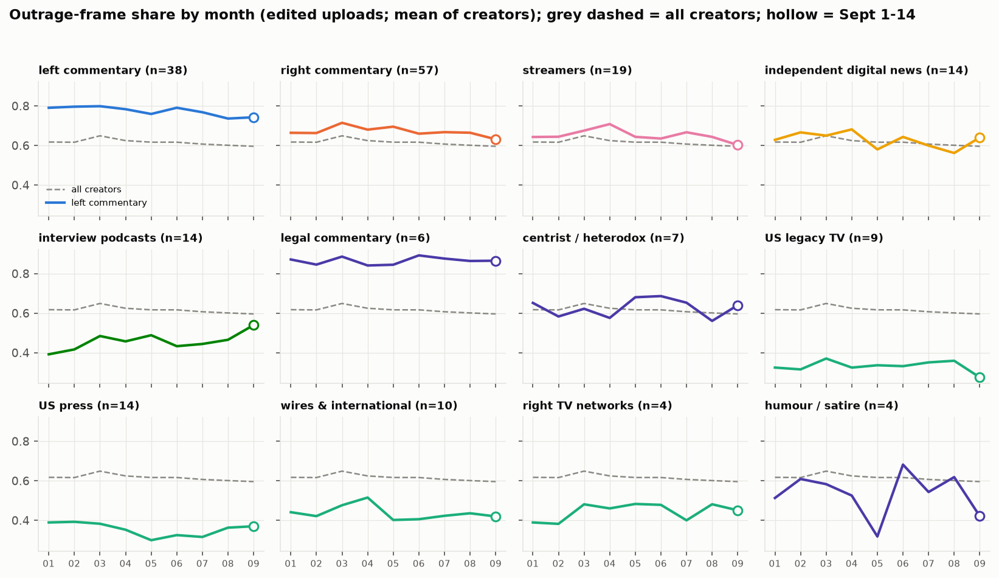
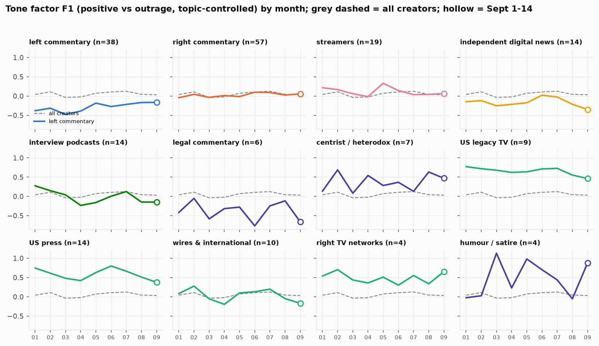
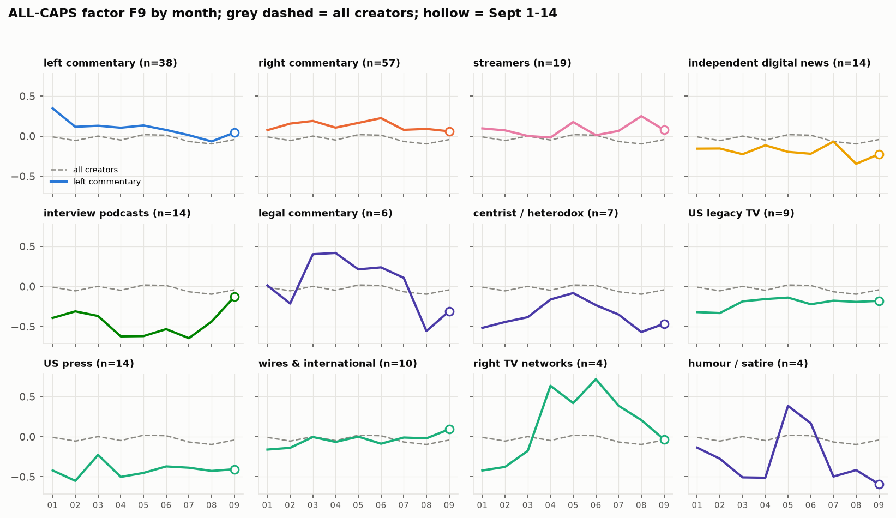

# 6. Drift: how titles changed from January to September

**The question.** Did the landscape's title style move over 2026, and did different lanes move differently? Months are the only safe unit: YouTube listing dates are month-accurate, and September covers the 1st to the 14th only (shown, never compared on volume).

## The finding in one paragraph

Not much, and not in one direction. Of 360 lane x genre x measure series (twelve dimensions and three hooks, nine months), 54 show a monotone trend (|Spearman| >= 0.6, p < 0.05), and they point different ways for different lanes. Averaged over all creators the outrage share of edited uploads is flat (65 % in January, 62 % in August). Underneath, left commentary cooled slightly (outrage 80 % to 79 %, ALL-CAPS score down, tone factor up), while the right TV networks' live streams went the other way (outrage share 27 % to 21 %). Topic turnover is steadier than style: creators re-mix their subjects every month by a similar amount, most in humour and interview podcasts, least in the wires and TV that follow the same news flow.

## Outrage share by month (edited uploads; mean of creators)

*Outrage-frame share by month, one panel per lane, against the all-creator mean (grey dashed).*

| lane | 2026-01 | 2026-02 | 2026-03 | 2026-04 | 2026-05 | 2026-06 | 2026-07 | 2026-08 | 2026-09 |
|---|---|---|---|---|---|---|---|---|---|
| US legacy TV | 0.32 | 0.32 | 0.37 | 0.32 | 0.34 | 0.33 | 0.35 | 0.36 | 0.28 |
| US press | 0.39 | 0.39 | 0.38 | 0.35 | 0.30 | 0.33 | 0.32 | 0.36 | 0.37 |
| all lanes (mean of creators) | 0.62 | 0.62 | 0.65 | 0.62 | 0.62 | 0.62 | 0.61 | 0.60 | 0.60 |
| independent digital news | 0.63 | 0.67 | 0.65 | 0.68 | 0.58 | 0.64 | 0.60 | 0.56 | 0.64 |
| left commentary | 0.79 | 0.80 | 0.80 | 0.78 | 0.76 | 0.79 | 0.77 | 0.74 | 0.74 |
| right commentary | 0.66 | 0.66 | 0.71 | 0.68 | 0.70 | 0.66 | 0.67 | 0.66 | 0.63 |
| streamers | 0.64 | 0.64 | 0.68 | 0.71 | 0.64 | 0.64 | 0.67 | 0.64 | 0.60 |

## Tone factor (F1, positive vs outrage; topic-controlled) by month

*The tone factor by month, per lane.*

| lane | 2026-01 | 2026-02 | 2026-03 | 2026-04 | 2026-05 | 2026-06 | 2026-07 | 2026-08 | 2026-09 |
|---|---|---|---|---|---|---|---|---|---|
| US legacy TV | 0.77 | 0.72 | 0.68 | 0.62 | 0.64 | 0.71 | 0.73 | 0.55 | 0.46 |
| US press | 0.75 | 0.61 | 0.48 | 0.42 | 0.63 | 0.80 | 0.66 | 0.51 | 0.38 |
| all lanes (mean of creators) | 0.04 | 0.11 | -0.04 | -0.02 | 0.07 | 0.11 | 0.12 | 0.04 | 0.03 |
| independent digital news | -0.15 | -0.12 | -0.25 | -0.22 | -0.17 | 0.02 | -0.02 | -0.21 | -0.35 |
| left commentary | -0.38 | -0.32 | -0.48 | -0.39 | -0.18 | -0.27 | -0.22 | -0.17 | -0.17 |
| right commentary | -0.04 | 0.04 | -0.04 | 0.01 | -0.01 | 0.10 | 0.09 | 0.03 | 0.06 |
| streamers | 0.22 | 0.17 | 0.06 | -0.02 | 0.33 | 0.14 | 0.04 | 0.04 | 0.07 |

## ALL-CAPS factor (F9) by month

*The ALL-CAPS factor by month, per lane.*

| lane | 2026-01 | 2026-02 | 2026-03 | 2026-04 | 2026-05 | 2026-06 | 2026-07 | 2026-08 | 2026-09 |
|---|---|---|---|---|---|---|---|---|---|
| US legacy TV | -0.32 | -0.33 | -0.19 | -0.16 | -0.14 | -0.22 | -0.18 | -0.19 | -0.18 |
| US press | -0.42 | -0.55 | -0.23 | -0.50 | -0.45 | -0.37 | -0.39 | -0.43 | -0.41 |
| all lanes (mean of creators) | -0.01 | -0.05 | 0.00 | -0.05 | 0.02 | 0.01 | -0.07 | -0.10 | -0.04 |
| independent digital news | -0.16 | -0.15 | -0.22 | -0.11 | -0.20 | -0.22 | -0.07 | -0.34 | -0.23 |
| left commentary | 0.35 | 0.12 | 0.13 | 0.11 | 0.13 | 0.08 | 0.01 | -0.07 | 0.04 |
| right commentary | 0.08 | 0.16 | 0.19 | 0.11 | 0.17 | 0.23 | 0.08 | 0.09 | 0.06 |
| streamers | 0.10 | 0.07 | 0.00 | -0.02 | 0.18 | 0.01 | 0.07 | 0.25 | 0.08 |

## The trends that are strong enough to report

| group | genre | measure | spearman_trend | first_month_value | last_full_month_value |
|---|---|---|---|---|---|
| US legacy TV | streams | F3: Labelled live/formulaic headline | -0.92 | 1.41 | 0.33 |
| US legacy TV | streams | F5: Question and explainer framing | 0.85 | -0.37 | 0.10 |
| US legacy TV | streams | F6: Person-centred | 0.78 | -0.14 | 0.22 |
| US legacy TV | streams | F7: Descriptive news prose vs title-case | -0.78 | 1.30 | 1.07 |
| US legacy TV | streams | F8: Numeric and dated | 0.70 | -0.49 | -0.30 |
| US legacy TV | streams | F9: ALL-CAPS shouting | 0.87 | -0.60 | -0.18 |
| US legacy TV | streams | F10: Quoted speech | 0.73 | -0.82 | -0.68 |
| US legacy TV | streams | outrage | -0.83 | 0.15 | 0.09 |
| US press | streams | F2: Clause headline vs noun-phrase | 0.77 | -1.00 | 0.39 |
| US press | streams | F7: Descriptive news prose vs title-case | 0.90 | -0.00 | 1.97 |
| US press | streams | F8: Numeric and dated | 0.93 | -0.12 | 0.47 |
| US press | streams | F9: ALL-CAPS shouting | 0.75 | -0.94 | -0.74 |
| US press | streams | F10: Quoted speech | 0.88 | -1.11 | -0.38 |
| US press | videos | F5: Question and explainer framing | 0.67 | 0.87 | 1.80 |
| centrist / heterodox | streams | F8: Numeric and dated | 0.79 | -0.61 | -0.17 |
| explainers / geopolitics | videos | F2: Clause headline vs noun-phrase | 0.67 | -1.53 | -0.63 |
| independent digital news | streams | F2: Clause headline vs noun-phrase | -0.77 | -0.53 | -0.72 |
| independent digital news | streams | outrage | -0.78 | 0.69 | 0.63 |
| interview podcasts | streams | F11: Long, upbeat, abstract | -0.72 | -0.69 | -0.84 |
| interview podcasts | videos | F2: Clause headline vs noun-phrase | 0.87 | -0.60 | -0.37 |
| interview podcasts | videos | F11: Long, upbeat, abstract | 0.70 | -0.50 | -0.32 |
| interview podcasts | videos | curiosity_gap | 0.70 | 0.00 | 0.02 |
| left commentary | streams | F6: Person-centred | 0.75 | 0.63 | 0.99 |
| left commentary | videos | F1: Positive tone vs outrage | 0.82 | -0.38 | -0.17 |
| left commentary | videos | F5: Question and explainer framing | -0.72 | 0.07 | 0.06 |
| left commentary | videos | F8: Numeric and dated | 0.72 | -0.17 | -0.11 |
| left commentary | videos | F9: ALL-CAPS shouting | -0.83 | 0.35 | -0.07 |
| left commentary | videos | F11: Long, upbeat, abstract | -0.77 | -0.03 | -0.16 |
| left commentary | videos | outrage | -0.75 | 0.79 | 0.74 |
| legal commentary | streams | F1: Positive tone vs outrage | -0.93 | -0.88 | -1.93 |
| legal commentary | videos | F4: Conversational stream talk | 0.67 | -0.22 | -0.14 |
| right TV networks | streams | F2: Clause headline vs noun-phrase | 0.75 | -1.15 | -0.31 |
| right TV networks | streams | F4: Conversational stream talk | -0.80 | -0.25 | -0.40 |
| right TV networks | streams | F5: Question and explainer framing | -0.72 | 0.25 | -0.32 |
| right TV networks | streams | F9: ALL-CAPS shouting | 0.73 | 0.58 | 1.68 |
| right TV networks | streams | outrage | 0.83 | 0.21 | 0.42 |
| right TV networks | videos | F3: Labelled live/formulaic headline | -0.88 | 0.77 | 0.62 |
| right TV networks | videos | F4: Conversational stream talk | -0.67 | -0.26 | -0.33 |
| right TV networks | videos | F5: Question and explainer framing | -0.78 | -0.16 | -0.40 |
| right TV networks | videos | F10: Quoted speech | -0.73 | 0.45 | -0.06 |
| right TV networks | videos | curiosity_gap | -0.78 | 0.02 | 0.01 |
| right commentary | streams | F8: Numeric and dated | -0.88 | 1.59 | -0.27 |
| right commentary | streams | curiosity_gap | 0.90 | 0.00 | 0.04 |
| right commentary | videos | F5: Question and explainer framing | -0.78 | 0.27 | 0.12 |
| right commentary | videos | F10: Quoted speech | 0.68 | -0.36 | -0.24 |
| streamers | videos | F3: Labelled live/formulaic headline | 0.68 | -0.44 | -0.34 |
| wires & international | streams | F7: Descriptive news prose vs title-case | -0.98 | 0.27 | 0.04 |
| wires & international | streams | F9: ALL-CAPS shouting | 0.85 | -0.45 | -0.24 |
| wires & international | streams | F10: Quoted speech | 0.72 | -0.11 | 0.17 |
| wires & international | videos | F3: Labelled live/formulaic headline | 0.87 | -0.35 | -0.22 |
| wires & international | videos | F6: Person-centred | 0.77 | -0.26 | -0.20 |
| wires & international | videos | F7: Descriptive news prose vs title-case | -0.87 | 0.90 | 0.65 |
| wires & international | videos | F8: Numeric and dated | 0.73 | 0.18 | 0.22 |
| wires & international | videos | curiosity_gap | 0.75 | 0.03 | 0.03 |

Read these with the lane sizes in mind: right TV networks are four channels, legal commentary eight, so a "lane trend" there can be one channel changing its stream titling (RSBN's date stamps, for instance). Per-creator trends for the thirty largest creators are in `drift_trends.csv` (level = creator) and every creator's monthly series is on its card as sparkline data (`drift_creator_monthly.csv`).

## Month-to-month topic change

Jensen-Shannon distance between a creator's topic mix in consecutive months (months with at least 15 titles), averaged per lane over the year:

| lane | mean month-to-month JS distance |
|---|---|
| wires & international | 0.45 |
| US legacy TV | 0.54 |
| left commentary | 0.60 |
| legal commentary | 0.61 |
| right TV networks | 0.61 |
| US press | 0.63 |
| independent digital news | 0.64 |
| streamers | 0.67 |
| explainers / geopolitics | 0.68 |
| right commentary | 0.69 |
| centrist / heterodox | 0.71 |
| interview podcasts | 0.72 |
| humour / satire | 0.88 |

The ordering is the inverse of news dependence: the wires and legacy TV move least because the news moves them all the same way; humour and interview podcasts move most because each episode is its own subject. The monthly matrix is in `topic_change_lane_monthly.csv`.

## Caveats

- Nine points per series is a short run; a trend that begins in March can look strong. The strong-trend table should be read as "worth a look", not as a finding on its own.
- September is a half month and appears in the tables for completeness; no volume comparison uses it.

Files: `drift_lane_monthly.csv`, `drift_creator_monthly.csv`, `drift_top30_monthly.csv`, `drift_trends.csv`, `topic_change_monthly.csv`, `topic_change_lane_monthly.csv`.
