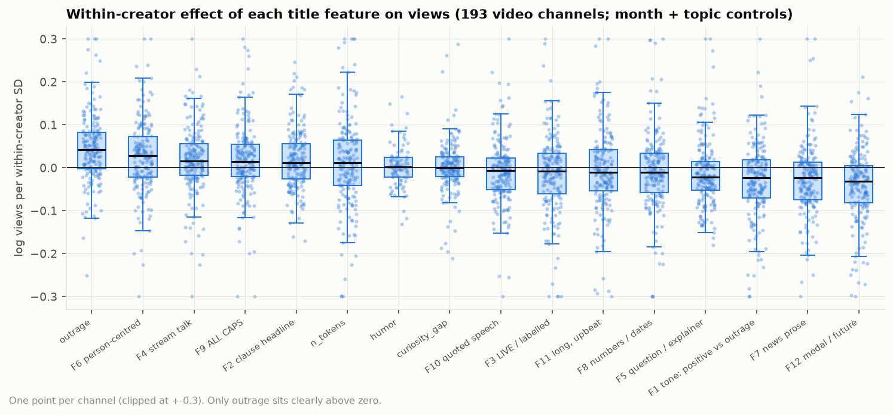
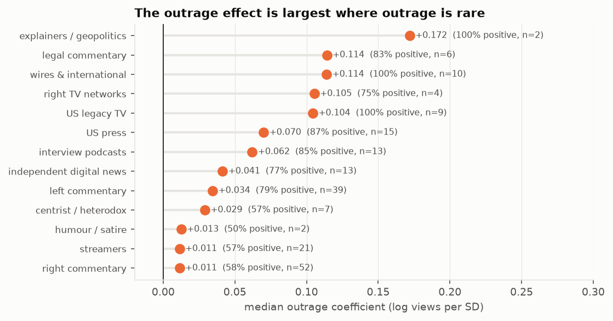
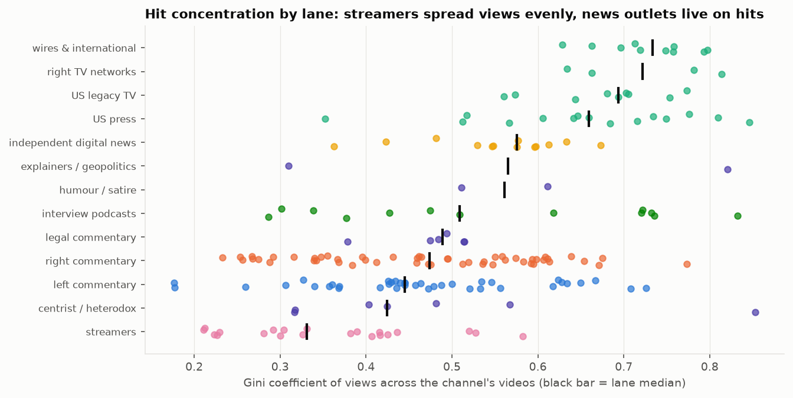
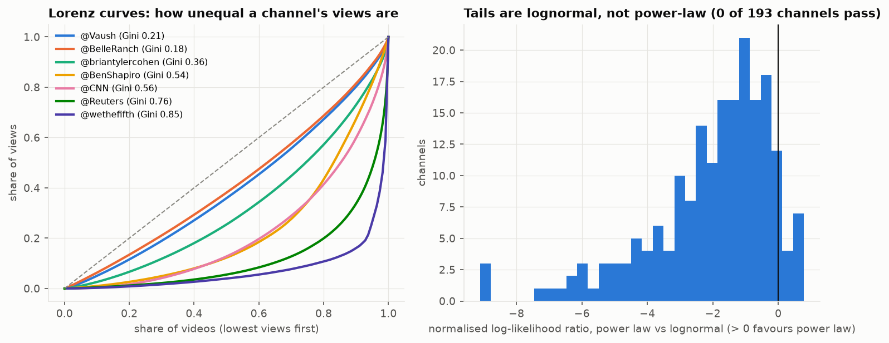

# 7. Views: does title style predict engagement, and how concentrated are hits?

**The question.** Within a channel, do titles with more outrage, more capitals, a question, a name, a longer length get more views once the story and the month are held fixed? And how unequal are a channel's views across its videos?

## The finding in one paragraph

Within creator, the outrage frame is the only title feature that predicts views with a consistent sign. For each of the 193 channels with at least 100 edited uploads carrying a view count, log views were regressed on the title's twelve factor scores, its hook labels and its length, with publish-month and topic dummies as controls; predictors are standardised within the channel. The outrage coefficient is positive for 73 % of channels, significant and positive for 24 %, significant and negative for 1 %, median +0.042 log views per standard deviation (a few per cent more views for a one-SD more outraged title). Every other predictor has a median effect at or below 0.03 in absolute value with sign agreement between 50 % and 70 % across channels, which is a null result at this sample size. Views are concentrated (median Gini 0.51; the top 10 % of a channel's videos take 38 % of its views) but the tail is not a power law: the Clauset-Shalizi-Newman likelihood-ratio test prefers a lognormal in 193 of 193 video channels. Concentration tracks channel size more than style.

## Within-creator effects, edited uploads (median over channels)

*Per-channel coefficients for every title feature; boxes show the spread across channels, the black line the median.*

Coefficient = change in log(1 + views) per one within-channel standard deviation of the predictor; `share_positive` = share of channels with a positive coefficient; `share_sig_*` at p < 0.05 (HC3).

| predictor | n_creators | median_coef_per_sd | q25 | q75 | share_positive | share_sig_positive | share_sig_negative | median_r2 |
|---|---|---|---|---|---|---|---|---|
| F1: Positive tone vs outrage | 193.000 | -0.023 | -0.070 | 0.019 | 0.352 | 0.021 | 0.187 | 0.296 |
| F10: Quoted speech | 193.000 | -0.006 | -0.050 | 0.023 | 0.425 | 0.036 | 0.124 | 0.296 |
| F11: Long, upbeat, abstract | 193.000 | -0.010 | -0.054 | 0.042 | 0.430 | 0.067 | 0.109 | 0.296 |
| F12: Modal and future speculation | 193.000 | -0.031 | -0.081 | 0.005 | 0.295 | 0.026 | 0.145 | 0.296 |
| F2: Clause headline vs noun-phrase | 193.000 | 0.011 | -0.026 | 0.056 | 0.611 | 0.104 | 0.031 | 0.296 |
| F3: Labelled live/formulaic headline | 193.000 | -0.008 | -0.061 | 0.034 | 0.435 | 0.104 | 0.078 | 0.296 |
| F4: Conversational stream talk | 193.000 | 0.016 | -0.017 | 0.056 | 0.663 | 0.119 | 0.047 | 0.296 |
| F5: Question and explainer framing | 193.000 | -0.022 | -0.052 | 0.015 | 0.368 | 0.062 | 0.104 | 0.296 |
| F6: Person-centred | 193.000 | 0.028 | -0.022 | 0.072 | 0.637 | 0.150 | 0.036 | 0.296 |
| F7: Descriptive news prose vs title-case | 193.000 | -0.023 | -0.075 | 0.012 | 0.347 | 0.073 | 0.119 | 0.296 |
| F8: Numeric and dated | 193.000 | -0.011 | -0.058 | 0.034 | 0.425 | 0.073 | 0.093 | 0.296 |
| F9: ALL-CAPS shouting | 193.000 | 0.014 | -0.020 | 0.055 | 0.596 | 0.088 | 0.036 | 0.296 |
| curiosity_gap | 185.000 | 0.000 | -0.020 | 0.025 | 0.503 | 0.016 | 0.027 | 0.294 |
| humor | 92.000 | 0.002 | -0.021 | 0.024 | 0.533 | 0.076 | 0.033 | 0.255 |
| n_tokens | 193.000 | 0.011 | -0.041 | 0.065 | 0.549 | 0.140 | 0.088 | 0.296 |
| outrage | 193.000 | 0.042 | -0.003 | 0.082 | 0.731 | 0.238 | 0.010 | 0.296 |

Live VODs (n = 59 channels) show the same picture, outrage +0.044 with 75 % positive, everything else near zero.

## The outrage effect by lane (edited uploads)

*Median outrage coefficient per lane with the share of channels where it is positive.*

| lane | n_creators | median_coef_per_sd | share_positive | share_sig_positive |
|---|---|---|---|---|
| explainers / geopolitics | 2.000 | 0.172 | 1.000 | 0.500 |
| legal commentary | 6.000 | 0.114 | 0.833 | 0.500 |
| wires & international | 10.000 | 0.114 | 1.000 | 0.800 |
| right TV networks | 4.000 | 0.105 | 0.750 | 0.750 |
| US legacy TV | 9.000 | 0.104 | 1.000 | 0.889 |
| US press | 15.000 | 0.070 | 0.867 | 0.267 |
| interview podcasts | 13.000 | 0.062 | 0.846 | 0.154 |
| independent digital news | 13.000 | 0.041 | 0.769 | 0.154 |
| left commentary | 39.000 | 0.034 | 0.795 | 0.231 |
| centrist / heterodox | 7.000 | 0.029 | 0.571 | 0.000 |
| humour / satire | 2.000 | 0.013 | 0.500 | 0.000 |
| streamers | 21.000 | 0.011 | 0.571 | 0.048 |
| right commentary | 52.000 | 0.011 | 0.577 | 0.096 |

The effect is largest and most consistent where outrage is *rare*: the wires, legacy TV, the press, legal commentary and interview podcasts. In left commentary, where three quarters of titles already carry the frame, it is smaller; in right commentary and among streamers it is close to nothing. That is what a saturating device looks like: it lifts a title above a neutral baseline, and lifts nothing when every title has it.

## What the model does and does not say

- Views are a snapshot taken at fetch time (2026-09-14): a January video has had eight months to accumulate views, a September one two weeks. The month dummies absorb this within a channel, so the coefficients compare titles published in the same month, but they describe views-to-date, not lifetime views.
- Subscriber normalisation changes nothing here: log(views / subscribers) is log(views) minus a constant within a channel, so every slope is identical; subscriber counts are reported beside the coefficients instead.
- Median R2 is 0.30: month and topic explain a fair share of within-channel views; title style, on top of them, explains little.
- Rumble channels have no view counts and are absent; the platform therefore never enters the engagement or concentration results.

Specification: `engagement_model.json`; per-channel coefficients: `engagement_coefficients.csv`.

## Hit concentration

*Gini coefficient of views per channel, grouped by lane.*

Per channel x genre with at least 100 videos carrying views (all rows, repeats included: a re-uploaded live loop is a separate video with its own views).

| lane | n | median_gini | median_top10_share |
|---|---|---|---|
| streamers | 21 | 0.33 | 0.26 |
| centrist / heterodox | 7 | 0.42 | 0.33 |
| left commentary | 39 | 0.45 | 0.34 |
| right commentary | 52 | 0.47 | 0.35 |
| legal commentary | 6 | 0.49 | 0.36 |
| interview podcasts | 13 | 0.51 | 0.39 |
| humour / satire | 2 | 0.56 | 0.46 |
| explainers / geopolitics | 2 | 0.57 | 0.50 |
| independent digital news | 13 | 0.58 | 0.43 |
| US press | 15 | 0.66 | 0.54 |
| US legacy TV | 9 | 0.69 | 0.54 |
| right TV networks | 4 | 0.72 | 0.62 |
| wires & international | 10 | 0.73 | 0.63 |

Streamers and daily left commentators spread views most evenly (Gini 0.18-0.33 for Tariq Nasheed, Belle of the Ranch, Vaush, the Hasan VOD channel); the wires, legacy TV, the press and the right TV networks are the most hit-driven (median Gini 0.66-0.73; Real America's Voice, Politicon, Axios and The Fifth Column above 0.81, the top tenth of their videos taking three quarters of their views).

*Left: Lorenz curves for seven channels. Right: the likelihood-ratio statistic of the power-law fit against a lognormal across all video channels.*

## Zipf's law for views

The rank-size view of the same distributions: within each channel, videos ranked by views, plotted on log-log axes. A straight line would be Zipf's law (views proportional to rank to a negative power); the curves instead bend downwards in the tail, which is what a lognormal looks like on these axes and what the formal test below confirms. The slope of log views on log rank over all of a channel's videos summarises how steeply views fall off down the ranking: the lane pattern follows the Gini ordering, shallow for streamers and daily left commentary, steep for the wires and legacy TV. Per-channel slopes (all videos, and the top decile only) are in `hit_concentration.csv` (`zipf_views_all`, `zipf_views_head`).

*Left: rank-size curves for eight channels, each normalised to its own top video. Right: the all-video Zipf slope per channel, grouped by lane.*

**Power law or not.** The `powerlaw` fit (discrete, xmin by KS minimisation) with the likelihood-ratio test against a lognormal supports a power-law tail in 0 of 193 video channels and 1 of 59 stream channels; the ratio even points towards the power law in only 6 % of video channels. Hits are heavy-tailed but lognormal-shaped, so no channel here should be described as having a power-law audience.

## Does style go with concentration?

Spearman correlations across channels, lane-demeaned (so a lane's overall level cannot drive them), edited uploads, p < 0.05 only:

| target | predictor | n_creators | spearman_r | p |
|---|---|---|---|---|
| gini | log_subscribers | 193 | -0.305 | 0.000 |
| gini | outrage | 193 | -0.274 | 0.000 |
| gini | F9: ALL-CAPS shouting | 193 | -0.153 | 0.034 |
| gini | F8: Numeric and dated | 193 | 0.148 | 0.040 |
| gini | F6: Person-centred | 193 | 0.182 | 0.011 |
| gini | F5: Question and explainer framing | 193 | 0.223 | 0.002 |
| top10_share | log_subscribers | 193 | -0.324 | 0.000 |
| top10_share | outrage | 193 | -0.281 | 0.000 |
| top10_share | F9: ALL-CAPS shouting | 193 | -0.159 | 0.027 |
| top10_share | F1: Positive tone vs outrage | 193 | 0.154 | 0.033 |
| top10_share | F6: Person-centred | 193 | 0.157 | 0.029 |
| top10_share | F5: Question and explainer framing | 193 | 0.199 | 0.006 |

The strongest correlate is size: channels with more subscribers are *less* concentrated (rho about -0.3), and channels whose titles are more outrage-framed are less concentrated too, partly because those are the daily commentary channels whose audiences turn up for everything. Question framing and person-centred titles go with slightly more concentration. All of these are weak (|rho| <= 0.32) and observational.

Files: `engagement_coefficients.csv`, `engagement_summary.csv`, `engagement_model.json`, `hit_concentration.csv`, `hit_concentration_correlations.csv`.
