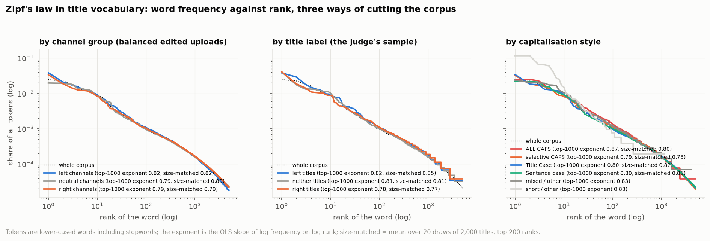
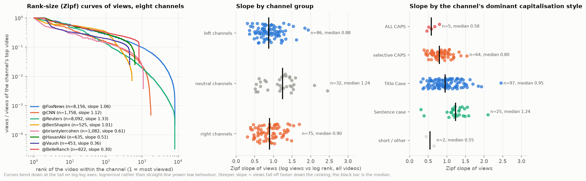
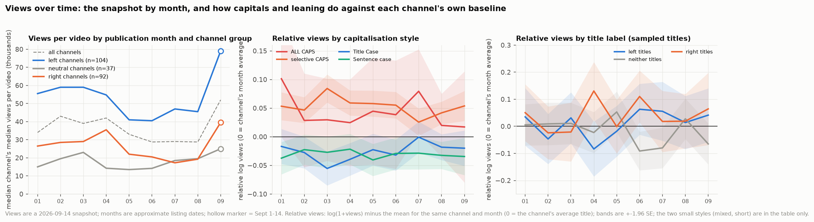
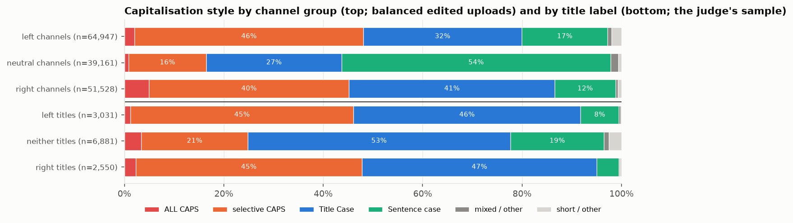

# 7. Zipf's law, and views over time

**The question.** Does title vocabulary follow Zipf's law, and does the shape of the law differ between left, neutral and right channels, between titles the judge read as left, neither or right, and between capitalisation styles? Do views within a channel follow a Zipf (rank-size) law? And how do views run over the months of 2026, again cut by channel group, by title label and by capitalisation style?

Three groupings run through the whole document. **Channel group**: left / neutral / right channels, each channel's title-leaning score from document 14 (thresholds ±0.05). **Title label**: left / neither / right, the judge's label of each sampled title (document 14; 12,462 of the 12,478 sampled titles are edited uploads and are used here). **Capitalisation style**: ALL CAPS, selective CAPS, Title Case, Sentence case, mixed / other and short / other, one rule per title (document 11).

## The finding in one paragraph

Title vocabulary is Zipfian in the way short texts usually are: on log-log axes the rank-frequency curve is straight through the head (R² 0.995 over the top 1,000 words) with an exponent that depends on the cut-off (0.78 over the top 1,000 words, 1.01 over the top 5,000), because ten-word titles have a flatter head than running prose. The three ways of cutting the corpus move the curve less than they move the words on it. Left channels have the steepest vocabulary (size-matched exponent 0.82 against 0.79 for the right group): "trump" is their most frequent word, ahead of "the". Among the labelled titles the left-read ones are again the most concentrated (0.85) and the right-read ones the least (0.77). ALL-CAPS titles are the shortest (6.2 tokens against 11.2 for sentence case) and their head is the flattest, with "this", "it" and "they" among the ten most frequent words: the shouted title is a reaction, not a headline. Views within a channel are *not* Zipfian: the rank-size curve bends down in the tail, the power-law fit is never significantly preferred to a lognormal (0 of 193 video channels; the lognormal is significantly preferred in 79 and the test is inconclusive in the rest), and the neutral group is the most hit-driven (median Gini 0.67 against 0.49 and 0.49). Over the months, views per video are a snapshot that favours older uploads, and the left group's channels sit far above the other two in every month (median channel 50k views per video against about 20k for the right group and 20k for the neutral). Against each channel's own monthly baseline, capitals earn views in every month of the year (ALL CAPS +0.04 and selective CAPS +0.05 log points, Title Case -0.03, sentence case -0.03), and right-read titles do a little better than left-read ones, which do a little better than neither (+0.04, +0.01, -0.02).

## Zipf's law in title vocabulary

*Word frequency against rank on log-log axes, three ways of cutting the corpus; the dotted black line is the whole corpus.*

Tokens are lower-cased words from the normalised title, stopwords included (Zipf's law is a statement about the whole vocabulary). Systems differ in size, and the OLS exponent depends on size, so two exponents are given: over the top 1,000 ranks of the whole system, and *size-matched* (the mean over 20 random draws of 2,000 titles, top 200 ranks), which is the one to compare across rows.

| grouping | system | n_titles | n_tokens | n_types | tokens_per_title | zipf_top100 | zipf_top1000 | zipf_top5000 | zipf_r2_top1000 | zipf_size_matched | top1_share | top_10 |
|---|---|---|---|---|---|---|---|---|---|---|---|---|
| corpus | all edited uploads (balanced) | 155636 | 1612982 | 48959 | 10.360 | 0.859 | 0.785 | 1.014 | 0.995 | 0.813 | 0.025 | the trump to in on of s is iran and |
| channel_group | left channels | 64947 | 618335 | 26834 | 9.520 | 0.857 | 0.824 | 1.087 | 0.996 | 0.818 | 0.038 | trump the to in as on s is of iran |
| channel_group | neutral channels | 39161 | 442699 | 28903 | 11.300 | 0.848 | 0.792 | 1.006 | 0.995 | 0.801 | 0.020 | in to the of trump on iran s for us |
| channel_group | right channels | 51528 | 551948 | 27779 | 10.710 | 0.828 | 0.786 | 1.023 | 0.996 | 0.786 | 0.034 | the to in is of trump on and a s |
| title_label | left titles | 3031 | 29617 | 6005 | 9.770 | 0.859 | 0.818 | 0.997 | 0.995 | 0.847 | 0.038 | trump the to is s in on of and as |
| title_label | right titles | 2550 | 26617 | 6104 | 10.440 | 0.769 | 0.775 | 0.965 | 0.996 | 0.773 | 0.041 | the to is on trump in of and for s |
| title_label | neither titles | 6881 | 62974 | 11081 | 9.150 | 0.864 | 0.811 | 0.964 | 0.996 | 0.815 | 0.040 | the to in is of a on s and trump |
| caps_style | ALL CAPS | 4163 | 25992 | 4936 | 6.240 | 0.764 | 0.875 | 0.990 | 0.994 | 0.795 | 0.025 | the is trump this to it in they iran s |
| caps_style | selective CAPS | 56805 | 592182 | 26654 | 10.420 | 0.808 | 0.794 | 1.067 | 0.997 | 0.782 | 0.032 | trump the to in as on s is of iran |
| caps_style | Title Case | 52644 | 543500 | 30226 | 10.320 | 0.852 | 0.795 | 1.015 | 0.996 | 0.824 | 0.034 | the trump to s in on of is and a |
| caps_style | Sentence case | 38729 | 431875 | 28270 | 11.150 | 0.863 | 0.796 | 1.012 | 0.995 | 0.812 | 0.022 | to in the of trump on iran and for s |
| caps_style | mixed / other | 1334 | 14193 | 4133 | 10.640 | 0.831 | 0.832 | 0.817 | 0.988 |  | 0.024 | in a the to s i of u this is |
| caps_style | short / other | 1961 | 5240 | 1123 | 2.670 | 1.256 | 0.827 | 0.776 | 0.864 |  | 0.117 | tyt hour episode 1 2 bonus 26 full hasanabi 2026 |

Three things to read off the table. The corpus exponent over the top 100 words (0.86) is higher than over the top 1,000 (0.78) and lower than over the top 5,000 (1.01): the head of a title vocabulary is flat because titles ration function words, and the tail is steep because a 155k-title corpus has a long list of names used once (the Stage 0 check on the balanced subset with streams included, `zipf_check.csv`, gives the same three figures). The left group is the most concentrated of the three channel groups and the left-read titles the most concentrated of the three labels, and "trump" heads both lists (3.8% of the left group's tokens, 3.8% of the left-read titles'), whereas the neutral group and the neither-read titles start with "the" and "in"; the right-read titles are the flattest system in the corpus, their most frequent words being the function words of a headline ("the", "to", "is", "on") with "trump" fifth. The capitalisation styles differ in length more than in slope; the ALL-CAPS system is the exception, with the lowest top-100 exponent (0.76) and the highest top-1,000 exponent (0.87): a small, repetitive vocabulary of reaction words with a very short tail.

Creator-level exponents (each channel's own vocabulary, top 200 ranks, from the Stage 0 check; and the subsampled Zipf and Heaps exponents of Stage 2, which exist only for the `n_creators_1500` channels with at least 1,500 tokens) averaged per group tell the same story from the channel side, with the ranked channels' dominant capitalisation style as a second cut:

| grouping | group | n_creators | zipf_words_top200_mean | zipf_words_top200_median | n_creators_1500 | zipf_words_1500_mean | heaps_beta_1500_mean | top1_word_share_mean |
|---|---|---|---|---|---|---|---|---|
| channel_group | left channels | 105 | 0.797 | 0.791 | 72 | 0.724 | 0.810 | 0.050 |
| channel_group | neutral channels | 38 | 0.789 | 0.809 | 25 | 0.712 | 0.843 | 0.043 |
| channel_group | right channels | 96 | 0.750 | 0.757 | 67 | 0.690 | 0.827 | 0.046 |
| dominant_caps_style | ALL CAPS | 7 | 0.735 | 0.740 | 5 | 0.692 | 0.814 | 0.036 |
| dominant_caps_style | selective CAPS | 74 | 0.784 | 0.791 | 63 | 0.701 | 0.809 | 0.046 |
| dominant_caps_style | Title Case | 126 | 0.763 | 0.761 | 75 | 0.713 | 0.828 | 0.050 |
| dominant_caps_style | Sentence case | 30 | 0.830 | 0.835 | 21 | 0.718 | 0.843 | 0.042 |

Channels whose titles are mostly sentence case (the news outlets) have the steepest own vocabularies and the fastest-growing ones (Heaps' β 0.84); channels that shout have the flattest.

## Zipf's law for views

*Left: rank-size curves for eight channels, each normalised to its own top video. Middle and right: the all-video Zipf slope per channel, by channel group and by the channel's dominant capitalisation style.*

Within each channel, videos ranked by views on log-log axes: a straight line would be Zipf's law for views (views proportional to rank to a negative power). The curves instead bend downwards in the tail, which is what a lognormal looks like on these axes and what the formal test confirms: the `powerlaw` fit (discrete, xmin by KS minimisation) with the likelihood-ratio test against a lognormal supports a power-law tail in 0 of 193 video channels. Hits are heavy-tailed but lognormal-shaped, so no channel here should be described as having a power-law audience. The slope of log views on log rank over all of a channel's videos still summarises how steeply views fall off down the ranking (per channel in `hit_concentration.csv`, `zipf_views_all` and `zipf_views_head`), and it lines up with the Gini coefficient and the top-10 % share:

| grouping | group | n_creators_with_views | zipf_views_all_median | zipf_views_head_median | gini_median | top10_share_median | powerlaw_like_share | caps_any_mean |
|---|---|---|---|---|---|---|---|---|
| channel_group | left channels | 86 | 0.876 | 0.425 | 0.494 | 0.373 | 0.000 | 0.375 |
| channel_group | neutral channels | 32 | 1.244 | 0.603 | 0.670 | 0.538 | 0.000 | 0.181 |
| channel_group | right channels | 75 | 0.898 | 0.419 | 0.495 | 0.361 | 0.000 | 0.403 |
| dominant_caps_style | ALL CAPS | 5 | 0.583 | 0.312 | 0.347 | 0.263 | 0.000 | 0.774 |
| dominant_caps_style | selective CAPS | 64 | 0.797 | 0.383 | 0.459 | 0.346 | 0.000 | 0.748 |
| dominant_caps_style | Title Case | 97 | 0.951 | 0.468 | 0.536 | 0.404 | 0.000 | 0.173 |
| dominant_caps_style | Sentence case | 25 | 1.236 | 0.634 | 0.681 | 0.557 | 0.000 | 0.070 |

The neutral group is the hit-driven one: its channels' views fall off fastest down the ranking (median slope 1.24; the top tenth of videos take 54 % of views). Left and right channels are nearly identical to each other (0.88 and 0.90) and much flatter: the daily commentary audience turns up for everything. The same ordering appears by capitalisation: channels that mostly shout spread views most evenly, sentence-case channels live on hits. Both patterns are the same fact seen twice, because the neutral group is where the sentence-case news outlets are.

## Views over time

*Left: the median over channels of the channel's median views per video, by publication month and channel group. Middle and right: log views relative to the same channel's average in the same month, by capitalisation style and by title label; bands are ±1.96 standard errors.*

Views are a snapshot taken at fetch time (2026-09-14) and months are YouTube's approximate listing dates, so the monthly curve mixes age with season: a January video has had eight months to accumulate views, and the last, half month holds the newest uploads still in their first weeks. That half month also shows the highest medians of the year, which says more about how fast a video collects its first views and about the approximate dating (anything listed as "weeks ago" lands at the start of September) than about September itself. Read the left panel as a comparison *between* groups within a month, not as growth over time. The median channel in the left group draws 1.5 to 2.5 times the views of the median channel in the next group in every month of the year:

| group | 2026-01 | 2026-02 | 2026-03 | 2026-04 | 2026-05 | 2026-06 | 2026-07 | 2026-08 | 2026-09 |
|---|---|---|---|---|---|---|---|---|---|
| all channels | 34,000 | 43,000 | 39,000 | 42,000 | 33,000 | 28,750 | 29,000 | 28,750 | 52,000 |
| left channels | 55,500 | 59,000 | 59,000 | 54,750 | 41,000 | 40,500 | 47,000 | 45,500 | 79,000 |
| neutral channels | 15,000 | 19,500 | 23,000 | 14,250 | 13,500 | 14,175 | 18,500 | 19,500 | 25,000 |
| right channels | 26,500 | 28,500 | 29,000 | 35,500 | 22,000 | 20,500 | 17,250 | 19,250 | 39,500 |

Within a channel the age effect cancels: **relative log views** is log(1 + views) minus the mean log(1 + views) of the same channel's videos in the same month, so 0 is the channel's average title that month and +0.05 is roughly 5 % more views than that average. By construction the three channel groups average 0 on it; capitalisation styles and title labels do not.

**By capitalisation style.** Capitals beat a channel's own baseline in every month of the year, and the two lower-case styles fall below it in every month:

| group | 2026-01 | 2026-02 | 2026-03 | 2026-04 | 2026-05 | 2026-06 | 2026-07 | 2026-08 | 2026-09 |
|---|---|---|---|---|---|---|---|---|---|
| ALL CAPS | +0.101 | +0.029 | +0.030 | +0.025 | +0.045 | +0.038 | +0.079 | +0.020 | +0.017 |
| selective CAPS | +0.053 | +0.047 | +0.084 | +0.059 | +0.058 | +0.055 | +0.025 | +0.042 | +0.054 |
| Title Case | -0.017 | -0.028 | -0.055 | -0.039 | -0.023 | -0.032 | -0.001 | -0.018 | -0.020 |
| Sentence case | -0.037 | -0.022 | -0.027 | -0.022 | -0.041 | -0.029 | -0.029 | -0.033 | -0.035 |
| mixed / other | +0.031 | +0.157 | -0.008 | -0.065 | +0.010 | +0.035 | +0.008 | +0.107 | -0.052 |
| short / other | +0.134 | +0.157 | +0.266 | +0.149 | +0.458 | +0.230 | +0.182 | +0.238 | +0.066 |

Over the year: ALL CAPS +0.040, selective CAPS +0.052, Title Case -0.026, Sentence case -0.030 (standard errors 0.014 for ALL CAPS and at most 0.005 for the three big styles). The effect is modest (a few per cent) but it is the most consistent title-level signal in the corpus, holding month after month and inside channels rather than between them; the twelve-factor regression with month *and topic* controls (all_tables.md, stage 5) gives the ALL-CAPS factor F9 a median coefficient of +0.014 log views per within-channel SD, positive for 60 % of channels: the same sign, smaller once the subject is held fixed. "Short / other" titles (966 videos, mostly numbered episodes and one-word titles) sit far above baseline, but that is a format effect, not a capitalisation one.

**By title label.** Over the 11,790 sampled titles with view counts, right-read titles outperform their channel's monthly average, left-read titles sit at it and neither-read titles fall just below; the differences are small, only the right-read figure clears two standard errors, and the monthly series is noisy (a few hundred titles per label per month):

| group | 2026-01 | 2026-02 | 2026-03 | 2026-04 | 2026-05 | 2026-06 | 2026-07 | 2026-08 | 2026-09 |
|---|---|---|---|---|---|---|---|---|---|
| left titles | +0.035 | -0.047 | +0.031 | -0.084 | -0.018 | +0.063 | +0.056 | +0.014 | +0.041 |
| neither titles | +0.005 | +0.009 | +0.011 | -0.023 | +0.053 | -0.091 | -0.080 | +0.028 | -0.065 |
| right titles | +0.050 | -0.024 | -0.021 | +0.131 | -0.001 | +0.110 | +0.018 | +0.019 | +0.064 |

Over the year: right +0.038 (SE 0.018), left +0.009, neither -0.016. Partisan wording, in other words, does about what capitals do, and the two overlap: 46 % of left-read and 48 % of right-read titles carry ALL or selective CAPS, against 25 % of neither-read ones.

## How the three cuts overlap

*Capitalisation style shares by channel group (balanced edited uploads) and by title label (the judge's sample).*

| grouping | group | n_titles | ALL CAPS | selective CAPS | Title Case | Sentence case | mixed / other | short / other | ALL + selective |
|---|---|---|---|---|---|---|---|---|---|
| channel_group | left channels | 64947 | 0.02 | 0.46 | 0.32 | 0.17 | 0.01 | 0.02 | 0.48 |
| channel_group | neutral channels | 39161 | 0.01 | 0.16 | 0.27 | 0.54 | 0.01 | 0.01 | 0.17 |
| channel_group | right channels | 51528 | 0.05 | 0.40 | 0.41 | 0.12 | 0.00 | 0.01 | 0.45 |
| title_label | left titles | 3031 | 0.01 | 0.45 | 0.46 | 0.08 | 0.00 | 0.00 | 0.46 |
| title_label | right titles | 2550 | 0.02 | 0.45 | 0.47 | 0.04 | 0.00 | 0.00 | 0.48 |
| title_label | neither titles | 6881 | 0.03 | 0.21 | 0.53 | 0.19 | 0.01 | 0.03 | 0.25 |

Left and right channels shout at the same rate (48 % and 45 % of titles with capitals); the neutral group is sentence case (54 %). The left group leans to selective CAPS (46 % of titles), the right group splits between Title Case (41 %) and selective CAPS (40 %); sentence case is 17 % and 12 %. Crossing the labelled titles with their style shows where the judge's labels come from: selective CAPS is the partisan style (63 % of its labelled titles read left or right), while ALL CAPS, Title Case and sentence case read as "neither" 71 %, 58 % and 79 % of the time (a fully shouted title is as often a reaction to an event as a stance on it), and within each style the right-read titles are the ones that draw the most views relative to their channel:

| caps_style | n_titles | share_left | share_neither | share_right | relative_log_views_left | relative_log_views_neither | relative_log_views_right |
|---|---|---|---|---|---|---|---|
| ALL CAPS | 332 | 0.115 | 0.711 | 0.175 | -0.010 | -0.004 | 0.069 |
| selective CAPS | 3988 | 0.341 | 0.369 | 0.291 | 0.006 | 0.033 | 0.066 |
| Title Case | 6227 | 0.223 | 0.584 | 0.194 | 0.002 | -0.038 | 0.006 |
| Sentence case | 1643 | 0.141 | 0.791 | 0.068 | 0.069 | -0.026 | 0.118 |
| mixed / other | 80 | 0.138 | 0.787 | 0.075 |  | -0.132 |  |
| short / other | 192 | 0.031 | 0.927 | 0.042 |  | 0.174 |  |

## What the numbers do and do not say

- Views are views-to-date at one fetch, not lifetime views, and Rumble channels have no view counts and are absent. The relative measure compares titles of the same channel in the same month, which removes both the channel's size and the age of its videos; it does not remove the subject of the video, and a shouted title about a shooting may draw views for the shooting.
- The outrage frame of document 4 is the other title-level signal that predicts views within a channel: in the twelve-factor regression with month and topic controls (all_tables.md, stage 5), the outrage coefficient is positive for 73 % of 193 video channels (median +0.042 log views per within-channel standard deviation); the capitals effect above is measured without topic controls and is of the same order.
- Title labels are the judge's reading of 12,478 sampled titles (50 per ranked channel, 16 for the smallest channels), so the label series are thin by month; the annual figures are the ones to quote.
- Zipf exponents from OLS on log-log axes are descriptive; the size-matched column is the only fair comparison across systems of different size, and the curves in the figure are the fuller statement.
- Channel groups are the left / neutral / right groups of document 14: each channel's score = (right − left) / titles over its sampled titles as labelled by the judge, sorted at ±0.05. A channel's group says how its *titles* read, not what its host believes.

Files: `zipf_words.csv`, `zipf_words_curves.csv`, `zipf_by_group.csv`, `views_by_month.csv`, `caps_style_by_group.csv`, `label_by_caps_style.csv`, `hit_concentration.csv`, `zipf_check.csv`, `zipf_check_creators.csv`, `engagement_summary.csv`.
