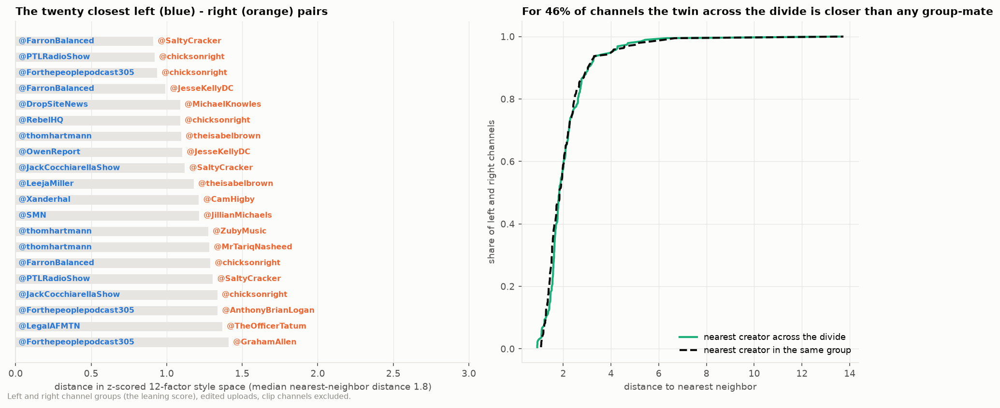

# 9. Stylistic twins across the political divide

**The question.** Which left channels and right channels (the channel groups of document 14) title their videos the same way?

## The finding in one paragraph

Style ignores the divide. Measured in the twelve-dimensional, topic-controlled style space of the style model, the nearest neighbor of a left channel is on the right side of the divide about as often as on its own side: for 46% of the 192 left and right channels the closest channel across the divide is closer than *any* channel in their own group, and the distributions of nearest-twin distance and nearest-group-mate distance sit almost on top of each other. The closest pairs are not the big names but the mid-sized daily channels on both sides: @FarronBalanced and @SaltyCracker, @PTLRadioShow and @chicksonright, @Forthepeoplepodcast305 and @chicksonright. What they share is form: emphasis capitals on one or two words, a named target, a verb of attack or collapse, no question, no label, no numbers.

*Left: the twenty closest left-right pairs. Right: for every left and right channel, the distance to its nearest channel across the divide against the distance to its nearest group-mate.*

## The twenty closest pairs

`distance` is Euclidean distance between z-scored topic-controlled factor scores (edited uploads); `distance_percentile_all_pairs` places the pair among all 239 ranked creators' pairwise distances (0 = the closest pair in the whole landscape).

| left_creator | right_creator | distance | distance_percentile_all_pairs |
|---|---|---|---|
| @FarronBalanced | @SaltyCracker | 0.91 | 0.00 |
| @PTLRadioShow | @chicksonright | 0.92 | 0.00 |
| @Forthepeoplepodcast305 | @chicksonright | 0.94 | 0.01 |
| @FarronBalanced | @JesseKellyDC | 0.99 | 0.01 |
| @DropSiteNews | @MichaelKnowles | 1.09 | 0.03 |
| @RebelHQ | @chicksonright | 1.09 | 0.03 |
| @thomhartmann | @theisabelbrown | 1.10 | 0.04 |
| @OwenReport | @JesseKellyDC | 1.10 | 0.04 |
| @JackCocchiarellaShow | @SaltyCracker | 1.12 | 0.05 |
| @LeejaMiller | @theisabelbrown | 1.18 | 0.07 |
| @Xanderhal | @CamHigby | 1.21 | 0.10 |
| @SMN | @JillianMichaels | 1.21 | 0.10 |
| @thomhartmann | @ZubyMusic | 1.27 | 0.14 |
| @thomhartmann | @MrTariqNasheed | 1.28 | 0.15 |
| @FarronBalanced | @chicksonright | 1.29 | 0.16 |
| @PTLRadioShow | @SaltyCracker | 1.31 | 0.18 |
| @JackCocchiarellaShow | @chicksonright | 1.34 | 0.19 |
| @Forthepeoplepodcast305 | @AnthonyBrianLogan | 1.34 | 0.20 |
| @LegalAFMTN | @TheOfficerTatum | 1.37 | 0.23 |
| @Forthepeoplepodcast305 | @GrahamAllen | 1.41 | 0.27 |

A few right-side channels recur as everybody's twin in the table above (@chicksonright x5, @SaltyCracker x3, @JesseKellyDC x2): they sit near the center of the commentary cloud, so they are close to many left channels at once. Hubness like this is a property of the space, not evidence of imitation.

## Every channel's twin across the divide

The full table is `style_twins_nearest.csv`; the twelve left and twelve right channels with the closest twins:

| creator | twin_across_divide | twin_distance | twin_rank_among_all_neighbours | nearest_same_group | nearest_same_group_distance | twin_closer_than_any_same_group |
|---|---|---|---|---|---|---|
| @FarronBalanced | @SaltyCracker | 0.91 | 1 | @JackCocchiarellaShow | 1.17 | yes |
| @PTLRadioShow | @chicksonright | 0.92 | 1 | @Forthepeoplepodcast305 | 1.28 | yes |
| @Forthepeoplepodcast305 | @chicksonright | 0.94 | 1 | @podsaveamerica | 1.28 | yes |
| @DropSiteNews | @MichaelKnowles | 1.09 | 1 | @NovaraMedia | 1.58 | yes |
| @RebelHQ | @chicksonright | 1.09 | 1 | @FarronBalanced | 1.37 | yes |
| @thomhartmann | @theisabelbrown | 1.10 | 1 | @LeejaMiller | 1.68 | yes |
| @OwenReport | @JesseKellyDC | 1.10 | 2 | @TheDonLemonShow | 1.09 | no |
| @JackCocchiarellaShow | @SaltyCracker | 1.12 | 1 | @FarronBalanced | 1.17 | yes |
| @LeejaMiller | @theisabelbrown | 1.18 | 1 | @ajplus | 1.38 | yes |
| @Xanderhal | @CamHigby | 1.21 | 1 | @TheMichaelCohenShow | 1.84 | yes |
| @SMN | @JillianMichaels | 1.21 | 1 | @samharrisorg | 1.61 | yes |
| @LegalAFMTN | @TheOfficerTatum | 1.37 | 1 | @dollemore | 1.83 | yes |

| creator | twin_across_divide | twin_distance | twin_rank_among_all_neighbours | nearest_same_group | nearest_same_group_distance | twin_closer_than_any_same_group |
|---|---|---|---|---|---|---|
| @SaltyCracker | @FarronBalanced | 0.91 | 1 | @chicksonright | 1.17 | yes |
| @chicksonright | @PTLRadioShow | 0.92 | 1 | @SaltyCracker | 1.17 | yes |
| @JesseKellyDC | @FarronBalanced | 0.99 | 1 | @SaltyCracker | 1.54 | yes |
| @MichaelKnowles | @DropSiteNews | 1.09 | 1 | @XAVIAER | 1.44 | yes |
| @theisabelbrown | @thomhartmann | 1.10 | 1 | @AndrewKlavan | 1.27 | yes |
| @CamHigby | @Xanderhal | 1.21 | 1 | @OfficialSaharTV | 1.51 | yes |
| @JillianMichaels | @SMN | 1.21 | 1 | @glennbeck | 1.42 | yes |
| @ZubyMusic | @thomhartmann | 1.27 | 1 | @BenShapiro | 1.62 | yes |
| @MrTariqNasheed | @thomhartmann | 1.28 | 1 | @theisabelbrown | 1.53 | yes |
| @AnthonyBrianLogan | @Forthepeoplepodcast305 | 1.34 | 1 | @oann | 1.62 | yes |
| @TheOfficerTatum | @LegalAFMTN | 1.37 | 1 | @TheQuartering | 2.09 | yes |
| @GrahamAllen | @Forthepeoplepodcast305 | 1.41 | 3 | @SaltyCracker | 1.26 | no |

`twin_rank_among_all_neighbours` = 1 means the twin is the creator's single nearest neighbor in the whole landscape (any group).

## Method

1. Style vectors: the twelve factor scores of the style model (`factor_loadings.csv`, `dimensions.csv`), topic-controlled (each title's score minus its topic's mean, averaged per creator), edited uploads only, creators with at least 50 unique titles, clip channels excluded (100 left and 92 right channels).
2. Each factor z-scored across the ranked creators so that no factor dominates; distance = Euclidean over the twelve.
3. For every channel on one side, the nearest channel on the other side is its twin; the same distance is computed to the nearest channel on its own side; the pair distance is also expressed as a percentile of all ranked pairwise distances.
4. "Left" and "right" are the channel groups of document 14: the channel's score over its sampled titles, below −0.05 and above +0.05. The neutral group is not in the comparison.

## Limitations

- The divide is the judge's reading of each channel's titles, so a channel whose titles read neutral although its host is partisan is left out, and a channel near a threshold can sit on either side; document 14 gives the reliability of the score.
- The space weights all twelve factors equally after z-scoring; two creators can be twins on capitals, questions and quotes while differing in tone, or the reverse. `dimensions.csv` has the per-factor scores if a narrower definition is wanted.
- Topic control removes the average effect of a topic on each score, not everything a subject does to a title.
- Distances shrink for creators near the center of the cloud (hubness above) and grow for eccentric ones; the percentile column is the fairer comparison.
- Only edited uploads; live VODs are too thin for both groups.

Files: `style_twins.csv`, `style_twins_nearest.csv`, `dimensions.csv`, `neighbours_style.csv`.
