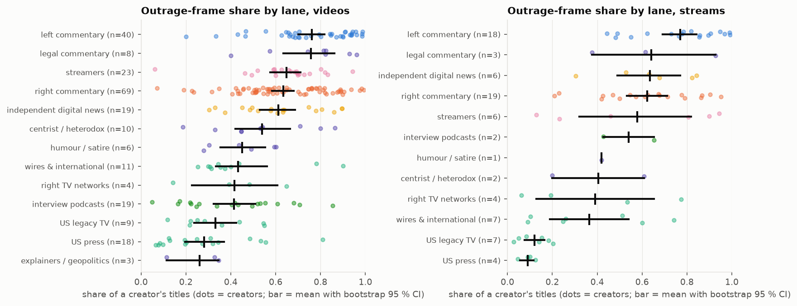

# 10. How much of political YouTube is framed as outrage, lane by lane?

**The question.** What share of a creator's titles frames its subject as outrageous, scandalous or threatening, and how does that differ between lanes?

## The finding in one paragraph

Across the landscape the outrage frame is the majority style of commentary and the minority style of news. Averaging creators within a lane (edited uploads), left commentary sits at 76 % (95 % CI 70 %-82 %) and explainers / geopolitics at 26 % (11 %-35 %); the commentary lanes on both sides, legal commentary and streamers all exceed 60 %, the wires, legacy TV and the press all fall below 45 %. The confidence intervals of the commentary block and the news block do not overlap. Left commentary is higher than right commentary (76 % vs 63 %), and the two intervals barely touch, so that gap is real but modest. Within every lane the creator-to-creator spread is wide (dots in the figure): lane is a weak predictor of any one channel.

*Each dot is a creator's share; the bar is the lane mean with a bootstrap 95 % interval.*

## Edited uploads

| lane | n_creators | mean | ci95_low | ci95_high | median | q25 | q75 | min | max |
|---|---|---|---|---|---|---|---|---|---|
| left commentary | 40 | 0.76 | 0.70 | 0.82 | 0.80 | 0.66 | 0.91 | 0.20 | 0.99 |
| legal commentary | 8 | 0.76 | 0.63 | 0.86 | 0.82 | 0.70 | 0.85 | 0.40 | 0.96 |
| streamers | 23 | 0.65 | 0.57 | 0.71 | 0.68 | 0.60 | 0.72 | 0.06 | 0.94 |
| right commentary | 69 | 0.63 | 0.58 | 0.68 | 0.61 | 0.51 | 0.79 | 0.07 | 0.99 |
| independent digital news | 19 | 0.61 | 0.53 | 0.69 | 0.61 | 0.49 | 0.76 | 0.30 | 0.90 |
| centrist / heterodox | 10 | 0.54 | 0.42 | 0.66 | 0.53 | 0.45 | 0.67 | 0.19 | 0.87 |
| humour / satire | 6 | 0.45 | 0.35 | 0.55 | 0.46 | 0.34 | 0.57 | 0.28 | 0.60 |
| wires & international | 11 | 0.43 | 0.33 | 0.56 | 0.35 | 0.31 | 0.42 | 0.25 | 0.90 |
| right TV networks | 4 | 0.42 | 0.23 | 0.61 | 0.44 | 0.33 | 0.52 | 0.14 | 0.65 |
| interview podcasts | 19 | 0.41 | 0.32 | 0.51 | 0.42 | 0.23 | 0.54 | 0.05 | 0.85 |
| US legacy TV | 9 | 0.33 | 0.24 | 0.42 | 0.28 | 0.22 | 0.44 | 0.12 | 0.55 |
| US press | 18 | 0.28 | 0.20 | 0.37 | 0.22 | 0.13 | 0.34 | 0.07 | 0.81 |
| explainers / geopolitics | 3 | 0.26 | 0.11 | 0.35 | 0.33 | 0.22 | 0.34 | 0.11 | 0.35 |

## Live VODs

| lane | n_creators | mean | ci95_low | ci95_high | median | q25 | q75 | min | max |
|---|---|---|---|---|---|---|---|---|---|
| left commentary | 18 | 0.77 | 0.69 | 0.84 | 0.80 | 0.65 | 0.90 | 0.44 | 0.99 |
| legal commentary | 3 | 0.64 | 0.38 | 0.93 | 0.62 | 0.50 | 0.77 | 0.38 | 0.93 |
| independent digital news | 6 | 0.63 | 0.49 | 0.77 | 0.65 | 0.55 | 0.79 | 0.30 | 0.84 |
| right commentary | 19 | 0.62 | 0.53 | 0.71 | 0.62 | 0.48 | 0.78 | 0.21 | 0.95 |
| streamers | 6 | 0.58 | 0.32 | 0.82 | 0.63 | 0.29 | 0.88 | 0.13 | 0.94 |
| interview podcasts | 2 | 0.54 | 0.43 | 0.65 | 0.54 | 0.48 | 0.60 | 0.43 | 0.65 |
| humour / satire | 1 | 0.42 | 0.42 | 0.42 | 0.42 | 0.42 | 0.42 | 0.42 | 0.42 |
| centrist / heterodox | 2 | 0.40 | 0.20 | 0.61 | 0.40 | 0.30 | 0.51 | 0.20 | 0.61 |
| right TV networks | 4 | 0.39 | 0.13 | 0.65 | 0.36 | 0.16 | 0.59 | 0.06 | 0.77 |
| wires & international | 7 | 0.36 | 0.19 | 0.54 | 0.26 | 0.17 | 0.56 | 0.09 | 0.74 |
| US legacy TV | 7 | 0.12 | 0.08 | 0.16 | 0.14 | 0.07 | 0.17 | 0.03 | 0.20 |
| US press | 4 | 0.09 | 0.06 | 0.12 | 0.10 | 0.08 | 0.11 | 0.05 | 0.12 |

## Method

1. **Definition.** A local model (Qwen3-14B, temperature 0) rated a creator-stratified sample of 3,000 raw titles; the outrage flag was defined in the prompt as "the subject is framed as outrageous, scandalous or threatening (slams, destroys, exposed, disaster, betrayal, meltdown)". 57 % of the sample was flagged.
2. **Classifier.** A logistic regression on the title's sentence embedding plus twelve style features, trained on those labels (5-fold cross-validation for the regularisation strength, then a stratified 20 % hold-out: accuracy 0.76, balanced accuracy 0.76, AUC 0.84, kappa 0.52), refitted on the whole sample and applied to every unique title.
3. **Aggregation.** Share of flagged titles per creator x genre (verbatim repeats collapsed); lane figure = mean of creators with at least 50 unique titles, with a bootstrap 95 % interval from 1,000 resamples of creators. Medians and quartiles describe the spread.

## Limitations

- **The rater.** The flag's test-retest kappa on 300 titles is 0.50 (moderate); the definition is broad, and a title about a shooting or a flood can be flagged as "threatening" without any editorial outrage. That is why the wires and legacy TV land at 30-45 % rather than near zero: part of their share is event negativity. Document 3's tone factor, built from word lists rather than a model, gives the same lane ordering, which is the check that the pattern is not a rater artefact.
- **The classifier** is right about three titles in four on held-out data; errors are roughly symmetric, so lane means are less biased than individual titles, but a single creator's share carries an error of several points.
- **Lanes** are the proposal in `lanes.csv`; small lanes (right TV networks n = 4, explainers n = 3) have wide intervals and should be read as descriptions of a handful of channels.
- Titles only: an outraged thumbnail over a neutral title, or the reverse, is invisible.

Files: `outrage_by_lane_ci.csv`, `format_hook_shares.csv`, `formats.parquet`, `hook_classifier.json`, `labels.csv`.
