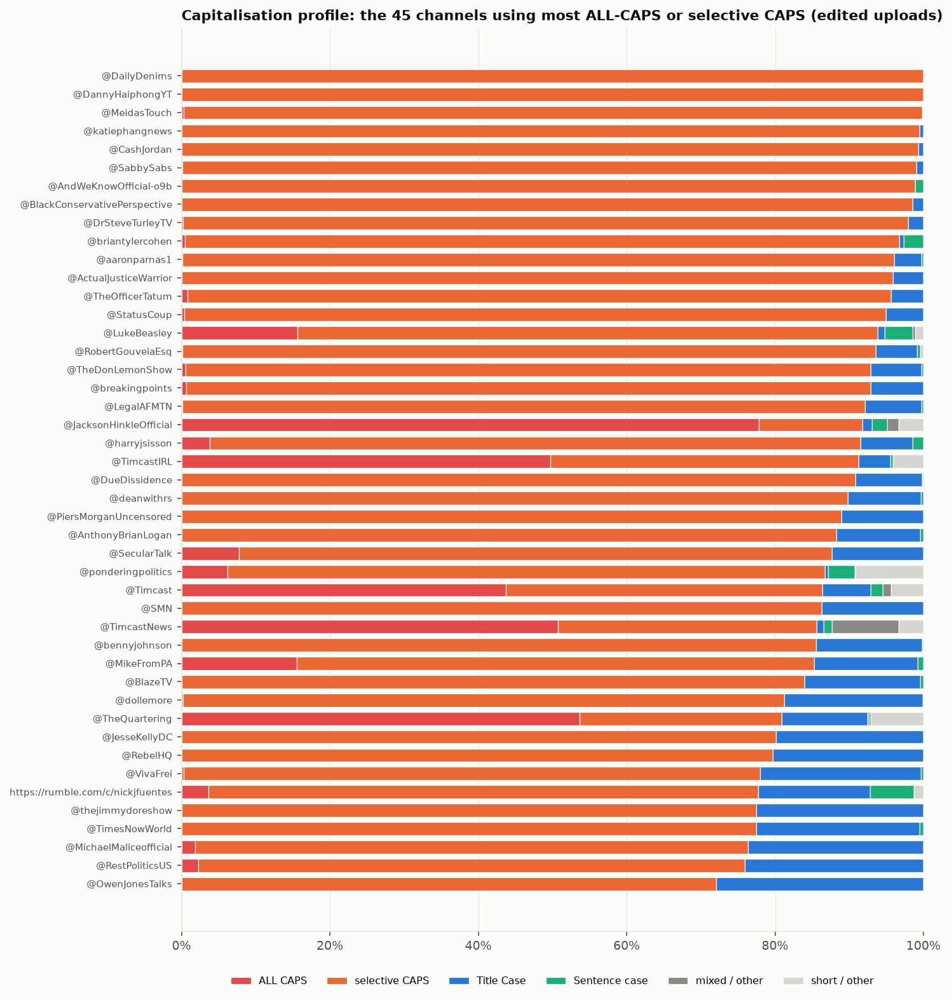
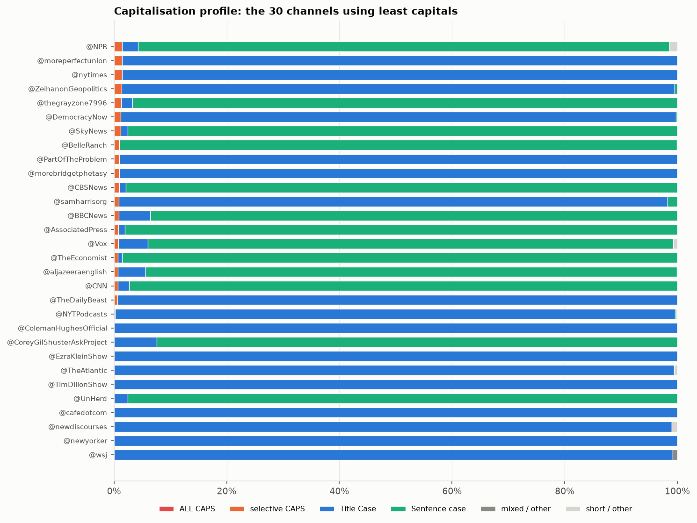
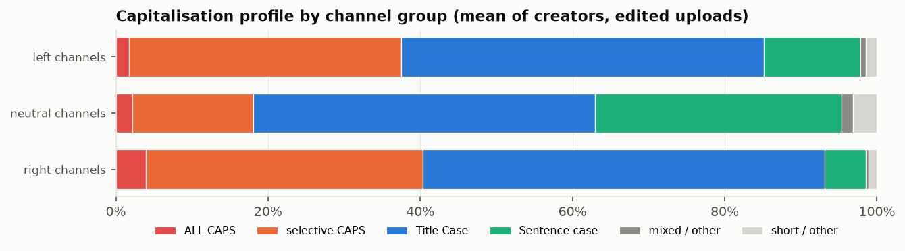
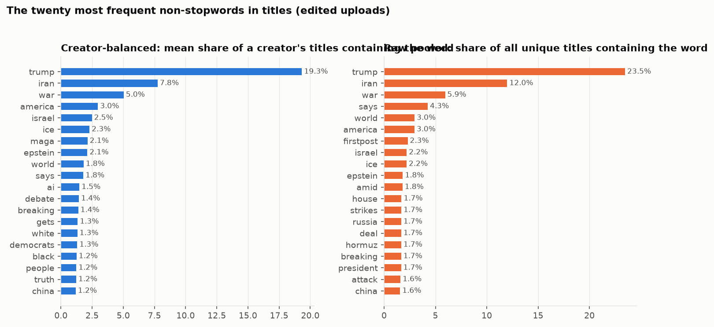

# 11. Capitalisation profile, and the words titles are made of

## Capitalisation profile

**The question.** How does each channel capitalise its titles: shouting in ALL CAPS, emphasising single words, Title Case, or sentence case?

### The finding in one paragraph

Averaged over the 239 ranked channels (edited uploads), 49 % of titles are Title Case, 33 % use selective CAPS (one or more shouted words inside a normally cased title: "Trump SLAMS Judge"), 13 % are sentence case, 3 % are ALL CAPS, and the rest are too short to classify or mixed. Selective capitals are the signature of the daily commentary channels: @DannyHaiphongYT, @MeidasTouch, @katiephangnews, @CashJordan, @SabbySabs put an emphasised word in more than 99 % of their titles. Full ALL-CAPS titles are rarer and concentrated in a handful of channels on both sides (Jackson Hinkle, TheQuartering, the three Timcast channels, Fleccas, and the streamers Hasan Piker and Vaush); the news outlets are sentence case or Title Case, and the selective capitals they do show are mostly quoted shouted words ('GAME CHANGER': ...) rather than emphasis. By channel group the left and right groups shout at the same rate (37 % and 40 % of the average channel's titles) and the neutral group hardly at all (18 %); document 7 follows the styles into views.

*The 45 channels that use ALL CAPS or selective CAPS most; the bar is the whole channel's titles.*

*The 30 channels using capitals least.*

*Channel-group means.*

### By channel group (mean of creators)

| group | ALL CAPS | selective CAPS | Title Case | Sentence case | mixed / other | short / other | ALL + selective |
|---|---|---|---|---|---|---|---|
| left channels | 0.02 | 0.36 | 0.48 | 0.13 | 0.01 | 0.01 | 0.37 |
| neutral channels | 0.02 | 0.16 | 0.45 | 0.32 | 0.02 | 0.03 | 0.18 |
| right channels | 0.04 | 0.36 | 0.53 | 0.05 | 0.00 | 0.01 | 0.40 |

### Every ranked channel, sorted by ALL CAPS + selective CAPS

| creator | group | n_titles | ALL + selective | ALL CAPS | selective CAPS | Title Case | Sentence case | mixed / other | short / other |
|---|---|---|---|---|---|---|---|---|---|
| @DannyHaiphongYT | left | 64 | 1.00 | 0.00 | 1.00 | 0.00 | 0.00 | 0.00 | 0.00 |
| @MeidasTouch | left | 3532 | 1.00 | 0.00 | 1.00 | 0.00 | 0.00 | 0.00 | 0.00 |
| @katiephangnews | left | 403 | 1.00 | 0.00 | 1.00 | 0.00 | 0.00 | 0.00 | 0.00 |
| @CashJordan | right | 299 | 0.99 | 0.00 | 0.99 | 0.01 | 0.00 | 0.00 | 0.00 |
| @SabbySabs | left | 626 | 0.99 | 0.00 | 0.99 | 0.01 | 0.00 | 0.00 | 0.00 |
| @AndWeKnowOfficial-o9b | right | 185 | 0.99 | 0.00 | 0.99 | 0.00 | 0.01 | 0.00 | 0.00 |
| @BlackConservativePerspective | right | 1271 | 0.99 | 0.00 | 0.99 | 0.01 | 0.00 | 0.00 | 0.00 |
| @DrSteveTurleyTV | right | 442 | 0.98 | 0.00 | 0.98 | 0.02 | 0.00 | 0.00 | 0.00 |
| @briantylercohen | left | 1081 | 0.97 | 0.00 | 0.96 | 0.01 | 0.03 | 0.00 | 0.00 |
| @ActualJusticeWarrior | right | 392 | 0.96 | 0.00 | 0.96 | 0.04 | 0.00 | 0.00 | 0.00 |
| @aaronparnas1 | left | 819 | 0.96 | 0.00 | 0.96 | 0.04 | 0.00 | 0.00 | 0.00 |
| @AnthonyBrianLogan | right | 248 | 0.96 | 0.00 | 0.96 | 0.04 | 0.00 | 0.00 | 0.00 |
| @TheOfficerTatum | right | 617 | 0.96 | 0.01 | 0.95 | 0.04 | 0.00 | 0.00 | 0.00 |
| @StatusCoup | left | 517 | 0.95 | 0.00 | 0.95 | 0.05 | 0.00 | 0.00 | 0.00 |
| @LukeBeasley | left | 1162 | 0.94 | 0.16 | 0.78 | 0.01 | 0.03 | 0.01 | 0.01 |
| @RobertGouveiaEsq | right | 696 | 0.94 | 0.00 | 0.93 | 0.06 | 0.00 | 0.00 | 0.00 |
| @breakingpoints | left | 1037 | 0.93 | 0.01 | 0.92 | 0.07 | 0.00 | 0.00 | 0.00 |
| @LegalAFMTN | left | 2735 | 0.92 | 0.00 | 0.92 | 0.08 | 0.00 | 0.00 | 0.00 |
| @JacksonHinkleOfficial | neutral | 388 | 0.92 | 0.78 | 0.14 | 0.01 | 0.01 | 0.02 | 0.03 |
| @harryjsisson | left | 681 | 0.91 | 0.04 | 0.88 | 0.07 | 0.01 | 0.00 | 0.00 |
| @TimcastIRL | right | 855 | 0.91 | 0.50 | 0.42 | 0.04 | 0.00 | 0.00 | 0.04 |
| @DueDissidence | left | 643 | 0.91 | 0.00 | 0.91 | 0.09 | 0.00 | 0.00 | 0.00 |
| @deanwithrs | left | 265 | 0.90 | 0.00 | 0.90 | 0.10 | 0.00 | 0.00 | 0.00 |
| @PiersMorganUncensored | neutral | 181 | 0.89 | 0.00 | 0.89 | 0.11 | 0.00 | 0.00 | 0.00 |
| @SecularTalk | left | 1458 | 0.87 | 0.19 | 0.69 | 0.12 | 0.00 | 0.00 | 0.00 |
| @ponderingpolitics | left | 1467 | 0.87 | 0.06 | 0.81 | 0.00 | 0.04 | 0.00 | 0.09 |
| @Timcast | right | 183 | 0.86 | 0.44 | 0.43 | 0.07 | 0.02 | 0.01 | 0.04 |
| @bennyjohnson | right | 1508 | 0.86 | 0.00 | 0.85 | 0.14 | 0.00 | 0.00 | 0.00 |
| @MikeFromPA | left | 129 | 0.85 | 0.16 | 0.70 | 0.14 | 0.01 | 0.00 | 0.00 |
| @TimcastNews | right | 534 | 0.85 | 0.53 | 0.33 | 0.01 | 0.01 | 0.09 | 0.04 |
| @BlazeTV | right | 868 | 0.84 | 0.00 | 0.84 | 0.16 | 0.00 | 0.00 | 0.00 |
| @dollemore | left | 1439 | 0.81 | 0.00 | 0.81 | 0.19 | 0.00 | 0.00 | 0.00 |
| @TheQuartering | right | 675 | 0.81 | 0.54 | 0.27 | 0.12 | 0.00 | 0.00 | 0.07 |
| @JesseKellyDC | right | 504 | 0.80 | 0.00 | 0.80 | 0.20 | 0.00 | 0.00 | 0.00 |
| @RebelHQ | left | 1292 | 0.80 | 0.00 | 0.80 | 0.20 | 0.00 | 0.00 | 0.00 |
| @VivaFrei | right | 331 | 0.78 | 0.00 | 0.78 | 0.22 | 0.00 | 0.00 | 0.00 |
| https://rumble.com/c/nickjfuentes | right | 305 | 0.78 | 0.06 | 0.71 | 0.15 | 0.06 | 0.00 | 0.01 |
| @thejimmydoreshow | neutral | 1146 | 0.77 | 0.00 | 0.77 | 0.23 | 0.00 | 0.00 | 0.00 |
| @TimesNowWorld | neutral | 8994 | 0.77 | 0.00 | 0.77 | 0.22 | 0.01 | 0.00 | 0.00 |
| @OwenJonesTalks | left | 233 | 0.72 | 0.00 | 0.72 | 0.28 | 0.00 | 0.00 | 0.00 |
| @DoubleDownNews | left | 66 | 0.71 | 0.06 | 0.65 | 0.23 | 0.05 | 0.02 | 0.00 |
| @HasanReactionsfanTwo | left | 340 | 0.71 | 0.00 | 0.71 | 0.28 | 0.01 | 0.00 | 0.00 |
| @CamHigby | right | 186 | 0.71 | 0.00 | 0.71 | 0.29 | 0.00 | 0.00 | 0.00 |
| @lonerboxlive | right | 88 | 0.70 | 0.00 | 0.70 | 0.30 | 0.00 | 0.00 | 0.00 |
| @jlptalk | right | 304 | 0.70 | 0.00 | 0.70 | 0.29 | 0.00 | 0.00 | 0.00 |
| @PiscoLitty | left | 56 | 0.70 | 0.04 | 0.66 | 0.29 | 0.00 | 0.02 | 0.00 |
| @glennbeck | right | 460 | 0.70 | 0.00 | 0.70 | 0.30 | 0.00 | 0.00 | 0.00 |
| @BadFaithPodcast | left | 81 | 0.69 | 0.00 | 0.69 | 0.31 | 0.00 | 0.00 | 0.00 |
| @usefulidiots | left | 186 | 0.69 | 0.01 | 0.68 | 0.27 | 0.04 | 0.01 | 0.00 |
| @adammockler | left | 1117 | 0.69 | 0.02 | 0.66 | 0.13 | 0.17 | 0.01 | 0.00 |
| @OfficialSaharTV | right | 893 | 0.68 | 0.02 | 0.65 | 0.32 | 0.01 | 0.00 | 0.00 |
| @TheDamageReport | left | 3204 | 0.67 | 0.00 | 0.67 | 0.16 | 0.00 | 0.00 | 0.17 |
| @LiberalHivemind | right | 846 | 0.65 | 0.09 | 0.57 | 0.04 | 0.27 | 0.01 | 0.02 |
| @FoxNews | right | 8210 | 0.65 | 0.00 | 0.65 | 0.03 | 0.31 | 0.00 | 0.00 |
| @lizwheeler | right | 86 | 0.65 | 0.00 | 0.65 | 0.35 | 0.00 | 0.00 | 0.00 |
| @thedavidpakmanshow | left | 1641 | 0.65 | 0.05 | 0.60 | 0.00 | 0.33 | 0.02 | 0.00 |
| @timesofindia | left | 9926 | 0.64 | 0.00 | 0.64 | 0.35 | 0.00 | 0.00 | 0.00 |
| @fightbackpodcast | right | 627 | 0.64 | 0.01 | 0.63 | 0.35 | 0.01 | 0.00 | 0.00 |
| @FoxNewsChannelClips | right | 5748 | 0.64 | 0.00 | 0.64 | 0.00 | 0.36 | 0.00 | 0.00 |
| https://rumble.com/c/GGreenwald | left | 76 | 0.62 | 0.00 | 0.62 | 0.38 | 0.00 | 0.00 | 0.00 |
| @DestinyDGGClips | right | 209 | 0.62 | 0.00 | 0.61 | 0.37 | 0.01 | 0.00 | 0.00 |
| @MyronGainesX | right | 389 | 0.61 | 0.00 | 0.61 | 0.38 | 0.01 | 0.01 | 0.00 |
| @OutKick | right | 51 | 0.61 | 0.00 | 0.61 | 0.39 | 0.00 | 0.00 | 0.00 |
| @TheSerfTimes | left | 247 | 0.60 | 0.00 | 0.60 | 0.05 | 0.34 | 0.01 | 0.00 |
| @lovettorleaveitpodcast | left | 114 | 0.59 | 0.00 | 0.59 | 0.41 | 0.00 | 0.00 | 0.00 |
| @FarronBalanced | left | 1780 | 0.58 | 0.00 | 0.57 | 0.42 | 0.01 | 0.00 | 0.00 |
| @RestPoliticsUS | left | 220 | 0.57 | 0.02 | 0.55 | 0.43 | 0.00 | 0.00 | 0.00 |
| @podsaveamerica | left | 667 | 0.55 | 0.00 | 0.55 | 0.43 | 0.02 | 0.00 | 0.00 |
| @thehill | neutral | 4249 | 0.55 | 0.00 | 0.55 | 0.10 | 0.35 | 0.01 | 0.00 |
| @TheYoungTurks | left | 2868 | 0.54 | 0.00 | 0.54 | 0.27 | 0.00 | 0.00 | 0.19 |
| https://rumble.com/c/TheAlexJonesShowLive | right | 513 | 0.54 | 0.28 | 0.25 | 0.45 | 0.01 | 0.00 | 0.00 |
| @PTLRadioShow | left | 1684 | 0.54 | 0.00 | 0.54 | 0.44 | 0.02 | 0.00 | 0.00 |
| @HasanAbi | left | 628 | 0.54 | 0.50 | 0.04 | 0.23 | 0.12 | 0.06 | 0.05 |
| @TheMichaelCohenShow | left | 479 | 0.53 | 0.01 | 0.53 | 0.46 | 0.00 | 0.00 | 0.00 |
| @FleccasTalks | right | 290 | 0.53 | 0.40 | 0.13 | 0.12 | 0.00 | 0.00 | 0.34 |
| @chicksonright | right | 475 | 0.52 | 0.00 | 0.52 | 0.47 | 0.00 | 0.00 | 0.00 |
| @FreshFitMiami | right | 111 | 0.52 | 0.00 | 0.52 | 0.48 | 0.00 | 0.00 | 0.00 |
| @The_Crucible | right | 226 | 0.52 | 0.00 | 0.52 | 0.43 | 0.04 | 0.00 | 0.00 |
| https://rumble.com/c/BannonsWarRoom | right | 4506 | 0.49 | 0.05 | 0.44 | 0.38 | 0.12 | 0.00 | 0.00 |
| @NovaraMedia | left | 585 | 0.49 | 0.00 | 0.49 | 0.51 | 0.00 | 0.00 | 0.00 |
| @AfterPartyEmily | right | 410 | 0.48 | 0.00 | 0.48 | 0.52 | 0.00 | 0.00 | 0.00 |
| @RedactedNews | right | 452 | 0.47 | 0.01 | 0.47 | 0.38 | 0.14 | 0.00 | 0.00 |
| @MichaelMaliceofficial | right | 55 | 0.47 | 0.02 | 0.45 | 0.51 | 0.02 | 0.00 | 0.00 |
| @RealAmericasVoice | right | 2653 | 0.47 | 0.23 | 0.23 | 0.52 | 0.01 | 0.00 | 0.00 |
| @HasanabiClips | left | 474 | 0.47 | 0.01 | 0.45 | 0.35 | 0.17 | 0.02 | 0.00 |
| @GlennKirschner2 | left | 262 | 0.47 | 0.00 | 0.47 | 0.51 | 0.02 | 0.00 | 0.00 |
| @MegynKelly | right | 1651 | 0.46 | 0.00 | 0.46 | 0.53 | 0.00 | 0.00 | 0.00 |
| @Xanderhal | left | 316 | 0.46 | 0.00 | 0.46 | 0.54 | 0.00 | 0.00 | 0.00 |
| @Vaush | left | 453 | 0.45 | 0.29 | 0.16 | 0.41 | 0.02 | 0.09 | 0.03 |
| @dineshdsouza | right | 92 | 0.45 | 0.27 | 0.17 | 0.50 | 0.00 | 0.01 | 0.04 |
| @marclamonthillnetwork | left | 321 | 0.45 | 0.00 | 0.45 | 0.55 | 0.00 | 0.00 | 0.00 |
| @MichaelKnowles | right | 472 | 0.44 | 0.00 | 0.44 | 0.55 | 0.00 | 0.00 | 0.00 |
| @JustPearlyThings | right | 669 | 0.43 | 0.01 | 0.42 | 0.54 | 0.02 | 0.01 | 0.00 |
| @LIVESNEAKO | neutral | 479 | 0.43 | 0.03 | 0.41 | 0.30 | 0.22 | 0.03 | 0.03 |
| @BadEmpanadaLive | left | 298 | 0.43 | 0.01 | 0.42 | 0.56 | 0.00 | 0.00 | 0.01 |
| @TomiLahrenIsFearless | right | 118 | 0.39 | 0.00 | 0.39 | 0.61 | 0.00 | 0.00 | 0.00 |
| @destinyhqclips | neutral | 197 | 0.39 | 0.00 | 0.39 | 0.60 | 0.02 | 0.00 | 0.00 |
| @Forthepeoplepodcast305 | left | 115 | 0.37 | 0.00 | 0.37 | 0.61 | 0.01 | 0.01 | 0.00 |
| @MattWalsh | right | 297 | 0.37 | 0.00 | 0.37 | 0.62 | 0.00 | 0.00 | 0.00 |
| @TheHumanistReport | left | 154 | 0.37 | 0.00 | 0.37 | 0.63 | 0.00 | 0.00 | 0.00 |
| @JillianMichaels | right | 457 | 0.37 | 0.05 | 0.31 | 0.63 | 0.01 | 0.00 | 0.00 |
| @SydneyWatson | right | 61 | 0.36 | 0.00 | 0.36 | 0.00 | 0.64 | 0.00 | 0.00 |
| @KimIversen | neutral | 534 | 0.35 | 0.00 | 0.35 | 0.63 | 0.01 | 0.00 | 0.00 |
| @ChadPrather1 | right | 160 | 0.35 | 0.00 | 0.35 | 0.64 | 0.01 | 0.00 | 0.00 |
| @TheAmalaEkpunobi | right | 211 | 0.34 | 0.00 | 0.34 | 0.65 | 0.00 | 0.00 | 0.00 |
| @SMN | left | 197 | 0.34 | 0.00 | 0.34 | 0.66 | 0.00 | 0.00 | 0.00 |
| @BrittanyVenti | neutral | 55 | 0.33 | 0.00 | 0.33 | 0.51 | 0.00 | 0.15 | 0.02 |
| @hutch | neutral | 162 | 0.33 | 0.01 | 0.31 | 0.58 | 0.06 | 0.01 | 0.03 |
| @fastpoliticspodcast | left | 145 | 0.31 | 0.00 | 0.31 | 0.69 | 0.00 | 0.00 | 0.00 |
| @RealDanBongino | right | 266 | 0.30 | 0.00 | 0.30 | 0.57 | 0.05 | 0.00 | 0.08 |
| @destiny | left | 267 | 0.29 | 0.00 | 0.29 | 0.56 | 0.00 | 0.09 | 0.06 |
| @zeteo | left | 206 | 0.28 | 0.00 | 0.28 | 0.71 | 0.00 | 0.00 | 0.00 |
| @TheAdamCarollaShow1 | right | 395 | 0.28 | 0.01 | 0.27 | 0.71 | 0.01 | 0.00 | 0.00 |
| @TheVaushPit | left | 403 | 0.28 | 0.12 | 0.16 | 0.50 | 0.02 | 0.18 | 0.03 |
| @underthedesknews | left | 79 | 0.28 | 0.03 | 0.25 | 0.56 | 0.16 | 0.00 | 0.00 |
| @GrahamAllen | right | 247 | 0.27 | 0.01 | 0.26 | 0.72 | 0.00 | 0.00 | 0.00 |
| @ClipsCandaceOwens | neutral | 192 | 0.27 | 0.00 | 0.27 | 0.72 | 0.01 | 0.01 | 0.00 |
| @Tim_Black | right | 329 | 0.26 | 0.00 | 0.26 | 0.74 | 0.00 | 0.01 | 0.00 |
| @RileyGaines | right | 143 | 0.25 | 0.00 | 0.25 | 0.75 | 0.00 | 0.00 | 0.00 |
| @OwenReport | left | 388 | 0.25 | 0.00 | 0.25 | 0.69 | 0.05 | 0.00 | 0.00 |
| @msnow | left | 9879 | 0.25 | 0.00 | 0.25 | 0.03 | 0.69 | 0.03 | 0.00 |
| @BenShapiro | right | 525 | 0.25 | 0.00 | 0.24 | 0.75 | 0.00 | 0.00 | 0.00 |
| @PoliticsJOE | left | 339 | 0.24 | 0.00 | 0.24 | 0.09 | 0.65 | 0.01 | 0.00 |
| @MarkDice | right | 92 | 0.24 | 0.07 | 0.17 | 0.74 | 0.00 | 0.01 | 0.01 |
| @laurenchenclips | right | 109 | 0.24 | 0.00 | 0.24 | 0.75 | 0.01 | 0.00 | 0.00 |
| @RSBN | right | 1640 | 0.24 | 0.00 | 0.24 | 0.75 | 0.02 | 0.00 | 0.00 |
| @TheDonLemonShow | left | 366 | 0.23 | 0.01 | 0.23 | 0.77 | 0.00 | 0.00 | 0.00 |
| @PoliticsGirl | left | 116 | 0.22 | 0.00 | 0.22 | 0.66 | 0.03 | 0.01 | 0.07 |
| @thomhartmann | left | 784 | 0.22 | 0.00 | 0.22 | 0.76 | 0.01 | 0.00 | 0.00 |
| @RebelNewsOnline | right | 1358 | 0.22 | 0.00 | 0.22 | 0.09 | 0.67 | 0.02 | 0.00 |
| @LeejaMiller | left | 60 | 0.22 | 0.00 | 0.22 | 0.75 | 0.00 | 0.02 | 0.02 |
| @DailyDenims | left | 215 | 0.21 | 0.00 | 0.21 | 0.74 | 0.04 | 0.00 | 0.00 |
| @winston_marshall | right | 109 | 0.21 | 0.00 | 0.21 | 0.67 | 0.09 | 0.03 | 0.00 |
| @oann | right | 1803 | 0.21 | 0.09 | 0.12 | 0.74 | 0.05 | 0.00 | 0.00 |
| @clayandbuck | right | 581 | 0.20 | 0.00 | 0.20 | 0.80 | 0.00 | 0.00 | 0.00 |
| @XAVIAER | right | 71 | 0.20 | 0.00 | 0.20 | 0.73 | 0.07 | 0.00 | 0.00 |
| @GeopoliticalEconomyReport | left | 72 | 0.19 | 0.00 | 0.19 | 0.00 | 0.81 | 0.00 | 0.00 |
| @JackCocchiarellaShow | left | 1524 | 0.19 | 0.00 | 0.18 | 0.79 | 0.02 | 0.00 | 0.00 |
| @NBCNews | neutral | 6499 | 0.18 | 0.00 | 0.18 | 0.08 | 0.71 | 0.03 | 0.00 |
| @DropSiteNews | left | 204 | 0.18 | 0.00 | 0.18 | 0.77 | 0.04 | 0.00 | 0.00 |
| @AsmonTV | right | 875 | 0.17 | 0.04 | 0.13 | 0.05 | 0.70 | 0.05 | 0.03 |
| @DemocracyDocket | left | 129 | 0.17 | 0.00 | 0.17 | 0.81 | 0.02 | 0.00 | 0.00 |
| @jimacosta | left | 313 | 0.17 | 0.01 | 0.16 | 0.70 | 0.12 | 0.01 | 0.00 |
| @TheRealTabithaSpeaks | left | 452 | 0.17 | 0.00 | 0.17 | 0.82 | 0.00 | 0.00 | 0.01 |
| @RealAlexClark | right | 79 | 0.16 | 0.00 | 0.16 | 0.82 | 0.01 | 0.00 | 0.00 |
| @theisabelbrown | right | 141 | 0.16 | 0.00 | 0.16 | 0.84 | 0.01 | 0.00 | 0.00 |
| @DarkHorsePod | right | 70 | 0.14 | 0.00 | 0.14 | 0.84 | 0.01 | 0.00 | 0.00 |
| @marklevinshow | right | 505 | 0.14 | 0.00 | 0.14 | 0.85 | 0.01 | 0.00 | 0.00 |
| @bbrettcooper | right | 143 | 0.14 | 0.00 | 0.14 | 0.86 | 0.00 | 0.00 | 0.00 |
| @HangOutwithSeanHannity | right | 154 | 0.14 | 0.00 | 0.14 | 0.86 | 0.01 | 0.00 | 0.00 |
| @rolandsmartin | left | 742 | 0.13 | 0.00 | 0.13 | 0.82 | 0.04 | 0.00 | 0.00 |
| @MrTariqNasheed | right | 403 | 0.13 | 0.00 | 0.13 | 0.86 | 0.00 | 0.00 | 0.01 |
| @TheBrianKilmeadeShow | right | 352 | 0.12 | 0.00 | 0.12 | 0.87 | 0.01 | 0.00 | 0.00 |
| @TheMajorityReport | left | 1657 | 0.12 | 0.01 | 0.11 | 0.86 | 0.00 | 0.00 | 0.01 |
| @HasanAbiVODs3 | left | 181 | 0.12 | 0.00 | 0.12 | 0.21 | 0.20 | 0.00 | 0.47 |
| @RonPlacone | left | 66 | 0.12 | 0.00 | 0.12 | 0.88 | 0.00 | 0.00 | 0.00 |
| @judgingfreedom | left | 355 | 0.12 | 0.00 | 0.12 | 0.86 | 0.02 | 0.00 | 0.00 |
| @RubinReport | right | 1047 | 0.11 | 0.00 | 0.11 | 0.89 | 0.00 | 0.00 | 0.00 |
| https://rumble.com/c/russellbrand | right | 259 | 0.11 | 0.01 | 0.10 | 0.50 | 0.36 | 0.00 | 0.03 |
| @nypost | right | 6304 | 0.11 | 0.00 | 0.11 | 0.88 | 0.02 | 0.00 | 0.00 |
| @NewsmaxTV | right | 3944 | 0.10 | 0.00 | 0.10 | 0.08 | 0.80 | 0.02 | 0.00 |
| @bulwarkmedia | left | 1826 | 0.10 | 0.00 | 0.10 | 0.89 | 0.00 | 0.00 | 0.00 |
| @joerogan | neutral | 141 | 0.10 | 0.00 | 0.10 | 0.09 | 0.00 | 0.00 | 0.81 |
| @AndrewKlavan | right | 196 | 0.10 | 0.03 | 0.07 | 0.89 | 0.00 | 0.00 | 0.02 |
| @franifio | left | 282 | 0.10 | 0.00 | 0.09 | 0.89 | 0.01 | 0.00 | 0.00 |
| @AlexStein99 | right | 87 | 0.09 | 0.02 | 0.07 | 0.84 | 0.05 | 0.02 | 0.00 |
| @Politicon | left | 496 | 0.09 | 0.00 | 0.09 | 0.84 | 0.02 | 0.00 | 0.04 |
| @BreakThroughNews | left | 242 | 0.09 | 0.00 | 0.09 | 0.90 | 0.01 | 0.00 | 0.00 |
| @SaltyCracker | right | 387 | 0.09 | 0.00 | 0.09 | 0.90 | 0.01 | 0.01 | 0.00 |
| @ANINewsIndia | neutral | 12279 | 0.08 | 0.00 | 0.08 | 0.12 | 0.77 | 0.02 | 0.00 |
| @TheLincolnProject | left | 123 | 0.08 | 0.00 | 0.08 | 0.72 | 0.02 | 0.00 | 0.19 |
| @ZubyMusic | right | 139 | 0.08 | 0.00 | 0.08 | 0.91 | 0.00 | 0.00 | 0.01 |
| @Semafor | neutral | 153 | 0.08 | 0.00 | 0.08 | 0.90 | 0.01 | 0.01 | 0.00 |
| @TheJoyReidShow | left | 238 | 0.08 | 0.00 | 0.08 | 0.89 | 0.03 | 0.00 | 0.00 |
| @JamarlThomas | left | 274 | 0.07 | 0.00 | 0.07 | 0.93 | 0.00 | 0.00 | 0.00 |
| @Styxhexenhammer666 | right | 446 | 0.07 | 0.00 | 0.07 | 0.88 | 0.02 | 0.01 | 0.02 |
| @StevenCrowder | right | 169 | 0.07 | 0.00 | 0.07 | 0.87 | 0.04 | 0.01 | 0.02 |
| @RufoandLomez | right | 80 | 0.06 | 0.00 | 0.06 | 0.94 | 0.00 | 0.00 | 0.00 |
| @thewarningwithsteveschmidt | left | 289 | 0.06 | 0.00 | 0.06 | 0.92 | 0.02 | 0.00 | 0.00 |
| @triggerpod | right | 151 | 0.05 | 0.00 | 0.05 | 0.95 | 0.00 | 0.00 | 0.00 |
| @nationalreview | right | 191 | 0.05 | 0.00 | 0.05 | 0.94 | 0.01 | 0.00 | 0.00 |
| @wethefifth | neutral | 112 | 0.04 | 0.00 | 0.04 | 0.93 | 0.03 | 0.00 | 0.00 |
| @axios | neutral | 137 | 0.04 | 0.00 | 0.04 | 0.41 | 0.52 | 0.03 | 0.00 |
| @StosselTV | right | 50 | 0.04 | 0.00 | 0.04 | 0.94 | 0.00 | 0.00 | 0.02 |
| @ajplus | left | 50 | 0.04 | 0.00 | 0.04 | 0.94 | 0.02 | 0.00 | 0.00 |
| @nousnetwork | left | 156 | 0.04 | 0.00 | 0.04 | 0.92 | 0.03 | 0.01 | 0.00 |
| @turningpointusa | right | 183 | 0.04 | 0.00 | 0.04 | 0.96 | 0.00 | 0.00 | 0.01 |
| @ClubRandomPodcast | neutral | 197 | 0.04 | 0.00 | 0.04 | 0.77 | 0.01 | 0.01 | 0.18 |
| @therationalnational | left | 142 | 0.04 | 0.00 | 0.04 | 0.95 | 0.01 | 0.00 | 0.00 |
| @TechCrunch | neutral | 145 | 0.03 | 0.00 | 0.03 | 0.26 | 0.68 | 0.03 | 0.00 |
| @chriscuomo | left | 208 | 0.03 | 0.00 | 0.03 | 0.94 | 0.02 | 0.00 | 0.00 |
| @LegalEagle | left | 105 | 0.03 | 0.00 | 0.03 | 0.96 | 0.00 | 0.00 | 0.01 |
| @PragerU | right | 385 | 0.03 | 0.00 | 0.03 | 0.95 | 0.01 | 0.00 | 0.01 |
| @Reuters | neutral | 8076 | 0.03 | 0.00 | 0.03 | 0.01 | 0.96 | 0.01 | 0.00 |
| @ThePodcastoftheLotusEaters | right | 622 | 0.03 | 0.00 | 0.02 | 0.93 | 0.01 | 0.00 | 0.03 |
| @chinainsights-r2w | neutral | 278 | 0.03 | 0.00 | 0.03 | 0.90 | 0.07 | 0.01 | 0.00 |
| @NewsNation | neutral | 7372 | 0.02 | 0.00 | 0.02 | 0.06 | 0.89 | 0.02 | 0.00 |
| @Firstpost | neutral | 10126 | 0.02 | 0.00 | 0.02 | 0.97 | 0.00 | 0.00 | 0.00 |
| @USATODAY | neutral | 2221 | 0.02 | 0.00 | 0.02 | 0.00 | 0.95 | 0.02 | 0.00 |
| @markets | neutral | 7974 | 0.02 | 0.00 | 0.02 | 0.94 | 0.01 | 0.00 | 0.03 |
| @X22Report-y5y | right | 395 | 0.02 | 0.00 | 0.02 | 0.98 | 0.00 | 0.00 | 0.00 |
| @Forbes | neutral | 1256 | 0.02 | 0.00 | 0.02 | 0.98 | 0.00 | 0.00 | 0.00 |
| @MLChristiansen | right | 118 | 0.02 | 0.00 | 0.02 | 0.98 | 0.00 | 0.00 | 0.00 |
| @POLITICO | neutral | 295 | 0.02 | 0.00 | 0.02 | 0.07 | 0.86 | 0.05 | 0.00 |
| @TuckerCarlson | neutral | 119 | 0.02 | 0.00 | 0.02 | 0.97 | 0.01 | 0.00 | 0.00 |
| @DylanBurnsLIVE | left | 190 | 0.02 | 0.00 | 0.02 | 0.96 | 0.03 | 0.00 | 0.00 |
| @60minutes | neutral | 325 | 0.02 | 0.00 | 0.02 | 0.35 | 0.58 | 0.01 | 0.04 |
| @ABCNews | neutral | 7971 | 0.01 | 0.00 | 0.01 | 0.19 | 0.77 | 0.03 | 0.00 |
| @NPR | left | 70 | 0.01 | 0.00 | 0.01 | 0.03 | 0.93 | 0.01 | 0.01 |
| @nytimes | left | 71 | 0.01 | 0.00 | 0.01 | 0.99 | 0.00 | 0.00 | 0.00 |
| @moreperfectunion | left | 71 | 0.01 | 0.00 | 0.01 | 0.99 | 0.00 | 0.00 | 0.00 |
| @ZeihanonGeopolitics | neutral | 217 | 0.01 | 0.00 | 0.01 | 0.97 | 0.01 | 0.00 | 0.00 |
| @thegrayzone7996 | left | 155 | 0.01 | 0.00 | 0.01 | 0.02 | 0.95 | 0.01 | 0.00 |
| @DemocracyNow | left | 814 | 0.01 | 0.00 | 0.01 | 0.98 | 0.00 | 0.00 | 0.00 |
| @SkyNews | left | 3677 | 0.01 | 0.00 | 0.01 | 0.01 | 0.96 | 0.02 | 0.00 |
| @BelleRanch | left | 822 | 0.01 | 0.00 | 0.01 | 0.00 | 0.99 | 0.00 | 0.00 |
| @PartOfTheProblem | right | 103 | 0.01 | 0.00 | 0.01 | 0.87 | 0.00 | 0.01 | 0.11 |
| @morebridgetphetasy | right | 206 | 0.01 | 0.00 | 0.01 | 0.99 | 0.00 | 0.00 | 0.00 |
| @CBSNews | neutral | 8322 | 0.01 | 0.00 | 0.01 | 0.01 | 0.94 | 0.04 | 0.00 |
| @samharrisorg | left | 116 | 0.01 | 0.00 | 0.01 | 0.97 | 0.02 | 0.00 | 0.00 |
| @BBCNews | neutral | 2440 | 0.01 | 0.00 | 0.01 | 0.05 | 0.93 | 0.01 | 0.00 |
| @AssociatedPress | neutral | 5572 | 0.01 | 0.00 | 0.01 | 0.01 | 0.95 | 0.03 | 0.00 |
| @Vox | left | 133 | 0.01 | 0.00 | 0.01 | 0.03 | 0.92 | 0.03 | 0.01 |
| @TheEconomist | left | 137 | 0.01 | 0.00 | 0.01 | 0.00 | 0.98 | 0.01 | 0.00 |
| @aljazeeraenglish | left | 7000 | 0.01 | 0.00 | 0.01 | 0.05 | 0.94 | 0.01 | 0.00 |
| @CNN | left | 1757 | 0.01 | 0.00 | 0.01 | 0.02 | 0.94 | 0.03 | 0.00 |
| @TheDailyBeast | left | 322 | 0.01 | 0.00 | 0.01 | 0.99 | 0.00 | 0.00 | 0.00 |
| @NYTPodcasts | left | 481 | 0.00 | 0.00 | 0.00 | 0.99 | 0.00 | 0.01 | 0.00 |
| @ColemanHughesOfficial | right | 54 | 0.00 | 0.00 | 0.00 | 1.00 | 0.00 | 0.00 | 0.00 |
| @CoreyGilShusterAskProject | neutral | 53 | 0.00 | 0.00 | 0.00 | 0.08 | 0.91 | 0.02 | 0.00 |
| @EzraKleinShow | left | 65 | 0.00 | 0.00 | 0.00 | 1.00 | 0.00 | 0.00 | 0.00 |
| @LeverNews | left | 73 | 0.00 | 0.00 | 0.00 | 0.99 | 0.01 | 0.00 | 0.00 |
| @TheAtlantic | left | 166 | 0.00 | 0.00 | 0.00 | 0.99 | 0.00 | 0.00 | 0.01 |
| @TimDillonShow | neutral | 68 | 0.00 | 0.00 | 0.00 | 0.94 | 0.04 | 0.00 | 0.01 |
| @UnHerd | left | 83 | 0.00 | 0.00 | 0.00 | 0.01 | 0.98 | 0.01 | 0.00 |
| @cafedotcom | left | 54 | 0.00 | 0.00 | 0.00 | 1.00 | 0.00 | 0.00 | 0.00 |
| @newdiscourses | right | 98 | 0.00 | 0.00 | 0.00 | 0.99 | 0.00 | 0.00 | 0.01 |
| @newyorker | neutral | 51 | 0.00 | 0.00 | 0.00 | 1.00 | 0.00 | 0.00 | 0.00 |
| @wsj | neutral | 119 | 0.00 | 0.00 | 0.00 | 0.99 | 0.00 | 0.01 | 0.00 |

### Method

Each unique normalised title (brand suffixes such as "| Fox News" removed, so channel tags do not count) is classified by one rule in this order: **short / other** if it has fewer than three 2+-letter words; **ALL CAPS** if at least 90 % of its words are all-capitals; **selective CAPS** if it contains at least one all-capitals word of three or more letters that is neither a known acronym nor a generic label; **mixed / other** if it starts lower-case; **Title Case** if at least 80 % of the remaining content words (function words excluded) start with a capital; **sentence case** otherwise. Acronyms are learned from the corpus itself (956 words that are all-capitals in at least 80 % of their non-initial occurrences in mixed-case titles, e.g. FBI, ICE, GOP, NATO, AI; the list is `caps_acronyms.txt`); the generic labels are LIVE, BREAKING, WATCH, NEW, FULL, EXCLUSIVE, UPDATE, REPLAY and the like. Shares are over a channel's unique titles per genre.

### Limitations

- Any single emphasised word makes a title "selective CAPS", so the category mixes light emphasis ("This Is INSANE") with heavy ("MAGA MELTDOWN as Trump LOSES IT").
- The acronym exemption is corpus-learned: a word that is usually shouted (e.g. a name a channel always capitalises) can be learned as an acronym and stop counting, and a genuine acronym rarely written in mixed case can count as emphasis.
- Title Case vs sentence case is a threshold (80 % of content words capitalised); headlines dense with proper nouns can tip over it.
- Computed on normalised titles; a channel whose only capitals were in a stripped show-name suffix scores lower than its raw titles look.
- Channel groups are the left / neutral / right groups of document 14: each channel's score = (right − left) / titles over its sampled titles as labelled by the judge, sorted at ±0.05. A channel's group says how its *titles* read, not what its host believes.

## The twenty most frequent non-stopwords

**The question.** What words do titles actually use most?

| rank_balanced | word | balanced_share_of_titles | creators_using | raw_pooled_share_of_titles | rank_raw |
|---|---|---|---|---|---|
| 1 | trump | 0.192 | 227 | 0.235 | 1 |
| 2 | iran | 0.073 | 213 | 0.114 | 2 |
| 3 | war | 0.049 | 220 | 0.058 | 3 |
| 4 | america | 0.030 | 213 | 0.030 | 5 |
| 5 | israel | 0.025 | 160 | 0.022 | 8 |
| 6 | epstein | 0.022 | 200 | 0.020 | 10 |
| 7 | ice | 0.022 | 198 | 0.021 | 9 |
| 8 | maga | 0.021 | 176 | 0.014 | 23 |
| 9 | says | 0.018 | 178 | 0.042 | 4 |
| 10 | world | 0.017 | 190 | 0.023 | 6 |
| 11 | ai | 0.015 | 171 | 0.015 | 22 |
| 12 | breaking | 0.014 | 147 | 0.017 | 15 |
| 13 | debate | 0.014 | 153 | 0.006 | 119 |
| 14 | white | 0.013 | 188 | 0.014 | 24 |
| 15 | gets | 0.013 | 182 | 0.011 | 36 |
| 16 | democrats | 0.013 | 157 | 0.010 | 42 |
| 17 | people | 0.012 | 182 | 0.010 | 39 |
| 18 | black | 0.012 | 139 | 0.007 | 99 |
| 19 | truth | 0.012 | 181 | 0.006 | 111 |
| 20 | china | 0.012 | 145 | 0.016 | 20 |

Trump is in one title in 5 of the average creator's and in 23 % of all titles; the war words (iran, war, israel) and the year's institutions (ice, epstein, maga, democrats) follow. The two columns disagree where the big news channels differ from everyone else: "says" is the 4th most frequent word in the raw pool (wire headlinese: "X says Y") but only 9th when creators count equally; "debate", "black" and "truth" are commentary words that the pooled count buries.

### Method

Tokens are lower-cased words from the normalised title with curly apostrophes normalised and possessive "'s" removed (so "Trump's" counts as "trump"); stopwords are the pipeline list plus scikit-learn's English list plus a few title-furniture words (live, new, news, video, full, show, watch, podcast, vs, ft, ep). The creator-balanced share is, for each ranked creator with edited uploads, the share of its unique titles containing the word, averaged over creators; the raw share pools all unique edited-upload titles. The top 400 words by raw count were scored; `top_words.csv` has all of them.

### Limitations

Unigrams only, so "white house" is "white" and "house"; hyphenated and censored words ("f***ing") are split by the tokeniser; the stopword list is a choice (it removes "says"-type words only when they are in the list, which "says" is not).

Files: `caps_profile.csv`, `caps_acronyms.txt`, `top_words.csv`.
