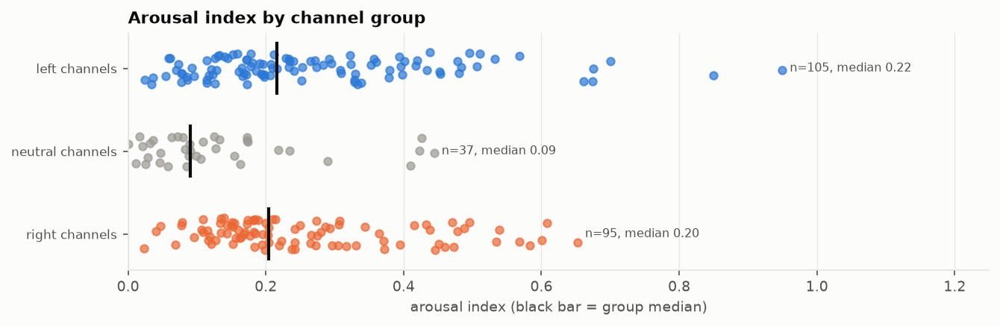

# 12. Arousal index by channel

**The question.** On one 0-1 scale, how emotionally charged is each channel's titling: capitals, exclamation marks, power words, emoji and sentiment intensity together?

## The finding in one paragraph

The index runs from @MeidasTouch (0.95) at the top, followed by @katiephangnews, @ponderingpolitics, @LukeBeasley, @LegalAFMTN, to @newyorker, @joerogan, @Semafor, @60minutes at the bottom (all under 0.02). The top of the ranking is the daily outrage channels of both sides plus the MeidasTouch network; the bottom is magazines, wires and interview podcasts. By channel group, the left group has the highest median (0.22), the right group is close behind (0.20) and the neutral group sits far below (0.09). The index agrees with the independent measures it should agree with: Spearman +0.77 with the LLM rater's *sensational* score aggregated per channel, -0.70 with the tone factor (positive = calm) and +0.32 with the ALL-CAPS factor of the style model.

*All ranked channels with edited uploads, highest first; color = channel group.*

## By channel group

| group | n_creators | median | mean | min | max |
|---|---|---|---|---|---|
| left channels | 105 | 0.22 | 0.27 | 0.02 | 0.95 |
| neutral channels | 37 | 0.09 | 0.13 | 0.00 | 0.44 |
| right channels | 95 | 0.20 | 0.26 | 0.02 | 0.65 |

## Every ranked channel (edited uploads), with the raw components

| rank | creator | group | index (0-1) | ALL-CAPS word share | ! per title | power words per title | emoji per title | VADER intensity | n_titles |
|---|---|---|---|---|---|---|---|---|---|
| 1.000 | @MeidasTouch | left | 0.950 | 0.578 | 1.623 | 0.874 | 0.152 | 0.371 | 3315 |
| 2.000 | @katiephangnews | left | 0.849 | 0.495 | 1.018 | 1.010 | 0.081 | 0.379 | 381 |
| 3.000 | @ponderingpolitics | left | 0.700 | 0.482 | 0.100 | 0.882 | 0.267 | 0.304 | 1392 |
| 4.000 | @LukeBeasley | left | 0.675 | 0.587 | 0.865 | 0.794 | 0.003 | 0.319 | 1109 |
| 5.000 | @LegalAFMTN | left | 0.675 | 0.405 | 1.097 | 0.655 | 0.038 | 0.323 | 2593 |
| 6.000 | @SecularTalk | left | 0.661 | 0.528 | 0.933 | 0.854 | 0.003 | 0.294 | 1374 |
| 7.000 | @BlackConservativePerspective | right | 0.653 | 0.339 | 0.831 | 0.990 | 0.000 | 0.343 | 1192 |
| 8.000 | @TheQuartering | right | 0.608 | 0.696 | 0.462 | 0.681 | 0.002 | 0.336 | 637 |
| 9.000 | @bennyjohnson | right | 0.601 | 0.171 | 0.240 | 0.868 | 0.374 | 0.275 | 1453 |
| 10.000 | @RobertGouveiaEsq | right | 0.583 | 0.255 | 0.980 | 0.630 | 0.000 | 0.387 | 660 |
| 11.000 | @aaronparnas1 | left | 0.568 | 0.299 | 0.209 | 0.956 | 0.066 | 0.306 | 769 |
| 12.000 | https://rumble.com/c/TheAlexJonesShowLive | right | 0.568 | 0.379 | 0.565 | 0.503 | 0.290 | 0.188 | 513 |
| 13.000 | @DrSteveTurleyTV | right | 0.538 | 0.294 | 2.705 | 0.621 | 0.000 | 0.274 | 417 |
| 14.000 | @AndWeKnowOfficial-o9b | right | 0.534 | 0.383 | 0.793 | 0.391 | 0.000 | 0.410 | 184 |
| 15.000 | @MikeFromPA | left | 0.532 | 0.391 | 1.080 | 0.328 | 0.032 | 0.260 | 125 |
| 16.000 | @harryjsisson | left | 0.511 | 0.378 | 0.212 | 0.921 | 0.014 | 0.298 | 632 |
| 17.000 | @DannyHaiphongYT | left | 0.506 | 0.262 | 0.189 | 1.660 | 0.000 | 0.342 | 53 |
| 18.000 | @TheMichaelCohenShow | left | 0.495 | 0.211 | 0.185 | 0.643 | 0.119 | 0.261 | 437 |
| 19.000 | @MyronGainesX | right | 0.495 | 0.115 | 0.871 | 0.789 | 0.000 | 0.286 | 365 |
| 20.000 | @MarkDice | right | 0.487 | 0.107 | 0.427 | 0.438 | 0.157 | 0.238 | 89 |
| 21.000 | @SabbySabs | left | 0.483 | 0.285 | 1.027 | 0.353 | 0.000 | 0.288 | 587 |
| 22.000 | @briantylercohen | left | 0.480 | 0.301 | 0.053 | 0.931 | 0.020 | 0.313 | 1019 |
| 23.000 | @DoubleDownNews | left | 0.478 | 0.274 | 0.031 | 0.984 | 0.016 | 0.317 | 64 |
| 24.000 | @BlazeTV | right | 0.478 | 0.145 | 0.478 | 0.694 | 0.069 | 0.263 | 829 |
| 25.000 | @OfficialSaharTV | right | 0.472 | 0.132 | 0.852 | 0.378 | 0.110 | 0.202 | 831 |
| 26.000 | @TheOfficerTatum | right | 0.471 | 0.333 | 0.204 | 0.763 | 0.000 | 0.330 | 599 |
| 27.000 | @jlptalk | right | 0.460 | 0.189 | 0.157 | 0.294 | 0.201 | 0.271 | 293 |
| 28.000 | @PiscoLitty | left | 0.453 | 0.274 | 0.148 | 0.500 | 0.074 | 0.300 | 54 |
| 29.000 | @adammockler | left | 0.452 | 0.320 | 0.212 | 0.632 | 0.013 | 0.325 | 1055 |
| 30.000 | @LiberalHivemind | right | 0.451 | 0.280 | 0.476 | 0.265 | 0.119 | 0.221 | 800 |
| 31.000 | @FreshFitMiami | right | 0.446 | 0.056 | 0.908 | 0.551 | 0.000 | 0.302 | 98 |
| 32.000 | @thejimmydoreshow | neutral | 0.444 | 0.164 | 0.986 | 0.516 | 0.000 | 0.256 | 1077 |
| 33.000 | @VivaFrei | right | 0.438 | 0.155 | 1.048 | 0.445 | 0.000 | 0.256 | 310 |
| 34.000 | @RebelHQ | left | 0.438 | 0.199 | 0.222 | 0.898 | 0.001 | 0.301 | 1190 |
| 35.000 | @dollemore | left | 0.434 | 0.353 | 0.584 | 0.384 | 0.000 | 0.296 | 1376 |
| 36.000 | @TimcastNews | right | 0.433 | 0.688 | 0.015 | 0.457 | 0.008 | 0.282 | 519 |
| 37.000 | @PiersMorganUncensored | neutral | 0.426 | 0.121 | 0.827 | 0.636 | 0.000 | 0.254 | 173 |
| 38.000 | @JacksonHinkleOfficial | neutral | 0.423 | 0.834 | 0.041 | 0.455 | 0.000 | 0.277 | 343 |
| 39.000 | @HasanabiClips | left | 0.420 | 0.171 | 0.091 | 0.530 | 0.137 | 0.213 | 474 |
| 40.000 | @StatusCoup | left | 0.417 | 0.322 | 0.307 | 0.446 | 0.012 | 0.313 | 489 |
| 41.000 | @TimcastIRL | right | 0.416 | 0.669 | 0.002 | 0.399 | 0.000 | 0.290 | 824 |
| 42.000 | @TimesNowWorld | neutral | 0.410 | 0.212 | 0.259 | 0.862 | 0.000 | 0.268 | 8489 |
| 43.000 | @usefulidiots | left | 0.402 | 0.155 | 0.039 | 0.933 | 0.000 | 0.307 | 179 |
| 44.000 | @JackCocchiarellaShow | left | 0.399 | 0.066 | 0.178 | 0.877 | 0.001 | 0.318 | 1446 |
| 45.000 | @TheDamageReport | left | 0.396 | 0.165 | 0.018 | 0.889 | 0.000 | 0.313 | 3015 |
| 46.000 | @Timcast | right | 0.395 | 0.648 | 0.006 | 0.425 | 0.000 | 0.262 | 174 |
| 47.000 | @timesofindia | left | 0.394 | 0.184 | 0.105 | 1.101 | 0.000 | 0.262 | 9372 |
| 48.000 | @GeopoliticalEconomyReport | left | 0.380 | 0.088 | 0.045 | 0.896 | 0.000 | 0.314 | 67 |
| 49.000 | @breakingpoints | left | 0.379 | 0.327 | 0.031 | 0.567 | 0.000 | 0.314 | 998 |
| 50.000 | https://rumble.com/c/nickjfuentes | right | 0.372 | 0.365 | 0.151 | 0.495 | 0.000 | 0.286 | 305 |
| 51.000 | @SecretScholars | right | 0.371 | 0.130 | 0.009 | 1.151 | 0.000 | 0.276 | 106 |
| 52.000 | @ActualJusticeWarrior | right | 0.364 | 0.241 | 0.000 | 0.500 | 0.000 | 0.392 | 368 |
| 53.000 | @deanwithrs | left | 0.360 | 0.311 | 0.008 | 0.414 | 0.000 | 0.341 | 251 |
| 54.000 | @podsaveamerica | left | 0.357 | 0.148 | 0.009 | 0.753 | 0.000 | 0.311 | 643 |
| 55.000 | @OwenJonesTalks | left | 0.353 | 0.166 | 0.004 | 0.717 | 0.009 | 0.297 | 226 |
| 56.000 | @AnthonyBrianLogan | right | 0.344 | 0.201 | 0.871 | 0.253 | 0.000 | 0.220 | 233 |
| 57.000 | @RestPoliticsUS | left | 0.338 | 0.234 | 0.101 | 0.572 | 0.000 | 0.286 | 208 |
| 58.000 | @TheDonLemonShow | left | 0.333 | 0.100 | 0.629 | 0.351 | 0.006 | 0.261 | 348 |
| 59.000 | @chicksonright | right | 0.331 | 0.116 | 0.193 | 0.677 | 0.025 | 0.237 | 446 |
| 60.000 | @HasanAbi | left | 0.330 | 0.560 | 0.176 | 0.232 | 0.007 | 0.223 | 591 |
| 61.000 | @FarronBalanced | left | 0.329 | 0.147 | 0.101 | 0.494 | 0.000 | 0.324 | 1705 |
| 62.000 | @GlennKirschner2 | left | 0.328 | 0.116 | 0.750 | 0.172 | 0.000 | 0.277 | 244 |
| 63.000 | @PTLRadioShow | left | 0.323 | 0.154 | 0.035 | 0.724 | 0.008 | 0.261 | 1580 |
| 64.000 | @thedavidpakmanshow | left | 0.322 | 0.251 | 0.018 | 0.493 | 0.000 | 0.299 | 1541 |
| 65.000 | @CamHigby | right | 0.317 | 0.144 | 0.362 | 0.391 | 0.023 | 0.249 | 174 |
| 66.000 | @DueDissidence | left | 0.309 | 0.289 | 0.040 | 0.430 | 0.000 | 0.282 | 596 |
| 67.000 | @TheRealTabithaSpeaks | left | 0.308 | 0.036 | 1.197 | 0.144 | 0.014 | 0.205 | 431 |
| 68.000 | @ChadPrather1 | right | 0.307 | 0.077 | 0.493 | 0.322 | 0.000 | 0.283 | 152 |
| 69.000 | @RealAmericasVoice | right | 0.306 | 0.323 | 0.011 | 0.527 | 0.015 | 0.227 | 2339 |
| 70.000 | @RedactedNews | right | 0.304 | 0.097 | 0.215 | 0.724 | 0.000 | 0.234 | 424 |
| 71.000 | @TheAdamCarollaShow1 | right | 0.296 | 0.094 | 0.274 | 0.360 | 0.054 | 0.225 | 372 |
| 72.000 | @lovettorleaveitpodcast | left | 0.295 | 0.112 | 0.036 | 0.645 | 0.000 | 0.275 | 110 |
| 73.000 | @DestinyDGGClips | right | 0.293 | 0.120 | 0.094 | 0.524 | 0.016 | 0.265 | 191 |
| 74.000 | @Vaush | left | 0.292 | 0.364 | 0.028 | 0.348 | 0.000 | 0.260 | 431 |
| 75.000 | @TuckerCarlson | neutral | 0.289 | 0.027 | 0.000 | 0.779 | 0.000 | 0.273 | 113 |
| 76.000 | @RubinReport | right | 0.287 | 0.039 | 0.005 | 0.773 | 0.000 | 0.266 | 1011 |
| 77.000 | @rolandsmartin | left | 0.283 | 0.043 | 0.093 | 0.722 | 0.003 | 0.250 | 698 |
| 78.000 | @FleccasTalks | right | 0.280 | 0.788 | 0.028 | 0.083 | 0.000 | 0.213 | 288 |
| 79.000 | @fightbackpodcast | right | 0.274 | 0.172 | 0.426 | 0.332 | 0.000 | 0.227 | 584 |
| 80.000 | @JesseKellyDC | right | 0.274 | 0.161 | 0.052 | 0.435 | 0.000 | 0.283 | 478 |
| 81.000 | @TheYoungTurks | left | 0.274 | 0.206 | 0.089 | 0.386 | 0.000 | 0.272 | 2706 |
| 82.000 | @SydneyWatson | right | 0.273 | 0.086 | 0.000 | 0.439 | 0.000 | 0.317 | 57 |
| 83.000 | @TheSerfTimes | left | 0.271 | 0.180 | 0.142 | 0.395 | 0.000 | 0.264 | 233 |
| 84.000 | @The_Crucible | right | 0.266 | 0.107 | 0.096 | 0.656 | 0.000 | 0.229 | 218 |
| 85.000 | @TheHumanistReport | left | 0.265 | 0.064 | 0.041 | 0.521 | 0.007 | 0.278 | 146 |
| 86.000 | @CashJordan | right | 0.264 | 0.479 | 0.000 | 0.268 | 0.000 | 0.216 | 299 |
| 87.000 | @Forthepeoplepodcast305 | left | 0.253 | 0.086 | 0.081 | 0.541 | 0.000 | 0.253 | 111 |
| 88.000 | @Xanderhal | left | 0.251 | 0.097 | 0.204 | 0.343 | 0.003 | 0.266 | 289 |
| 89.000 | @JillianMichaels | right | 0.250 | 0.134 | 0.192 | 0.467 | 0.005 | 0.222 | 437 |
| 90.000 | @GrahamAllen | right | 0.242 | 0.074 | 0.186 | 0.425 | 0.000 | 0.252 | 247 |
| 91.000 | @dineshdsouza | right | 0.242 | 0.487 | 0.016 | 0.129 | 0.000 | 0.219 | 62 |
| 92.000 | @Tim_Black | right | 0.242 | 0.046 | 0.116 | 0.405 | 0.048 | 0.212 | 311 |
| 93.000 | @DailyDenims | left | 0.241 | 0.056 | 0.014 | 0.609 | 0.000 | 0.248 | 215 |
| 94.000 | @destiny | left | 0.240 | 0.101 | 0.015 | 0.427 | 0.023 | 0.243 | 262 |
| 95.000 | @glennbeck | right | 0.238 | 0.116 | 0.162 | 0.508 | 0.000 | 0.218 | 437 |
| 96.000 | @JamarlThomas | left | 0.234 | 0.043 | 0.041 | 0.604 | 0.004 | 0.235 | 245 |
| 97.000 | @destinyhqclips | neutral | 0.234 | 0.106 | 0.000 | 0.599 | 0.000 | 0.229 | 197 |
| 98.000 | @DemocracyDocket | left | 0.233 | 0.071 | 0.008 | 0.418 | 0.000 | 0.282 | 122 |
| 99.000 | @HasanReactionsfanTwo | left | 0.233 | 0.174 | 0.050 | 0.445 | 0.000 | 0.232 | 319 |
| 100.000 | @LegalEagle | left | 0.229 | 0.055 | 0.041 | 0.268 | 0.000 | 0.313 | 97 |
| 101.000 | @lizwheeler | right | 0.222 | 0.147 | 0.260 | 0.286 | 0.000 | 0.224 | 77 |
| 102.000 | @lonerboxlive | right | 0.219 | 0.160 | 0.024 | 0.451 | 0.000 | 0.225 | 82 |
| 103.000 | @chinainsights-r2w | neutral | 0.218 | 0.017 | 0.126 | 0.546 | 0.000 | 0.228 | 238 |
| 104.000 | @BadEmpanadaLive | left | 0.216 | 0.147 | 0.073 | 0.237 | 0.000 | 0.269 | 274 |
| 105.000 | @marklevinshow | right | 0.214 | 0.030 | 0.027 | 0.323 | 0.000 | 0.294 | 486 |
| 106.000 | @SMN | left | 0.212 | 0.111 | 0.021 | 0.274 | 0.000 | 0.277 | 190 |
| 107.000 | @laurenchenclips | right | 0.210 | 0.054 | 0.028 | 0.413 | 0.000 | 0.260 | 109 |
| 108.000 | @TheDailyBeast | left | 0.209 | 0.009 | 0.000 | 0.507 | 0.000 | 0.257 | 294 |
| 109.000 | @TheVaushPit | left | 0.207 | 0.196 | 0.021 | 0.310 | 0.000 | 0.235 | 384 |
| 110.000 | @PoliticsGirl | left | 0.207 | 0.123 | 0.200 | 0.118 | 0.000 | 0.268 | 110 |
| 111.000 | https://rumble.com/c/BannonsWarRoom | right | 0.205 | 0.132 | 0.147 | 0.272 | 0.040 | 0.179 | 4506 |
| 112.000 | @AfterPartyEmily | right | 0.204 | 0.067 | 0.013 | 0.494 | 0.000 | 0.232 | 393 |
| 113.000 | @MattWalsh | right | 0.203 | 0.063 | 0.032 | 0.422 | 0.000 | 0.245 | 277 |
| 114.000 | @TheBrianKilmeadeShow | right | 0.199 | 0.041 | 0.057 | 0.435 | 0.000 | 0.241 | 352 |
| 115.000 | @MichaelKnowles | right | 0.199 | 0.107 | 0.038 | 0.360 | 0.000 | 0.240 | 445 |
| 116.000 | @therationalnational | left | 0.198 | 0.042 | 0.030 | 0.489 | 0.007 | 0.221 | 135 |
| 117.000 | @fastpoliticspodcast | left | 0.197 | 0.106 | 0.174 | 0.377 | 0.000 | 0.206 | 138 |
| 118.000 | @NovaraMedia | left | 0.196 | 0.110 | 0.014 | 0.386 | 0.000 | 0.234 | 565 |
| 119.000 | @TheMajorityReport | left | 0.195 | 0.096 | 0.015 | 0.354 | 0.000 | 0.246 | 1520 |
| 120.000 | @PartOfTheProblem | right | 0.195 | 0.024 | 0.000 | 0.247 | 0.000 | 0.300 | 97 |
| 121.000 | @FoxNews | right | 0.195 | 0.184 | 0.035 | 0.303 | 0.000 | 0.224 | 7727 |
| 122.000 | @underthedesknews | left | 0.193 | 0.117 | 0.243 | 0.230 | 0.000 | 0.219 | 74 |
| 123.000 | @judgingfreedom | left | 0.191 | 0.033 | 0.000 | 0.452 | 0.000 | 0.242 | 345 |
| 124.000 | @MLChristiansen | right | 0.189 | 0.033 | 0.034 | 0.353 | 0.000 | 0.256 | 116 |
| 125.000 | https://rumble.com/c/GGreenwald | left | 0.186 | 0.135 | 0.066 | 0.303 | 0.000 | 0.225 | 76 |
| 126.000 | @BenShapiro | right | 0.184 | 0.080 | 0.057 | 0.294 | 0.000 | 0.245 | 506 |
| 127.000 | @JustPearlyThings | right | 0.184 | 0.115 | 0.222 | 0.146 | 0.002 | 0.233 | 631 |
| 128.000 | @SaltyCracker | right | 0.183 | 0.033 | 0.003 | 0.305 | 0.000 | 0.269 | 361 |
| 129.000 | @nypost | right | 0.183 | 0.042 | 0.014 | 0.433 | 0.000 | 0.231 | 6036 |
| 130.000 | @oann | right | 0.182 | 0.148 | 0.005 | 0.285 | 0.007 | 0.222 | 1736 |
| 131.000 | @AlexStein99 | right | 0.181 | 0.050 | 0.268 | 0.354 | 0.000 | 0.193 | 82 |
| 132.000 | @thegrayzone7996 | left | 0.180 | 0.044 | 0.000 | 0.396 | 0.000 | 0.240 | 144 |
| 133.000 | @thomhartmann | left | 0.178 | 0.065 | 0.086 | 0.336 | 0.000 | 0.228 | 760 |
| 134.000 | @DropSiteNews | left | 0.178 | 0.041 | 0.005 | 0.424 | 0.000 | 0.231 | 198 |
| 135.000 | @XAVIAER | right | 0.177 | 0.062 | 0.088 | 0.294 | 0.000 | 0.237 | 68 |
| 136.000 | @MegynKelly | right | 0.174 | 0.085 | 0.008 | 0.371 | 0.000 | 0.224 | 1591 |
| 137.000 | @BrittanyVenti | neutral | 0.174 | 0.060 | 0.120 | 0.240 | 0.020 | 0.212 | 50 |
| 138.000 | @KimIversen | neutral | 0.173 | 0.090 | 0.061 | 0.307 | 0.000 | 0.226 | 505 |
| 139.000 | @DemocracyNow | left | 0.173 | 0.025 | 0.014 | 0.287 | 0.000 | 0.262 | 767 |
| 140.000 | @TheLincolnProject | left | 0.173 | 0.036 | 0.025 | 0.210 | 0.008 | 0.263 | 119 |
| 141.000 | @AndrewKlavan | right | 0.173 | 0.041 | 0.016 | 0.224 | 0.000 | 0.272 | 183 |
| 142.000 | @thehill | neutral | 0.172 | 0.157 | 0.050 | 0.299 | 0.000 | 0.206 | 4045 |
| 143.000 | @OwenReport | left | 0.172 | 0.080 | 0.000 | 0.291 | 0.000 | 0.244 | 368 |
| 144.000 | @aljazeeraenglish | left | 0.171 | 0.035 | 0.000 | 0.335 | 0.000 | 0.248 | 6643 |
| 145.000 | @clayandbuck | right | 0.170 | 0.057 | 0.099 | 0.356 | 0.000 | 0.213 | 565 |
| 146.000 | @FoxNewsChannelClips | right | 0.169 | 0.169 | 0.013 | 0.262 | 0.000 | 0.215 | 5421 |
| 147.000 | @TheJoyReidShow | left | 0.168 | 0.049 | 0.137 | 0.209 | 0.004 | 0.236 | 234 |
| 148.000 | @BreakThroughNews | left | 0.166 | 0.052 | 0.000 | 0.470 | 0.000 | 0.204 | 234 |
| 149.000 | @PoliticsJOE | left | 0.165 | 0.061 | 0.000 | 0.382 | 0.000 | 0.221 | 325 |
| 150.000 | @winston_marshall | right | 0.164 | 0.056 | 0.067 | 0.385 | 0.000 | 0.207 | 104 |
| 151.000 | @LIVESNEAKO | neutral | 0.162 | 0.118 | 0.072 | 0.263 | 0.013 | 0.195 | 472 |
| 152.000 | @RealDanBongino | right | 0.162 | 0.064 | 0.041 | 0.293 | 0.000 | 0.230 | 266 |
| 153.000 | @msnow | left | 0.161 | 0.087 | 0.035 | 0.376 | 0.000 | 0.202 | 9398 |
| 154.000 | @TheAmalaEkpunobi | right | 0.160 | 0.071 | 0.030 | 0.315 | 0.000 | 0.222 | 197 |
| 155.000 | @jimacosta | left | 0.159 | 0.054 | 0.056 | 0.422 | 0.007 | 0.185 | 301 |
| 156.000 | @Styxhexenhammer666 | right | 0.156 | 0.039 | 0.087 | 0.197 | 0.000 | 0.246 | 380 |
| 157.000 | @hutch | neutral | 0.154 | 0.112 | 0.025 | 0.275 | 0.000 | 0.212 | 160 |
| 158.000 | @RebelNewsOnline | right | 0.154 | 0.063 | 0.046 | 0.279 | 0.006 | 0.215 | 1273 |
| 159.000 | @StevenCrowder | right | 0.152 | 0.034 | 0.006 | 0.297 | 0.000 | 0.235 | 165 |
| 160.000 | @DylanBurnsLIVE | left | 0.152 | 0.029 | 0.000 | 0.303 | 0.000 | 0.237 | 175 |
| 161.000 | @AsmonTV | right | 0.152 | 0.091 | 0.000 | 0.319 | 0.000 | 0.211 | 825 |
| 162.000 | @RileyGaines | right | 0.151 | 0.062 | 0.084 | 0.315 | 0.000 | 0.205 | 143 |
| 163.000 | @ZubyMusic | right | 0.150 | 0.024 | 0.000 | 0.331 | 0.000 | 0.229 | 130 |
| 164.000 | @marclamonthillnetwork | left | 0.145 | 0.072 | 0.142 | 0.333 | 0.000 | 0.177 | 309 |
| 165.000 | @nationalreview | right | 0.144 | 0.027 | 0.000 | 0.202 | 0.000 | 0.253 | 183 |
| 166.000 | @theisabelbrown | right | 0.143 | 0.038 | 0.052 | 0.261 | 0.000 | 0.223 | 134 |
| 167.000 | @UnHerd | left | 0.140 | 0.019 | 0.000 | 0.303 | 0.000 | 0.227 | 76 |
| 168.000 | @HangOutwithSeanHannity | right | 0.139 | 0.039 | 0.019 | 0.318 | 0.000 | 0.212 | 154 |
| 169.000 | @X22Report-y5y | right | 0.135 | 0.052 | 0.000 | 0.441 | 0.000 | 0.177 | 379 |
| 170.000 | @MichaelMaliceofficial | right | 0.135 | 0.109 | 0.020 | 0.137 | 0.000 | 0.227 | 51 |
| 171.000 | @TomiLahrenIsFearless | right | 0.134 | 0.068 | 0.027 | 0.372 | 0.009 | 0.169 | 113 |
| 172.000 | @SkyNews | left | 0.133 | 0.026 | 0.001 | 0.267 | 0.000 | 0.226 | 3412 |
| 173.000 | @ANINewsIndia | neutral | 0.132 | 0.068 | 0.090 | 0.298 | 0.000 | 0.184 | 11623 |
| 174.000 | @bulwarkmedia | left | 0.130 | 0.042 | 0.029 | 0.347 | 0.000 | 0.191 | 1730 |
| 175.000 | @zeteo | left | 0.128 | 0.064 | 0.015 | 0.333 | 0.000 | 0.188 | 198 |
| 176.000 | @Firstpost | neutral | 0.128 | 0.045 | 0.005 | 0.384 | 0.000 | 0.183 | 9637 |
| 177.000 | @bbrettcooper | right | 0.127 | 0.047 | 0.065 | 0.194 | 0.014 | 0.195 | 139 |
| 178.000 | @thewarningwithsteveschmidt | left | 0.126 | 0.024 | 0.004 | 0.198 | 0.000 | 0.235 | 273 |
| 179.000 | @franifio | left | 0.126 | 0.044 | 0.026 | 0.203 | 0.000 | 0.222 | 271 |
| 180.000 | @BBCNews | neutral | 0.125 | 0.049 | 0.001 | 0.260 | 0.000 | 0.211 | 2352 |
| 181.000 | @BadFaithPodcast | left | 0.123 | 0.136 | 0.052 | 0.221 | 0.000 | 0.177 | 77 |
| 182.000 | @RufoandLomez | right | 0.121 | 0.037 | 0.000 | 0.230 | 0.000 | 0.217 | 74 |
| 183.000 | @moreperfectunion | left | 0.120 | 0.008 | 0.000 | 0.368 | 0.000 | 0.193 | 68 |
| 184.000 | @turningpointusa | right | 0.118 | 0.028 | 0.007 | 0.118 | 0.026 | 0.206 | 152 |
| 185.000 | @HasanAbiVODs3 | left | 0.118 | 0.075 | 0.006 | 0.018 | 0.074 | 0.054 | 163 |
| 186.000 | @PragerU | right | 0.116 | 0.016 | 0.051 | 0.278 | 0.005 | 0.190 | 371 |
| 187.000 | @morebridgetphetasy | right | 0.115 | 0.009 | 0.000 | 0.195 | 0.000 | 0.230 | 200 |
| 188.000 | @CNN | left | 0.115 | 0.042 | 0.001 | 0.274 | 0.000 | 0.198 | 1638 |
| 189.000 | @Vox | left | 0.114 | 0.016 | 0.000 | 0.331 | 0.000 | 0.193 | 127 |
| 190.000 | @Politicon | left | 0.114 | 0.037 | 0.017 | 0.292 | 0.002 | 0.189 | 480 |
| 191.000 | @ThePodcastoftheLotusEaters | right | 0.109 | 0.018 | 0.027 | 0.158 | 0.000 | 0.223 | 588 |
| 192.000 | @Reuters | neutral | 0.108 | 0.046 | 0.000 | 0.183 | 0.000 | 0.212 | 7680 |
| 193.000 | @MrTariqNasheed | right | 0.108 | 0.058 | 0.003 | 0.325 | 0.000 | 0.173 | 354 |
| 194.000 | https://rumble.com/c/russellbrand | right | 0.107 | 0.049 | 0.058 | 0.247 | 0.004 | 0.176 | 259 |
| 195.000 | @USATODAY | neutral | 0.106 | 0.034 | 0.005 | 0.237 | 0.000 | 0.199 | 2135 |
| 196.000 | @ClipsCandaceOwens | neutral | 0.099 | 0.076 | 0.021 | 0.198 | 0.000 | 0.183 | 192 |
| 197.000 | @NYTPodcasts | left | 0.096 | 0.008 | 0.004 | 0.251 | 0.000 | 0.194 | 454 |
| 198.000 | @NewsmaxTV | right | 0.096 | 0.037 | 0.003 | 0.239 | 0.000 | 0.187 | 3744 |
| 199.000 | @TheAtlantic | left | 0.092 | 0.023 | 0.000 | 0.210 | 0.000 | 0.195 | 157 |
| 200.000 | @wsj | neutral | 0.090 | 0.039 | 0.000 | 0.288 | 0.000 | 0.169 | 104 |
| 201.000 | @ABCNews | neutral | 0.089 | 0.038 | 0.001 | 0.167 | 0.000 | 0.197 | 7521 |
| 202.000 | @CBSNews | neutral | 0.088 | 0.023 | 0.001 | 0.220 | 0.000 | 0.189 | 7956 |
| 203.000 | @EzraKleinShow | left | 0.086 | 0.002 | 0.000 | 0.200 | 0.000 | 0.197 | 60 |
| 204.000 | @RonPlacone | left | 0.085 | 0.070 | 0.079 | 0.159 | 0.000 | 0.168 | 63 |
| 205.000 | @ZeihanonGeopolitics | neutral | 0.085 | 0.014 | 0.005 | 0.188 | 0.000 | 0.195 | 202 |
| 206.000 | @AssociatedPress | neutral | 0.083 | 0.029 | 0.001 | 0.169 | 0.000 | 0.193 | 5262 |
| 207.000 | @NewsNation | neutral | 0.079 | 0.038 | 0.016 | 0.186 | 0.000 | 0.178 | 6882 |
| 208.000 | @TheEconomist | left | 0.078 | 0.029 | 0.000 | 0.215 | 0.000 | 0.177 | 130 |
| 209.000 | @triggerpod | right | 0.078 | 0.020 | 0.007 | 0.252 | 0.000 | 0.170 | 143 |
| 210.000 | @ColemanHughesOfficial | right | 0.078 | 0.008 | 0.000 | 0.212 | 0.000 | 0.184 | 52 |
| 211.000 | @nousnetwork | left | 0.077 | 0.019 | 0.007 | 0.224 | 0.000 | 0.176 | 152 |
| 212.000 | @samharrisorg | left | 0.077 | 0.035 | 0.000 | 0.167 | 0.000 | 0.185 | 108 |
| 213.000 | @LeejaMiller | left | 0.073 | 0.062 | 0.000 | 0.107 | 0.000 | 0.186 | 56 |
| 214.000 | @NBCNews | neutral | 0.072 | 0.070 | 0.003 | 0.148 | 0.000 | 0.172 | 6161 |
| 215.000 | @chriscuomo | left | 0.070 | 0.027 | 0.005 | 0.232 | 0.000 | 0.164 | 203 |
| 216.000 | @RSBN | right | 0.069 | 0.130 | 0.001 | 0.132 | 0.000 | 0.152 | 1553 |
| 217.000 | @markets | neutral | 0.064 | 0.052 | 0.000 | 0.159 | 0.000 | 0.167 | 7665 |
| 218.000 | @cafedotcom | left | 0.061 | 0.029 | 0.000 | 0.288 | 0.000 | 0.140 | 52 |
| 219.000 | @ajplus | left | 0.059 | 0.012 | 0.000 | 0.140 | 0.000 | 0.179 | 50 |
| 220.000 | @TimDillonShow | neutral | 0.058 | 0.032 | 0.015 | 0.091 | 0.000 | 0.180 | 66 |
| 221.000 | @NPR | left | 0.054 | 0.016 | 0.000 | 0.157 | 0.000 | 0.169 | 70 |
| 222.000 | @RealAlexClark | right | 0.047 | 0.029 | 0.027 | 0.151 | 0.014 | 0.132 | 73 |
| 223.000 | @TechCrunch | neutral | 0.047 | 0.046 | 0.000 | 0.079 | 0.000 | 0.169 | 139 |
| 224.000 | @wethefifth | neutral | 0.046 | 0.031 | 0.000 | 0.168 | 0.000 | 0.152 | 107 |
| 225.000 | @DarkHorsePod | right | 0.041 | 0.024 | 0.000 | 0.138 | 0.000 | 0.156 | 65 |
| 226.000 | @Forbes | neutral | 0.036 | 0.027 | 0.000 | 0.119 | 0.006 | 0.146 | 1196 |
| 227.000 | @LeverNews | left | 0.036 | 0.012 | 0.000 | 0.169 | 0.000 | 0.147 | 71 |
| 228.000 | @BelleRanch | left | 0.034 | 0.023 | 0.000 | 0.147 | 0.000 | 0.147 | 770 |
| 229.000 | @POLITICO | neutral | 0.032 | 0.026 | 0.007 | 0.108 | 0.000 | 0.151 | 286 |
| 230.000 | @axios | neutral | 0.029 | 0.035 | 0.000 | 0.161 | 0.000 | 0.134 | 137 |
| 231.000 | @ClubRandomPodcast | neutral | 0.025 | 0.011 | 0.005 | 0.157 | 0.005 | 0.124 | 185 |
| 232.000 | @nytimes | left | 0.025 | 0.009 | 0.014 | 0.116 | 0.000 | 0.146 | 69 |
| 233.000 | @newdiscourses | right | 0.024 | 0.005 | 0.000 | 0.105 | 0.000 | 0.150 | 95 |
| 234.000 | @60minutes | neutral | 0.021 | 0.012 | 0.000 | 0.153 | 0.000 | 0.135 | 301 |
| 235.000 | @Semafor | neutral | 0.016 | 0.061 | 0.000 | 0.074 | 0.000 | 0.103 | 149 |
| 236.000 | @joerogan | neutral | 0.012 | 0.046 | 0.000 | 0.000 | 0.000 | 0.033 | 133 |
| 237.000 | @newyorker | neutral | 0.000 | 0.002 | 0.000 | 0.020 | 0.000 | 0.113 | 50 |

Live VODs and low-n channels are in `arousal_index.csv` (column `genre`, flag `low_n`).

## Method

For each unique title: (1) the share of 2+-letter words in ALL CAPS; (2) the number of exclamation marks, capped at three; (3) power words, the count of shock words, violence/outrage verbs and intensifiers from the pipeline lexicons ("insane", "slams", "exposed", "absolutely"); (4) emoji characters; (5) VADER intensity, the positive plus negative sentiment shares (arousal, not valence: "AMAZING" counts as much as "DISGUSTING"). Each component is averaged per channel x genre; across the ranked channels of a genre it is winsorized at the 2nd and 98th percentile and min-max scaled to 0-1; the index is the mean of the five scaled components. Ranks and percentiles are within genre.

## Limitations

- Equal weights are a choice; a channel that only shouts and a channel that only exclaims can tie.
- Emoji are rare (most channels average zero per title), so that component mostly separates a few emoji users (MeidasTouch, Benny Johnson, Pondering Politics) from everyone else.
- Min-max scaling depends on the extremes even after winsorizing; the ranking is stable, the spacing between values is not meaningful beyond ordering.
- VADER is a general-purpose sentiment lexicon on ten-word texts; "war" or "shooting" raise intensity in a wire headline as they do in a rant.
- Computed on normalized titles (brand suffixes removed).
- Channel groups are the left / neutral / right groups of document 14: each channel's score = (right − left) / titles over its sampled titles as labeled by the judge, sorted at ±0.05. A channel's group says how its *titles* read, not what its host believes.

Files: `arousal_index.csv`.
