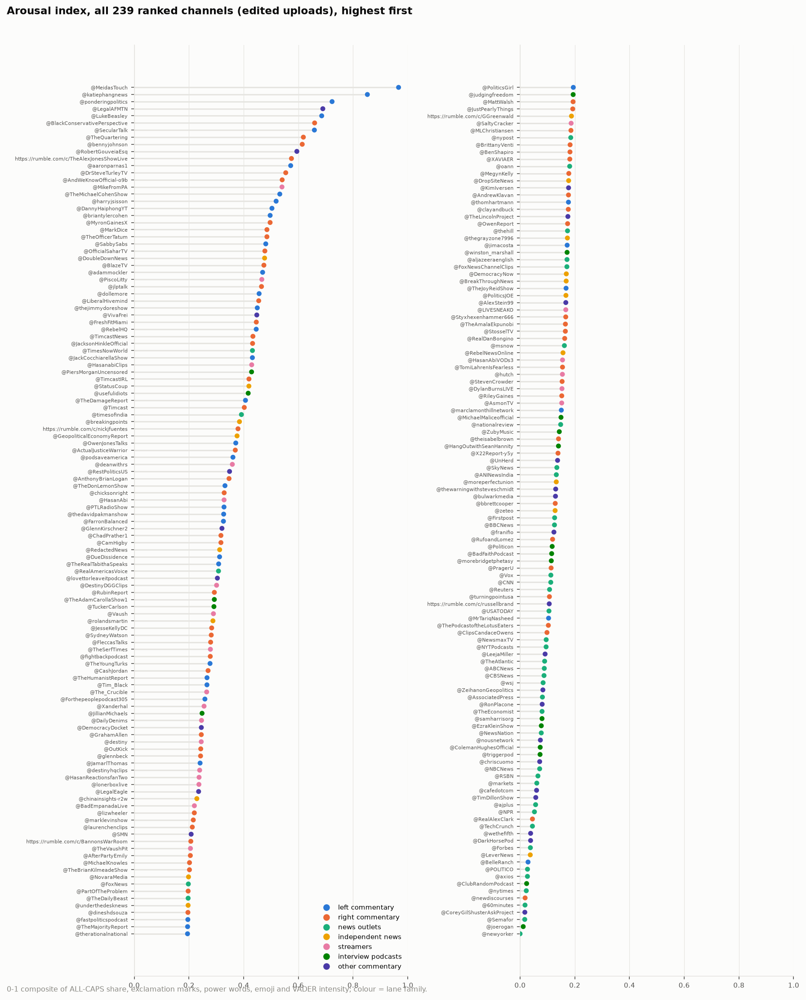
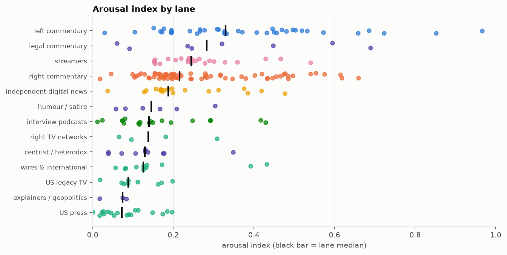

# 12. Arousal index by channel

**The question.** On one 0-1 scale, how emotionally charged is each channel's titling: capitals, exclamation marks, power words, emoji and sentiment intensity together?

## The finding in one paragraph

The index runs from @MeidasTouch (0.97) at the top, followed by @katiephangnews, @ponderingpolitics, @LegalAFMTN, @LukeBeasley, to @newyorker, @joerogan, @Semafor, @CoreyGilShusterAskProject at the bottom (all under 0.02). The top of the ranking is the daily outrage channels of both sides plus the MeidasTouch network; the bottom is magazines, wires and interview podcasts. By lane, left commentary has the highest median, then legal commentary and streamers; the press and legacy TV the lowest. The index agrees with the independent measures it should agree with: Spearman +0.77 with the LLM rater's *sensational* score aggregated per channel, -0.72 with the tone factor (positive = calm) and +0.30 with the ALL-CAPS factor of document 3.

*All ranked channels with edited uploads, highest first; colour = lane family.*

## By lane

| lane | n_creators | median | mean | min | max |
|---|---|---|---|---|---|
| left commentary | 40 | 0.33 | 0.38 | 0.03 | 0.97 |
| legal commentary | 8 | 0.28 | 0.34 | 0.06 | 0.69 |
| streamers | 23 | 0.24 | 0.27 | 0.15 | 0.54 |
| right commentary | 69 | 0.22 | 0.28 | 0.02 | 0.66 |
| independent digital news | 19 | 0.19 | 0.23 | 0.04 | 0.48 |
| humour / satire | 6 | 0.15 | 0.16 | 0.06 | 0.30 |
| interview podcasts | 19 | 0.14 | 0.17 | 0.01 | 0.43 |
| right TV networks | 4 | 0.14 | 0.16 | 0.07 | 0.31 |
| centrist / heterodox | 10 | 0.13 | 0.14 | 0.04 | 0.35 |
| wires & international | 11 | 0.13 | 0.17 | 0.06 | 0.43 |
| US legacy TV | 9 | 0.09 | 0.11 | 0.02 | 0.20 |
| explainers / geopolitics | 3 | 0.07 | 0.06 | 0.02 | 0.08 |
| US press | 18 | 0.07 | 0.08 | 0.00 | 0.20 |

## Every ranked channel (edited uploads), with the raw components

| rank | creator | lane | index (0-1) | ALL-CAPS word share | ! per title | power words per title | emoji per title | VADER intensity | n_titles |
|---|---|---|---|---|---|---|---|---|---|
| 1.000 | @MeidasTouch | left commentary | 0.966 | 0.577 | 1.546 | 0.876 | 0.149 | 0.369 | 3532 |
| 2.000 | @katiephangnews | left commentary | 0.852 | 0.494 | 0.985 | 0.998 | 0.082 | 0.378 | 403 |
| 3.000 | @ponderingpolitics | left commentary | 0.723 | 0.486 | 0.098 | 0.900 | 0.277 | 0.308 | 1467 |
| 4.000 | @LegalAFMTN | legal commentary | 0.689 | 0.406 | 1.056 | 0.667 | 0.038 | 0.324 | 2735 |
| 5.000 | @LukeBeasley | left commentary | 0.685 | 0.588 | 0.855 | 0.787 | 0.003 | 0.318 | 1162 |
| 6.000 | @BlackConservativePerspective | right commentary | 0.659 | 0.340 | 0.834 | 0.997 | 0.000 | 0.345 | 1271 |
| 7.000 | @SecularTalk | left commentary | 0.659 | 0.519 | 0.897 | 0.835 | 0.003 | 0.292 | 1458 |
| 8.000 | @TheQuartering | right commentary | 0.618 | 0.663 | 0.477 | 0.699 | 0.001 | 0.332 | 675 |
| 9.000 | @bennyjohnson | right commentary | 0.614 | 0.171 | 0.241 | 0.878 | 0.366 | 0.276 | 1508 |
| 10.000 | @RobertGouveiaEsq | legal commentary | 0.594 | 0.254 | 1.024 | 0.606 | 0.000 | 0.379 | 696 |
| 11.000 | https://rumble.com/c/TheAlexJonesShowLive | right commentary | 0.575 | 0.379 | 0.565 | 0.503 | 0.290 | 0.188 | 513 |
| 12.000 | @aaronparnas1 | left commentary | 0.572 | 0.300 | 0.197 | 0.941 | 0.062 | 0.305 | 819 |
| 13.000 | @DrSteveTurleyTV | right commentary | 0.554 | 0.292 | 2.715 | 0.643 | 0.000 | 0.278 | 442 |
| 14.000 | @AndWeKnowOfficial-o9b | right commentary | 0.541 | 0.383 | 0.789 | 0.389 | 0.000 | 0.410 | 185 |
| 15.000 | @MikeFromPA | streamers | 0.540 | 0.388 | 1.093 | 0.333 | 0.031 | 0.262 | 129 |
| 16.000 | @TheMichaelCohenShow | left commentary | 0.532 | 0.237 | 0.182 | 0.691 | 0.119 | 0.268 | 479 |
| 17.000 | @harryjsisson | left commentary | 0.519 | 0.369 | 0.200 | 0.925 | 0.013 | 0.298 | 681 |
| 18.000 | @DannyHaiphongYT | left commentary | 0.503 | 0.254 | 0.156 | 1.703 | 0.000 | 0.345 | 64 |
| 19.000 | @briantylercohen | left commentary | 0.497 | 0.299 | 0.051 | 0.935 | 0.020 | 0.317 | 1081 |
| 20.000 | @MyronGainesX | right commentary | 0.497 | 0.116 | 0.864 | 0.779 | 0.000 | 0.282 | 389 |
| 21.000 | @MarkDice | right commentary | 0.485 | 0.106 | 0.413 | 0.435 | 0.152 | 0.235 | 92 |
| 22.000 | @TheOfficerTatum | right commentary | 0.485 | 0.332 | 0.209 | 0.770 | 0.000 | 0.331 | 617 |
| 23.000 | @SabbySabs | left commentary | 0.481 | 0.285 | 0.997 | 0.350 | 0.000 | 0.287 | 626 |
| 24.000 | @OfficialSaharTV | right commentary | 0.478 | 0.130 | 0.848 | 0.394 | 0.105 | 0.204 | 893 |
| 25.000 | @DoubleDownNews | independent digital news | 0.477 | 0.267 | 0.030 | 0.955 | 0.015 | 0.315 | 66 |
| 26.000 | @BlazeTV | right commentary | 0.474 | 0.144 | 0.462 | 0.677 | 0.066 | 0.260 | 868 |
| 27.000 | @adammockler | left commentary | 0.469 | 0.328 | 0.214 | 0.648 | 0.013 | 0.327 | 1117 |
| 28.000 | @PiscoLitty | streamers | 0.466 | 0.282 | 0.143 | 0.518 | 0.071 | 0.302 | 56 |
| 29.000 | @jlptalk | right commentary | 0.465 | 0.187 | 0.151 | 0.299 | 0.194 | 0.274 | 304 |
| 30.000 | @dollemore | left commentary | 0.457 | 0.357 | 0.654 | 0.379 | 0.000 | 0.298 | 1439 |
| 31.000 | @LiberalHivemind | right commentary | 0.455 | 0.284 | 0.465 | 0.267 | 0.116 | 0.222 | 846 |
| 32.000 | @thejimmydoreshow | left commentary | 0.450 | 0.165 | 0.988 | 0.514 | 0.000 | 0.255 | 1146 |
| 33.000 | @VivaFrei | legal commentary | 0.448 | 0.157 | 1.054 | 0.441 | 0.000 | 0.261 | 331 |
| 34.000 | @FreshFitMiami | right commentary | 0.446 | 0.062 | 0.919 | 0.486 | 0.000 | 0.309 | 111 |
| 35.000 | @RebelHQ | left commentary | 0.446 | 0.199 | 0.228 | 0.889 | 0.001 | 0.300 | 1292 |
| 36.000 | @TimcastNews | right commentary | 0.434 | 0.687 | 0.017 | 0.453 | 0.007 | 0.280 | 534 |
| 37.000 | @JacksonHinkleOfficial | right commentary | 0.433 | 0.852 | 0.036 | 0.469 | 0.000 | 0.282 | 388 |
| 38.000 | @TimesNowWorld | wires & international | 0.432 | 0.226 | 0.250 | 0.856 | 0.000 | 0.280 | 8994 |
| 39.000 | @JackCocchiarellaShow | left commentary | 0.432 | 0.091 | 0.244 | 0.878 | 0.001 | 0.322 | 1524 |
| 40.000 | @HasanabiClips | streamers | 0.429 | 0.171 | 0.091 | 0.530 | 0.137 | 0.213 | 474 |
| 41.000 | @PiersMorganUncensored | interview podcasts | 0.429 | 0.120 | 0.807 | 0.635 | 0.000 | 0.255 | 181 |
| 42.000 | @TimcastIRL | right commentary | 0.419 | 0.649 | 0.002 | 0.407 | 0.000 | 0.290 | 855 |
| 43.000 | @StatusCoup | independent digital news | 0.419 | 0.326 | 0.309 | 0.427 | 0.012 | 0.311 | 517 |
| 44.000 | @usefulidiots | interview podcasts | 0.417 | 0.153 | 0.038 | 0.935 | 0.000 | 0.312 | 186 |
| 45.000 | @TheDamageReport | left commentary | 0.407 | 0.165 | 0.018 | 0.891 | 0.000 | 0.313 | 3204 |
| 46.000 | @Timcast | right commentary | 0.402 | 0.624 | 0.005 | 0.448 | 0.000 | 0.262 | 183 |
| 47.000 | @timesofindia | wires & international | 0.392 | 0.179 | 0.102 | 1.085 | 0.000 | 0.261 | 9926 |
| 48.000 | @breakingpoints | independent digital news | 0.385 | 0.322 | 0.031 | 0.565 | 0.000 | 0.314 | 1037 |
| 49.000 | https://rumble.com/c/nickjfuentes | right commentary | 0.379 | 0.365 | 0.151 | 0.495 | 0.000 | 0.286 | 305 |
| 50.000 | @GeopoliticalEconomyReport | independent digital news | 0.376 | 0.086 | 0.042 | 0.833 | 0.000 | 0.317 | 72 |
| 51.000 | @OwenJonesTalks | left commentary | 0.371 | 0.168 | 0.004 | 0.742 | 0.009 | 0.301 | 233 |
| 52.000 | @ActualJusticeWarrior | right commentary | 0.369 | 0.241 | 0.000 | 0.492 | 0.000 | 0.394 | 392 |
| 53.000 | @podsaveamerica | left commentary | 0.361 | 0.147 | 0.009 | 0.744 | 0.000 | 0.309 | 667 |
| 54.000 | @deanwithrs | streamers | 0.359 | 0.313 | 0.019 | 0.404 | 0.000 | 0.332 | 265 |
| 55.000 | @RestPoliticsUS | centrist / heterodox | 0.348 | 0.232 | 0.100 | 0.573 | 0.000 | 0.290 | 220 |
| 56.000 | @AnthonyBrianLogan | right commentary | 0.347 | 0.201 | 0.863 | 0.258 | 0.000 | 0.221 | 248 |
| 57.000 | @TheDonLemonShow | left commentary | 0.332 | 0.099 | 0.628 | 0.342 | 0.005 | 0.260 | 366 |
| 58.000 | @chicksonright | right commentary | 0.329 | 0.113 | 0.196 | 0.663 | 0.023 | 0.234 | 475 |
| 59.000 | @HasanAbi | streamers | 0.328 | 0.551 | 0.174 | 0.226 | 0.006 | 0.220 | 628 |
| 60.000 | @PTLRadioShow | left commentary | 0.328 | 0.151 | 0.033 | 0.727 | 0.008 | 0.260 | 1684 |
| 61.000 | @thedavidpakmanshow | left commentary | 0.327 | 0.250 | 0.017 | 0.491 | 0.000 | 0.298 | 1641 |
| 62.000 | @FarronBalanced | left commentary | 0.326 | 0.143 | 0.098 | 0.481 | 0.000 | 0.320 | 1780 |
| 63.000 | @GlennKirschner2 | legal commentary | 0.321 | 0.114 | 0.725 | 0.172 | 0.000 | 0.274 | 262 |
| 64.000 | @ChadPrather1 | right commentary | 0.317 | 0.079 | 0.512 | 0.350 | 0.000 | 0.280 | 160 |
| 65.000 | @CamHigby | right commentary | 0.317 | 0.142 | 0.376 | 0.398 | 0.022 | 0.243 | 186 |
| 66.000 | @RedactedNews | independent digital news | 0.312 | 0.098 | 0.204 | 0.730 | 0.000 | 0.236 | 452 |
| 67.000 | @DueDissidence | left commentary | 0.312 | 0.290 | 0.037 | 0.425 | 0.000 | 0.280 | 643 |
| 68.000 | @TheRealTabithaSpeaks | left commentary | 0.309 | 0.035 | 1.177 | 0.144 | 0.015 | 0.205 | 452 |
| 69.000 | @RealAmericasVoice | right TV networks | 0.308 | 0.315 | 0.011 | 0.521 | 0.014 | 0.228 | 2653 |
| 70.000 | @lovettorleaveitpodcast | humour / satire | 0.304 | 0.111 | 0.044 | 0.649 | 0.000 | 0.276 | 114 |
| 71.000 | @DestinyDGGClips | streamers | 0.301 | 0.122 | 0.105 | 0.526 | 0.014 | 0.266 | 209 |
| 72.000 | @RubinReport | right commentary | 0.293 | 0.038 | 0.005 | 0.772 | 0.000 | 0.266 | 1047 |
| 73.000 | @TheAdamCarollaShow1 | interview podcasts | 0.293 | 0.089 | 0.263 | 0.347 | 0.051 | 0.229 | 395 |
| 74.000 | @TuckerCarlson | interview podcasts | 0.291 | 0.028 | 0.000 | 0.765 | 0.000 | 0.271 | 119 |
| 75.000 | @Vaush | streamers | 0.289 | 0.356 | 0.026 | 0.340 | 0.000 | 0.256 | 453 |
| 76.000 | @rolandsmartin | independent digital news | 0.288 | 0.043 | 0.093 | 0.721 | 0.003 | 0.250 | 742 |
| 77.000 | @JesseKellyDC | right commentary | 0.283 | 0.163 | 0.054 | 0.454 | 0.000 | 0.283 | 504 |
| 78.000 | @SydneyWatson | right commentary | 0.282 | 0.087 | 0.000 | 0.459 | 0.000 | 0.317 | 61 |
| 79.000 | @FleccasTalks | right commentary | 0.279 | 0.783 | 0.031 | 0.083 | 0.000 | 0.213 | 290 |
| 80.000 | @TheSerfTimes | streamers | 0.278 | 0.177 | 0.146 | 0.401 | 0.000 | 0.267 | 247 |
| 81.000 | @fightbackpodcast | right commentary | 0.278 | 0.171 | 0.418 | 0.335 | 0.000 | 0.229 | 627 |
| 82.000 | @TheYoungTurks | left commentary | 0.277 | 0.205 | 0.091 | 0.387 | 0.000 | 0.271 | 2868 |
| 83.000 | @CashJordan | right commentary | 0.270 | 0.479 | 0.000 | 0.268 | 0.000 | 0.216 | 299 |
| 84.000 | @TheHumanistReport | left commentary | 0.266 | 0.063 | 0.039 | 0.506 | 0.006 | 0.279 | 154 |
| 85.000 | @Tim_Black | left commentary | 0.266 | 0.046 | 0.112 | 0.404 | 0.064 | 0.212 | 329 |
| 86.000 | @The_Crucible | streamers | 0.265 | 0.108 | 0.093 | 0.633 | 0.000 | 0.228 | 226 |
| 87.000 | @Forthepeoplepodcast305 | left commentary | 0.258 | 0.086 | 0.078 | 0.530 | 0.000 | 0.258 | 115 |
| 88.000 | @Xanderhal | streamers | 0.255 | 0.093 | 0.196 | 0.354 | 0.003 | 0.268 | 316 |
| 89.000 | @JillianMichaels | interview podcasts | 0.248 | 0.136 | 0.188 | 0.455 | 0.004 | 0.219 | 457 |
| 90.000 | @DailyDenims | streamers | 0.246 | 0.056 | 0.014 | 0.609 | 0.000 | 0.248 | 215 |
| 91.000 | @DemocracyDocket | legal commentary | 0.245 | 0.071 | 0.008 | 0.450 | 0.000 | 0.284 | 129 |
| 92.000 | @GrahamAllen | right commentary | 0.245 | 0.074 | 0.186 | 0.425 | 0.000 | 0.252 | 247 |
| 93.000 | @destiny | streamers | 0.245 | 0.102 | 0.015 | 0.431 | 0.022 | 0.244 | 267 |
| 94.000 | @OutKick | right commentary | 0.243 | 0.128 | 0.137 | 0.451 | 0.000 | 0.235 | 51 |
| 95.000 | @glennbeck | right commentary | 0.242 | 0.122 | 0.159 | 0.498 | 0.000 | 0.220 | 460 |
| 96.000 | @JamarlThomas | left commentary | 0.241 | 0.041 | 0.040 | 0.606 | 0.004 | 0.238 | 274 |
| 97.000 | @destinyhqclips | streamers | 0.239 | 0.106 | 0.000 | 0.599 | 0.000 | 0.229 | 197 |
| 98.000 | @HasanReactionsfanTwo | streamers | 0.237 | 0.170 | 0.053 | 0.444 | 0.000 | 0.232 | 340 |
| 99.000 | @lonerboxlive | streamers | 0.236 | 0.164 | 0.034 | 0.477 | 0.000 | 0.229 | 88 |
| 100.000 | @LegalEagle | legal commentary | 0.235 | 0.051 | 0.038 | 0.267 | 0.000 | 0.321 | 105 |
| 101.000 | @chinainsights-r2w | independent digital news | 0.229 | 0.018 | 0.112 | 0.561 | 0.000 | 0.235 | 278 |
| 102.000 | @BadEmpanadaLive | streamers | 0.220 | 0.147 | 0.074 | 0.225 | 0.000 | 0.273 | 298 |
| 103.000 | @lizwheeler | right commentary | 0.220 | 0.154 | 0.244 | 0.291 | 0.000 | 0.219 | 86 |
| 104.000 | @marklevinshow | right commentary | 0.216 | 0.029 | 0.026 | 0.315 | 0.000 | 0.298 | 505 |
| 105.000 | @laurenchenclips | right commentary | 0.212 | 0.054 | 0.028 | 0.413 | 0.000 | 0.260 | 109 |
| 106.000 | @SMN | humour / satire | 0.208 | 0.112 | 0.020 | 0.264 | 0.000 | 0.274 | 197 |
| 107.000 | https://rumble.com/c/BannonsWarRoom | right commentary | 0.207 | 0.132 | 0.147 | 0.272 | 0.040 | 0.179 | 4506 |
| 108.000 | @TheVaushPit | streamers | 0.206 | 0.192 | 0.020 | 0.305 | 0.000 | 0.232 | 403 |
| 109.000 | @AfterPartyEmily | right commentary | 0.205 | 0.066 | 0.012 | 0.488 | 0.000 | 0.232 | 410 |
| 110.000 | @MichaelKnowles | right commentary | 0.202 | 0.106 | 0.036 | 0.362 | 0.000 | 0.241 | 472 |
| 111.000 | @TheBrianKilmeadeShow | right commentary | 0.202 | 0.041 | 0.057 | 0.435 | 0.000 | 0.241 | 352 |
| 112.000 | @NovaraMedia | independent digital news | 0.198 | 0.108 | 0.014 | 0.386 | 0.000 | 0.235 | 585 |
| 113.000 | @FoxNews | US legacy TV | 0.198 | 0.182 | 0.036 | 0.303 | 0.000 | 0.225 | 8210 |
| 114.000 | @PartOfTheProblem | right commentary | 0.197 | 0.025 | 0.000 | 0.252 | 0.000 | 0.300 | 103 |
| 115.000 | @TheDailyBeast | US press | 0.197 | 0.009 | 0.000 | 0.463 | 0.000 | 0.252 | 322 |
| 116.000 | @underthedesknews | independent digital news | 0.197 | 0.110 | 0.228 | 0.215 | 0.000 | 0.232 | 79 |
| 117.000 | @dineshdsouza | right commentary | 0.196 | 0.386 | 0.043 | 0.120 | 0.000 | 0.197 | 92 |
| 118.000 | @fastpoliticspodcast | left commentary | 0.196 | 0.102 | 0.179 | 0.366 | 0.000 | 0.206 | 145 |
| 119.000 | @TheMajorityReport | left commentary | 0.195 | 0.099 | 0.016 | 0.340 | 0.000 | 0.246 | 1657 |
| 120.000 | @therationalnational | left commentary | 0.195 | 0.043 | 0.035 | 0.465 | 0.007 | 0.219 | 142 |
| 121.000 | @PoliticsGirl | left commentary | 0.195 | 0.130 | 0.198 | 0.112 | 0.000 | 0.254 | 116 |
| 122.000 | @judgingfreedom | interview podcasts | 0.194 | 0.035 | 0.003 | 0.442 | 0.000 | 0.244 | 355 |
| 123.000 | @MattWalsh | right commentary | 0.194 | 0.062 | 0.034 | 0.397 | 0.000 | 0.239 | 297 |
| 124.000 | @JustPearlyThings | right commentary | 0.192 | 0.121 | 0.233 | 0.154 | 0.001 | 0.235 | 669 |
| 125.000 | https://rumble.com/c/GGreenwald | independent digital news | 0.188 | 0.135 | 0.066 | 0.303 | 0.000 | 0.225 | 76 |
| 126.000 | @SaltyCracker | streamers | 0.187 | 0.033 | 0.003 | 0.300 | 0.000 | 0.273 | 387 |
| 127.000 | @MLChristiansen | right commentary | 0.186 | 0.033 | 0.034 | 0.347 | 0.000 | 0.253 | 118 |
| 128.000 | @nypost | US press | 0.185 | 0.043 | 0.014 | 0.432 | 0.000 | 0.232 | 6304 |
| 129.000 | @BrittanyVenti | right commentary | 0.183 | 0.057 | 0.109 | 0.218 | 0.018 | 0.232 | 55 |
| 130.000 | @BenShapiro | right commentary | 0.182 | 0.079 | 0.055 | 0.293 | 0.000 | 0.243 | 525 |
| 131.000 | @XAVIAER | right commentary | 0.182 | 0.063 | 0.085 | 0.310 | 0.000 | 0.237 | 71 |
| 132.000 | @oann | right TV networks | 0.181 | 0.144 | 0.004 | 0.283 | 0.007 | 0.221 | 1803 |
| 133.000 | @MegynKelly | right commentary | 0.178 | 0.083 | 0.008 | 0.373 | 0.000 | 0.226 | 1651 |
| 134.000 | @DropSiteNews | independent digital news | 0.178 | 0.042 | 0.005 | 0.426 | 0.000 | 0.227 | 204 |
| 135.000 | @KimIversen | centrist / heterodox | 0.177 | 0.089 | 0.060 | 0.313 | 0.000 | 0.227 | 534 |
| 136.000 | @AndrewKlavan | right commentary | 0.177 | 0.044 | 0.015 | 0.214 | 0.000 | 0.277 | 196 |
| 137.000 | @thomhartmann | left commentary | 0.177 | 0.064 | 0.083 | 0.332 | 0.000 | 0.226 | 784 |
| 138.000 | @clayandbuck | right commentary | 0.176 | 0.055 | 0.098 | 0.363 | 0.000 | 0.218 | 581 |
| 139.000 | @TheLincolnProject | centrist / heterodox | 0.175 | 0.041 | 0.024 | 0.228 | 0.008 | 0.259 | 123 |
| 140.000 | @OwenReport | right commentary | 0.174 | 0.091 | 0.000 | 0.284 | 0.000 | 0.243 | 388 |
| 141.000 | @thehill | US press | 0.173 | 0.160 | 0.050 | 0.294 | 0.000 | 0.205 | 4249 |
| 142.000 | @thegrayzone7996 | independent digital news | 0.173 | 0.046 | 0.000 | 0.381 | 0.000 | 0.233 | 155 |
| 143.000 | @jimacosta | left commentary | 0.172 | 0.064 | 0.067 | 0.422 | 0.010 | 0.187 | 313 |
| 144.000 | @winston_marshall | interview podcasts | 0.172 | 0.053 | 0.073 | 0.385 | 0.000 | 0.213 | 109 |
| 145.000 | @aljazeeraenglish | wires & international | 0.172 | 0.035 | 0.000 | 0.331 | 0.000 | 0.248 | 7000 |
| 146.000 | @FoxNewsChannelClips | US legacy TV | 0.171 | 0.166 | 0.013 | 0.262 | 0.000 | 0.216 | 5748 |
| 147.000 | @DemocracyNow | independent digital news | 0.169 | 0.024 | 0.014 | 0.276 | 0.000 | 0.260 | 814 |
| 148.000 | @BreakThroughNews | independent digital news | 0.168 | 0.052 | 0.000 | 0.475 | 0.000 | 0.202 | 242 |
| 149.000 | @TheJoyReidShow | left commentary | 0.168 | 0.048 | 0.134 | 0.206 | 0.004 | 0.238 | 238 |
| 150.000 | @PoliticsJOE | independent digital news | 0.168 | 0.060 | 0.000 | 0.378 | 0.000 | 0.223 | 339 |
| 151.000 | @AlexStein99 | humour / satire | 0.167 | 0.050 | 0.253 | 0.333 | 0.000 | 0.185 | 87 |
| 152.000 | @LIVESNEAKO | streamers | 0.167 | 0.127 | 0.073 | 0.259 | 0.013 | 0.196 | 479 |
| 153.000 | @Styxhexenhammer666 | right commentary | 0.167 | 0.042 | 0.108 | 0.193 | 0.000 | 0.254 | 446 |
| 154.000 | @TheAmalaEkpunobi | right commentary | 0.166 | 0.071 | 0.028 | 0.303 | 0.000 | 0.230 | 211 |
| 155.000 | @StosselTV | right commentary | 0.165 | 0.017 | 0.020 | 0.260 | 0.000 | 0.262 | 50 |
| 156.000 | @RealDanBongino | right commentary | 0.163 | 0.064 | 0.041 | 0.293 | 0.000 | 0.230 | 266 |
| 157.000 | @msnow | US legacy TV | 0.162 | 0.086 | 0.035 | 0.373 | 0.000 | 0.202 | 9879 |
| 158.000 | @RebelNewsOnline | independent digital news | 0.157 | 0.061 | 0.047 | 0.284 | 0.006 | 0.217 | 1358 |
| 159.000 | @HasanAbiVODs3 | streamers | 0.155 | 0.075 | 0.006 | 0.017 | 0.099 | 0.050 | 181 |
| 160.000 | @TomiLahrenIsFearless | right commentary | 0.155 | 0.069 | 0.025 | 0.390 | 0.017 | 0.173 | 118 |
| 161.000 | @hutch | streamers | 0.155 | 0.111 | 0.025 | 0.272 | 0.000 | 0.213 | 162 |
| 162.000 | @StevenCrowder | right commentary | 0.154 | 0.034 | 0.006 | 0.290 | 0.000 | 0.238 | 169 |
| 163.000 | @DylanBurnsLIVE | streamers | 0.153 | 0.028 | 0.000 | 0.295 | 0.000 | 0.240 | 190 |
| 164.000 | @RileyGaines | right commentary | 0.152 | 0.062 | 0.084 | 0.315 | 0.000 | 0.205 | 143 |
| 165.000 | @AsmonTV | streamers | 0.152 | 0.093 | 0.000 | 0.318 | 0.000 | 0.210 | 875 |
| 166.000 | @marclamonthillnetwork | left commentary | 0.151 | 0.071 | 0.143 | 0.343 | 0.000 | 0.180 | 321 |
| 167.000 | @MichaelMaliceofficial | interview podcasts | 0.150 | 0.135 | 0.018 | 0.127 | 0.000 | 0.237 | 55 |
| 168.000 | @nationalreview | US press | 0.148 | 0.028 | 0.000 | 0.209 | 0.000 | 0.256 | 191 |
| 169.000 | @ZubyMusic | interview podcasts | 0.143 | 0.024 | 0.000 | 0.317 | 0.000 | 0.225 | 139 |
| 170.000 | @theisabelbrown | right commentary | 0.140 | 0.040 | 0.050 | 0.255 | 0.000 | 0.222 | 141 |
| 171.000 | @HangOutwithSeanHannity | interview podcasts | 0.140 | 0.039 | 0.019 | 0.318 | 0.000 | 0.212 | 154 |
| 172.000 | @X22Report-y5y | right commentary | 0.139 | 0.052 | 0.000 | 0.441 | 0.000 | 0.178 | 395 |
| 173.000 | @UnHerd | centrist / heterodox | 0.137 | 0.020 | 0.000 | 0.277 | 0.000 | 0.230 | 83 |
| 174.000 | @SkyNews | wires & international | 0.134 | 0.025 | 0.001 | 0.264 | 0.000 | 0.228 | 3677 |
| 175.000 | @ANINewsIndia | wires & international | 0.132 | 0.067 | 0.090 | 0.295 | 0.000 | 0.184 | 12279 |
| 176.000 | @moreperfectunion | independent digital news | 0.132 | 0.008 | 0.000 | 0.394 | 0.000 | 0.199 | 71 |
| 177.000 | @thewarningwithsteveschmidt | centrist / heterodox | 0.130 | 0.027 | 0.003 | 0.208 | 0.000 | 0.237 | 289 |
| 178.000 | @bulwarkmedia | centrist / heterodox | 0.129 | 0.042 | 0.030 | 0.341 | 0.000 | 0.191 | 1826 |
| 179.000 | @bbrettcooper | right commentary | 0.128 | 0.048 | 0.063 | 0.196 | 0.014 | 0.198 | 143 |
| 180.000 | @zeteo | independent digital news | 0.128 | 0.066 | 0.015 | 0.330 | 0.000 | 0.187 | 206 |
| 181.000 | @Firstpost | wires & international | 0.126 | 0.044 | 0.005 | 0.375 | 0.000 | 0.183 | 10126 |
| 182.000 | @BBCNews | wires & international | 0.126 | 0.049 | 0.001 | 0.259 | 0.000 | 0.211 | 2440 |
| 183.000 | @franifio | humour / satire | 0.124 | 0.044 | 0.025 | 0.202 | 0.000 | 0.220 | 282 |
| 184.000 | @RufoandLomez | right commentary | 0.119 | 0.040 | 0.000 | 0.237 | 0.000 | 0.213 | 80 |
| 185.000 | @Politicon | interview podcasts | 0.117 | 0.037 | 0.016 | 0.288 | 0.002 | 0.193 | 496 |
| 186.000 | @BadFaithPodcast | interview podcasts | 0.115 | 0.136 | 0.049 | 0.210 | 0.000 | 0.172 | 81 |
| 187.000 | @morebridgetphetasy | interview podcasts | 0.114 | 0.009 | 0.000 | 0.189 | 0.000 | 0.231 | 206 |
| 188.000 | @PragerU | right commentary | 0.113 | 0.016 | 0.049 | 0.273 | 0.005 | 0.188 | 385 |
| 189.000 | @Vox | US press | 0.113 | 0.016 | 0.000 | 0.316 | 0.000 | 0.194 | 133 |
| 190.000 | @CNN | US legacy TV | 0.112 | 0.042 | 0.001 | 0.267 | 0.000 | 0.197 | 1757 |
| 191.000 | @Reuters | wires & international | 0.108 | 0.050 | 0.000 | 0.181 | 0.000 | 0.211 | 8076 |
| 192.000 | @turningpointusa | right commentary | 0.107 | 0.025 | 0.005 | 0.098 | 0.022 | 0.208 | 183 |
| 193.000 | https://rumble.com/c/russellbrand | centrist / heterodox | 0.107 | 0.049 | 0.058 | 0.247 | 0.004 | 0.176 | 259 |
| 194.000 | @USATODAY | US press | 0.106 | 0.034 | 0.005 | 0.235 | 0.000 | 0.200 | 2221 |
| 195.000 | @MrTariqNasheed | left commentary | 0.104 | 0.052 | 0.002 | 0.300 | 0.000 | 0.176 | 403 |
| 196.000 | @ThePodcastoftheLotusEaters | right commentary | 0.103 | 0.017 | 0.026 | 0.151 | 0.000 | 0.220 | 622 |
| 197.000 | @ClipsCandaceOwens | right commentary | 0.098 | 0.076 | 0.021 | 0.198 | 0.000 | 0.183 | 192 |
| 198.000 | @NewsmaxTV | right TV networks | 0.095 | 0.037 | 0.003 | 0.236 | 0.000 | 0.188 | 3944 |
| 199.000 | @NYTPodcasts | US press | 0.095 | 0.008 | 0.006 | 0.241 | 0.000 | 0.196 | 481 |
| 200.000 | @LeejaMiller | legal commentary | 0.091 | 0.067 | 0.000 | 0.150 | 0.000 | 0.196 | 60 |
| 201.000 | @TheAtlantic | US press | 0.090 | 0.023 | 0.000 | 0.217 | 0.000 | 0.192 | 166 |
| 202.000 | @ABCNews | US legacy TV | 0.089 | 0.037 | 0.001 | 0.165 | 0.000 | 0.199 | 7971 |
| 203.000 | @CBSNews | US legacy TV | 0.087 | 0.022 | 0.000 | 0.217 | 0.000 | 0.190 | 8322 |
| 204.000 | @wsj | US press | 0.084 | 0.038 | 0.000 | 0.269 | 0.000 | 0.168 | 119 |
| 205.000 | @ZeihanonGeopolitics | explainers / geopolitics | 0.083 | 0.015 | 0.005 | 0.184 | 0.000 | 0.195 | 217 |
| 206.000 | @AssociatedPress | wires & international | 0.082 | 0.029 | 0.001 | 0.165 | 0.000 | 0.194 | 5572 |
| 207.000 | @RonPlacone | humour / satire | 0.081 | 0.067 | 0.076 | 0.152 | 0.000 | 0.168 | 66 |
| 208.000 | @TheEconomist | wires & international | 0.080 | 0.028 | 0.000 | 0.219 | 0.000 | 0.180 | 137 |
| 209.000 | @samharrisorg | interview podcasts | 0.080 | 0.032 | 0.000 | 0.172 | 0.000 | 0.190 | 116 |
| 210.000 | @EzraKleinShow | interview podcasts | 0.078 | 0.002 | 0.000 | 0.200 | 0.000 | 0.188 | 65 |
| 211.000 | @NewsNation | US legacy TV | 0.077 | 0.038 | 0.017 | 0.182 | 0.000 | 0.179 | 7372 |
| 212.000 | @nousnetwork | explainers / geopolitics | 0.074 | 0.018 | 0.006 | 0.218 | 0.000 | 0.175 | 156 |
| 213.000 | @ColemanHughesOfficial | interview podcasts | 0.074 | 0.008 | 0.000 | 0.204 | 0.000 | 0.183 | 54 |
| 214.000 | @triggerpod | interview podcasts | 0.073 | 0.020 | 0.013 | 0.238 | 0.000 | 0.167 | 151 |
| 215.000 | @chriscuomo | centrist / heterodox | 0.072 | 0.026 | 0.005 | 0.231 | 0.000 | 0.167 | 208 |
| 216.000 | @NBCNews | US legacy TV | 0.072 | 0.070 | 0.002 | 0.146 | 0.000 | 0.173 | 6499 |
| 217.000 | @RSBN | right TV networks | 0.065 | 0.130 | 0.001 | 0.132 | 0.000 | 0.149 | 1640 |
| 218.000 | @markets | US press | 0.061 | 0.052 | 0.001 | 0.155 | 0.000 | 0.166 | 7974 |
| 219.000 | @cafedotcom | legal commentary | 0.060 | 0.029 | 0.000 | 0.278 | 0.000 | 0.142 | 54 |
| 220.000 | @TimDillonShow | humour / satire | 0.057 | 0.031 | 0.015 | 0.088 | 0.000 | 0.184 | 68 |
| 221.000 | @ajplus | wires & international | 0.057 | 0.012 | 0.000 | 0.140 | 0.000 | 0.179 | 50 |
| 222.000 | @NPR | US press | 0.052 | 0.016 | 0.000 | 0.157 | 0.000 | 0.169 | 70 |
| 223.000 | @RealAlexClark | right commentary | 0.045 | 0.031 | 0.038 | 0.139 | 0.013 | 0.134 | 79 |
| 224.000 | @TechCrunch | US press | 0.045 | 0.046 | 0.000 | 0.090 | 0.000 | 0.168 | 145 |
| 225.000 | @wethefifth | centrist / heterodox | 0.039 | 0.031 | 0.000 | 0.161 | 0.000 | 0.148 | 112 |
| 226.000 | @DarkHorsePod | centrist / heterodox | 0.038 | 0.026 | 0.000 | 0.143 | 0.000 | 0.154 | 70 |
| 227.000 | @Forbes | US press | 0.038 | 0.027 | 0.000 | 0.119 | 0.009 | 0.146 | 1256 |
| 228.000 | @LeverNews | independent digital news | 0.037 | 0.013 | 0.000 | 0.164 | 0.000 | 0.152 | 73 |
| 229.000 | @BelleRanch | left commentary | 0.029 | 0.023 | 0.000 | 0.140 | 0.000 | 0.145 | 822 |
| 230.000 | @POLITICO | US press | 0.027 | 0.025 | 0.007 | 0.108 | 0.000 | 0.149 | 295 |
| 231.000 | @axios | US press | 0.027 | 0.035 | 0.000 | 0.161 | 0.000 | 0.134 | 137 |
| 232.000 | @ClubRandomPodcast | interview podcasts | 0.024 | 0.011 | 0.005 | 0.152 | 0.005 | 0.129 | 197 |
| 233.000 | @nytimes | US press | 0.023 | 0.009 | 0.014 | 0.127 | 0.000 | 0.144 | 71 |
| 234.000 | @newdiscourses | right commentary | 0.018 | 0.005 | 0.000 | 0.102 | 0.000 | 0.149 | 98 |
| 235.000 | @60minutes | US legacy TV | 0.018 | 0.011 | 0.000 | 0.145 | 0.000 | 0.136 | 325 |
| 236.000 | @CoreyGilShusterAskProject | explainers / geopolitics | 0.017 | 0.011 | 0.000 | 0.151 | 0.000 | 0.134 | 53 |
| 237.000 | @Semafor | US press | 0.017 | 0.061 | 0.000 | 0.078 | 0.000 | 0.103 | 153 |
| 238.000 | @joerogan | interview podcasts | 0.011 | 0.044 | 0.000 | 0.000 | 0.000 | 0.031 | 141 |
| 239.000 | @newyorker | US press | 0.000 | 0.002 | 0.000 | 0.020 | 0.000 | 0.111 | 51 |

Live VODs and low-n channels are in `arousal_index.csv` (column `genre`, flag `low_n`).

## Method

For each unique title: (1) the share of 2+-letter words in ALL CAPS; (2) the number of exclamation marks, capped at three; (3) power words, the count of shock words, violence/outrage verbs and intensifiers from the pipeline lexicons ("insane", "slams", "exposed", "absolutely"); (4) emoji characters; (5) VADER intensity, the positive plus negative sentiment shares (arousal, not valence: "AMAZING" counts as much as "DISGUSTING"). Each component is averaged per channel x genre; across the ranked channels of a genre it is winsorised at the 2nd and 98th percentile and min-max scaled to 0-1; the index is the mean of the five scaled components. Ranks and percentiles are within genre.

## Limitations

- Equal weights are a choice; a channel that only shouts and a channel that only exclaims can tie.
- Emoji are rare (most channels average zero per title), so that component mostly separates a few emoji users (MeidasTouch, Benny Johnson, Pondering Politics) from everyone else.
- Min-max scaling depends on the extremes even after winsorising; the ranking is stable, the spacing between values is not meaningful beyond ordering.
- VADER is a general-purpose sentiment lexicon on ten-word texts; "war" or "shooting" raise intensity in a wire headline as they do in a rant.
- Computed on normalised titles (brand suffixes removed).

Files: `arousal_index.csv`.
