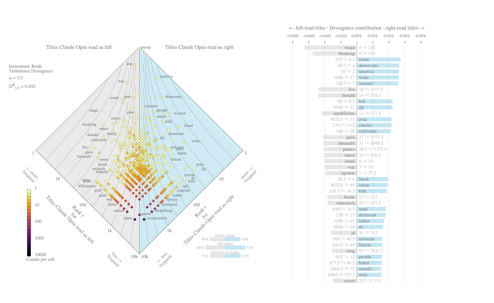
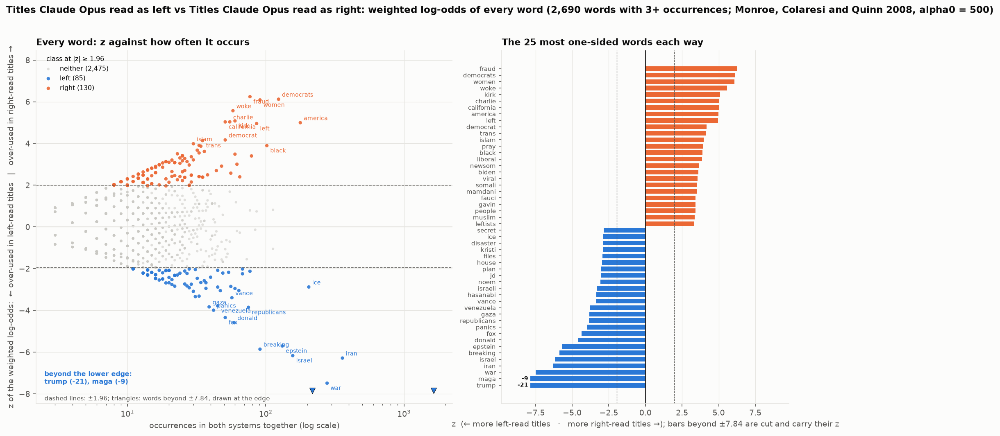
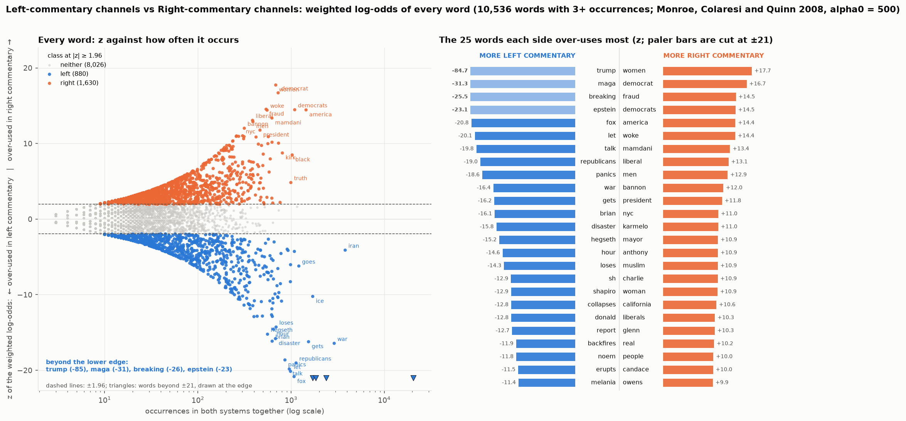
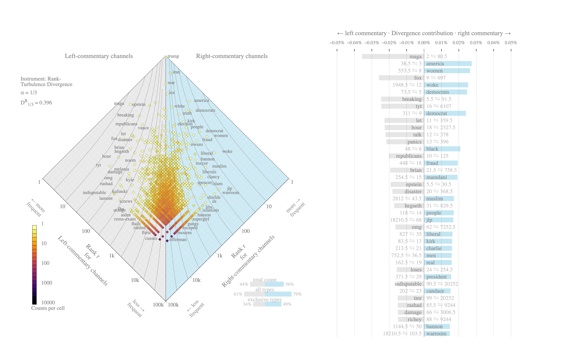

# 14. Political leaning from titles alone

**The question.** Can a channel's political leaning be read off its titles, and what does a reader react to when reading one? A frontier model (Claude Opus, through the Claude Code CLI) labels each sampled title as left, right or neither from the title text alone; a channel's score is the balance of right over left labels. Everything here is *model-perceived* leaning: how a careful, reader-like model reads the wording of a title. The sample is 16 titles per channel plus a top-up to 50, spread evenly across the months, for every channel with at least 50 edited uploads (239 of 274 channels; the other 35 stay at their base draw).

## The finding in one paragraph

Claude Opus labels 55 % of titles neither, 24 % left and 20 % right, and its channel score matches the channels' own words: of the 36 channels whose YouTube description declares a leaning ("conservative political commentator", "populist left perspective"), it puts 100 % on the declared side (no misses). Against the lane proposal, a weaker yardstick because the lanes are themselves a model's assignment, it reaches an AUC of 0.990 and 95 % of the 123 commentary channels. The channel score is reliable: two random halves of a channel's titles rank the 239 channels with 50 titles the same way (split-half Spearman 0.96), and the original 16-title draw ranks them the same way as the 34 titles drawn later from other months (Spearman 0.96). The words behind the labels are stance words: the *right* vocabulary is fraud, women, democrats, woke, left, charlie, california, america; the *left* vocabulary is trump, maga, war, israel, breaking, iran, epstein, donald.

*Left: each channel's score against the share of its titles read as neither. Right: the score by lane, dots = channels.*

## How much a channel's score depends on which titles were drawn

Two checks, both on the 239 channels with 50 labelled titles. Split-half: a channel's titles are split at random into two halves of 25, each half scored, and the two channel rankings correlated (Spearman; mean and SD over 20 random splits). Base vs top-up: the score from the original 16-title draw against the score from the disjoint top-up titles, which were drawn from other months.

| model | n_channels | median_titles_per_half | split_half_spearman_mean | split_half_spearman_sd |
|---|---|---|---|---|
| Claude Opus | 239 | 25 | 0.959 | 0.004 |

| model | n_channels | spearman_base_vs_topup | spearman_base_vs_all | lane_auc_base | lane_auc_all | mean_abs_change | side_changed | sign_flipped |
|---|---|---|---|---|---|---|---|---|
| Claude Opus | 239 | 0.959 | 0.981 | 0.986 | 0.993 | 0.074 | 23 | 0 |

*`lane_auc_base` / `lane_auc_all`: how well the score separates the left- and right-commentary lanes (same 109 channels) from the 16 base titles alone and from all 50. `side_changed`: channels whose call (right above +0.05, left below −0.05, else neither) differs between the 16-title and the 50-title score; `sign_flipped`: the subset that went from left to right or the reverse.*

*Left: every ranked channel's score from the original 16 titles against its score from the 34 top-up titles; the labelled points are the largest movers. Right: the two reliability figures.*

The largest movers between the 16-title and the 50-title score:

| creator | lane | score_base | score_topup | score_all | side_base | side_all |
|---|---|---|---|---|---|---|
| @TheOfficerTatum | right commentary | 0.88 | 0.35 | 0.52 | right | right |
| @ChadPrather1 | right commentary | 0.19 | 0.62 | 0.48 | right | right |
| @TheHumanistReport | left commentary | -0.50 | -0.91 | -0.78 | left | left |
| @TheDonLemonShow | left commentary | -0.88 | -0.47 | -0.60 | left | left |
| @MarkDice | right commentary | 0.81 | 0.41 | 0.54 | right | right |
| @TheDamageReport | left commentary | -0.88 | -0.53 | -0.64 | left | left |
| @winston_marshall | interview podcasts | 0.62 | 0.29 | 0.40 | right | right |
| @RufoandLomez | right commentary | 0.56 | 0.24 | 0.34 | right | right |

## Channel scores against two yardsticks

**The channels' own descriptions** (lane-independent: 36 channels with a leaning word in their YouTube description, 19 right, 17 left; rule and hand corrections in `leaning.py`):

| score | n_self_declared | agreement_with_self_description |
|---|---|---|
| Claude Opus | 36 | 1.000 |

Channels where the judge's sign differs from their self-description (0):

_(none)_

**The lane proposal** (consistency check only: `left_commentary` vs `right_commentary`; the lanes were assigned by a model of the same family, from channel names, descriptions and a sample of titles):

| score | n_creators | auc_right_vs_left_lane | accuracy_sign_vs_lane | n_nonzero | mean_score_left_lane | mean_score_right_lane |
|---|---|---|---|---|---|---|
| Claude Opus | 123 | 0.990 | 0.951 | 123 | -0.523 | 0.440 |

Where every channel lands (score above +0.05 = right, below −0.05 = left):

| lane | left | neither / unclear | right |
|---|---|---|---|
| centrist / heterodox | 6 | 2 | 4 |
| explainers / geopolitics | 3 | 3 | 1 |
| humour / satire | 5 | 1 | 2 |
| independent digital news | 17 | 1 | 2 |
| interview podcasts | 8 | 4 | 11 |
| left commentary | 44 | 1 | 3 |
| legal commentary | 6 | 0 | 3 |
| right commentary | 1 | 3 | 71 |
| right TV networks | 0 | 0 | 4 |
| streamers | 17 | 4 | 5 |
| US legacy TV | 2 | 5 | 2 |
| US press | 7 | 10 | 2 |
| wires & international | 6 | 8 | 0 |

*Every channel: the share of its sampled titles labelled left (blue), neither (grey) and right (orange), sorted from most left-reading to most right-reading, lane after the handle, score at the right.*

*Mean composition by lane.*

Two things in that table deserve a look. The news lanes are mostly *neither*, as they should be, but their partisan-read titles tilt left (15 channels left vs 4 right across the wires, the press and legacy TV): the judge reads a title hostile to the administration as left even in a news headline, so part of that tilt is the target-versus-stance ambiguity that no reader fully escapes. And the interview podcasts lean right as a lane (11 right, 8 left), which the lane proposal, built on format rather than politics, did not encode; Rogan sits at +0.00 over 50 titles.

Lane means (the 'neither' column is the mean share of a channel's titles labelled neither):

| lane | n_creators | score | 'neither' share |
|---|---|---|---|
| left commentary | 48 | -0.52 | 0.37 |
| independent digital news | 20 | -0.38 | 0.51 |
| legal commentary | 9 | -0.25 | 0.35 |
| humour / satire | 8 | -0.24 | 0.60 |
| streamers | 26 | -0.17 | 0.62 |
| centrist / heterodox | 12 | -0.16 | 0.55 |
| wires & international | 14 | -0.06 | 0.91 |
| US press | 19 | -0.06 | 0.83 |
| explainers / geopolitics | 7 | -0.05 | 0.88 |
| interview podcasts | 23 | -0.01 | 0.66 |
| US legacy TV | 9 | 0.01 | 0.83 |
| right TV networks | 4 | 0.41 | 0.58 |
| right commentary | 75 | 0.44 | 0.48 |

The most left-reading and most right-reading channels:

| creator | lane | n_titles | judge_score | judge_side |
|---|---|---|---|---|
| @aaronparnas1 | left commentary | 50 | -0.92 | left |
| @TheDailyBeast | US press | 50 | -0.90 | left |
| @deanwithrs | streamers | 50 | -0.90 | left |
| @LegalAFMTN | legal commentary | 50 | -0.88 | left |
| @fastpoliticspodcast | left commentary | 50 | -0.88 | left |
| @DemocracyDocket | legal commentary | 50 | -0.88 | left |
| @SecularTalk | left commentary | 50 | -0.84 | left |
| @dollemore | left commentary | 50 | -0.84 | left |
| @thewarningwithsteveschmidt | centrist / heterodox | 50 | -0.84 | left |
| @MeidasTouch | left commentary | 50 | -0.84 | left |
| @briantylercohen | left commentary | 50 | -0.82 | left |
| @FarronBalanced | left commentary | 50 | -0.82 | left |

| creator | lane | n_titles | judge_score | judge_side |
|---|---|---|---|---|
| @X22Report-y5y | right commentary | 50 | 0.96 | right |
| @BlackConservativePerspective | right commentary | 50 | 0.90 | right |
| @CamHigby | right commentary | 50 | 0.88 | right |
| @CashJordan | right commentary | 50 | 0.88 | right |
| @RobertGouveiaEsq | legal commentary | 50 | 0.86 | right |
| @AndWeKnowOfficial-o9b | right commentary | 50 | 0.84 | right |
| @OfficialSaharTV | right commentary | 50 | 0.82 | right |
| @ActualJusticeWarrior | right commentary | 50 | 0.78 | right |
| @nationalreview | US press | 50 | 0.74 | right |
| @BlaireWhiteX | right commentary | 11 | 0.73 | right |
| @DrSteveTurleyTV | right commentary | 50 | 0.72 | right |
| @turningpointusa | right commentary | 50 | 0.72 | right |

With 50 titles no channel scores ±1 (5 sit at or beyond ±0.90): even the most one-sided channels title one video in twenty as plain news.

Commentary channels whose title-leaning contradicts their lane (6 of 123):

| creator | lane | value | implied_side | n_titles |
|---|---|---|---|---|
| @OwenReport | right commentary | -0.22 | left | 50 |
| @JacksonHinkleOfficial | right commentary | -0.04 | left | 50 |
| @BrittanyVenti | right commentary | -0.02 | left | 50 |
| @Tim_Black | left commentary | 0.12 | right | 50 |
| @MrTariqNasheed | left commentary | 0.18 | right | 50 |
| @PhillipScottPodcast | left commentary | 0.25 | right | 16 |

These are the channels the left/right axis fits worst: the anti-war, anti-establishment right (Owen Shroyer, Jackson Hinkle, Dave Smith's Part of the Problem), whose titles attack the administration's wars and the Republican establishment in the vocabulary the left uses, and Black-media channels that attack Democrats. They are a reason to treat the lane proposal as provisional.

## Does perceived leaning move over the year?

The top-up titles were spread evenly across months, so the sample supports a lane-level look at whether the balance of partisan titles moved between January and September (lanes with at least 50 sampled titles in every month; a channel contributes about five titles a month, so channel-level months are not readable):

| lane | titles / month | 2026-01 | 2026-02 | 2026-03 | 2026-04 | 2026-05 | 2026-06 | 2026-07 | 2026-08 | 2026-09 |
|---|---|---|---|---|---|---|---|---|---|---|
| left commentary | 236 | -0.57 | -0.60 | -0.52 | -0.53 | -0.49 | -0.55 | -0.51 | -0.49 | -0.57 |
| independent digital news | 107 | -0.40 | -0.30 | -0.50 | -0.43 | -0.33 | -0.38 | -0.31 | -0.42 | -0.43 |
| streamers | 132 | -0.12 | -0.25 | -0.09 | -0.21 | -0.26 | -0.16 | -0.20 | -0.13 | -0.13 |
| wires & international | 66 | +0.00 | -0.07 | -0.12 | -0.08 | -0.06 | -0.03 | -0.08 | -0.06 | -0.08 |
| US press | 102 | -0.11 | -0.05 | -0.04 | -0.05 | +0.00 | -0.04 | -0.03 | -0.07 | -0.15 |
| interview podcasts | 113 | +0.04 | +0.00 | +0.05 | +0.03 | +0.08 | +0.00 | +0.01 | +0.02 | -0.07 |
| right commentary | 393 | +0.46 | +0.50 | +0.42 | +0.43 | +0.43 | +0.42 | +0.42 | +0.47 | +0.42 |

It did not move: left commentary ranges from -0.60 to -0.49; independent digital news from -0.50 to -0.30; right commentary from +0.42 to +0.50; the share of all sampled titles read as partisan stays between 42 % and 47 % every month. Whatever the news did over the year, the channels' title stance is a fixed property of the channel, which is also what document 6 found for style.

## What reads as right and what reads as left

Titles Claude Opus labelled left (3,033) vs right (2,556), compared two ways: weighted log-odds (which words are over-used on one side, given how often they appear at all) and rank-turbulence divergence, read off an allotaxonograph (Dodds et al. 2023), the instrument built for exactly this comparison of two Zipfian systems.

*Allotaxonograph of the titles Claude Opus read as left (system 1, left flank) against the titles it read as right (system 2, right flank); drawn by the Computational Story Lab's own renderer (allotaxonometer-ui), rank-turbulence divergence with α = 1/3. Diamond: every word placed by its rank in each system on log axes, the rank-rank plane rotated so that words used equally sit on the vertical centre line; colour = how many words share a cell; the words named along the flanks are the furthest from the centre line at each frequency, i.e. the most one-sided. Contour lines join equal contributions to the divergence. Right: the 40 largest contributions, each with its two ranks (system 1 ⇋ system 2), grey bars pulling left, blue bars pulling right. Below the diamond: the balance of tokens, types and exclusive types between the two systems.*

How to read it. The two vocabularies overlap less than the label shares suggest: DR1/3 = 0.492, with 50 % of the left-read words never appearing in a right-read title and 51 % the other way. The apex is shared (the year's subjects), and the divergence is carried by the flanks: on the left maga, breaking, fox, donald, republicans, gaza, hasanabi, panics; on the right fraud, democrats, america, woke, women, left, jlp, pray. The bottom edges of the diamond, where the dark cells run, are the words used once on one side and never on the other, which is where the labelled sample's smallness shows (5,545 and 5,622 word types from 3,033 and 2,556 titles).

The two instruments disagree about one word, and the disagreement is instructive: "trump" is the most over-used word on the left by log-odds (1,344 occurrences in left-read titles against 298 in right-read ones), but it sits at the apex of the diamond, because it is the top-ranked word on both sides; rank turbulence measures who *changes* the ordering, not who wins the count.

Right-labelled vocabulary (top 20 by weighted log-odds; `rtd_contribution` is the word's share of D, in per cent, signed positive when the word is more prominent in right-labelled titles; ranks are tied ranks over the union of both vocabularies, so a word absent from one side takes that side's last tied rank):

| word | log_odds_right_vs_left | z | count_right | count_left | rank_right | rank_left | rtd_contribution |
|---|---|---|---|---|---|---|---|
| fraud | 1.942 | 5.980 | 67 | 10 | 8.5 | 347 | 0.055 |
| women | 1.461 | 5.700 | 72 | 18 | 7 | 128.5 | 0.052 |
| democrats | 1.109 | 5.650 | 94 | 34 | 4 | 38.5 | 0.053 |
| woke | 2.530 | 5.280 | 52 | 4 | 13 | 1066 | 0.052 |
| left | 1.201 | 4.990 | 67 | 22 | 8.5 | 89 | 0.045 |
| charlie | 1.517 | 4.870 | 51 | 12 | 14.5 | 270 | 0.043 |
| california | 1.882 | 4.820 | 44 | 7 | 20 | 568 | 0.042 |
| america | 0.648 | 4.280 | 115 | 67 | 2 | 10 | 0.052 |
| kirk | 1.131 | 4.210 | 51 | 18 | 14.5 | 128.5 | 0.038 |
| democrat | 1.309 | 4.090 | 41 | 12 | 23 | 270 | 0.036 |
| trans | 1.869 | 4.040 | 31 | 5 | 34.5 | 849 | 0.036 |
| black | 0.757 | 3.900 | 75 | 39 | 6 | 28.5 | 0.039 |
| leftist | 1.980 | 3.880 | 28 | 4 | 45 | 1066 | 0.034 |
| pray | 3.257 | 3.840 | 33 | 1 | 31 | 4022.5 | 0.043 |
| liberal | 1.604 | 3.680 | 28 | 6 | 45 | 692.5 | 0.032 |
| newsom | 1.492 | 3.640 | 29 | 7 | 40.5 | 568 | 0.032 |
| islam | 3.140 | 3.610 | 28 | 1 | 45 | 4022.5 | 0.038 |
| biden | 1.365 | 3.510 | 29 | 8 | 40.5 | 473.5 | 0.031 |
| somali | 2.384 | 3.460 | 22 | 2 | 75 | 2064.5 | 0.030 |
| levin | 1.980 | 3.360 | 21 | 3 | 84 | 1411 | 0.027 |

Left-labelled vocabulary (top 20 by weighted log-odds):

| word | log_odds_right_vs_left | z | count_right | count_left | rank_right | rank_left | rtd_contribution |
|---|---|---|---|---|---|---|---|
| trump | -1.384 | -22.280 | 298 | 1344 | 1 | 1 | -0.000 |
| maga | -2.285 | -9.520 | 16 | 205 | 145 | 4 | -0.065 |
| war | -1.081 | -7.850 | 65 | 223 | 10 | 3 | -0.040 |
| israel | -1.238 | -6.550 | 33 | 134 | 31 | 6 | -0.040 |
| breaking | -1.920 | -6.060 | 10 | 85 | 312 | 8 | -0.055 |
| iran | -0.671 | -5.880 | 107 | 240 | 3 | 2 | -0.021 |
| epstein | -1.157 | -5.780 | 30 | 112 | 37.5 | 7 | -0.039 |
| donald | -1.831 | -4.790 | 7 | 54 | 518.5 | 14 | -0.048 |
| fox | -2.411 | -4.430 | 3 | 45 | 1377.5 | 18 | -0.048 |
| republicans | -1.254 | -4.330 | 14 | 58 | 177.5 | 12 | -0.044 |
| gaza | -2.333 | -4.240 | 3 | 41 | 1377.5 | 27 | -0.042 |
| panics | -2.290 | -4.140 | 3 | 39 | 1377.5 | 28.5 | -0.041 |
| hasanabi | -2.583 | -3.970 | 2 | 37 | 2049.5 | 31 | -0.041 |
| venezuela | -1.476 | -3.960 | 8 | 42 | 437.5 | 26 | -0.037 |
| vance | -1.201 | -3.810 | 12 | 47 | 236.5 | 16 | -0.041 |
| jd | -1.146 | -3.300 | 10 | 37 | 312 | 31 | -0.032 |
| house | -0.908 | -3.290 | 17 | 49 | 131 | 15 | -0.037 |
| noem | -1.600 | -3.080 | 4 | 24 | 1024 | 79 | -0.027 |
| kristi | -1.784 | -3.040 | 3 | 22 | 1377.5 | 89 | -0.027 |
| israeli | -1.430 | -3.020 | 5 | 25 | 796 | 72 | -0.026 |

Read as a map of the two grammars of attack: the right's titles are about Democrats, fraud, women and trans issues, the woke, Charlie Kirk, California and Newsom, Islam and Mamdani; the left's are about Trump, MAGA, the wars (Iran, Israel, Gaza, Venezuela), Epstein, Vance and Noem, and they carry the outrage furniture (breaking, panics).

## Log-odds: a left / right / neither lexicon, and what a word list can and cannot do

The allotaxonograph ranks words by how far they move between the two rankings; weighted log-odds asks a different question, whether a word is over-used on one side *given how common it is overall*, and gives every word a z-score, so a cutoff turns the vocabulary into a three-way lexicon: right at z ≥ 1.96, left at z ≤ −1.96, neither otherwise (the two-sided 5 % level; words with fewer than 3 occurrences are not classified).

*Left: every word by its z (vertical) and its frequency (horizontal, log scale) for the titles Claude Opus read as left against those it read as right; blue = left-class, orange = right-class, grey = neither. Right: the 25 words each side over-uses most, mirrored about the spine, the word beside the spine and its z at the bar's end; bars beyond the axis cap are cut, drawn paler, and keep their value.*

How many words clear the cutoff, for the judge's titles and for the two lanes' whole outputs:

| comparison | n_words | n_left | n_right | n_neither | share_classified | top_left | top_right |
|---|---|---|---|---|---|---|---|
| Claude Opus | 2803 | 89 | 120 | 2594 | 0.07 | trump, maga, war, israel, breaking, iran, epstein, donald, fox, republicans, gaza, panics, hasanabi, venezuela, vance | fraud, women, democrats, woke, left, charlie, california, america, kirk, democrat, trans, black, leftist, pray, liberal |
| the two lanes | 10536 | 880 | 1630 | 8026 | 0.24 | trump, maga, breaking, epstein, fox, let, talk, republicans, panics, war, gets, brian, disaster, hegseth, hour | women, democrat, fraud, democrats, america, woke, mamdani, liberal, men, bannon, president, nyc, karmelo, mayor, anthony |

Comparing the judge's classes with the lanes' over the words both classify: 99 % of the 189 words both call partisan point the same way (kappa 0.13 over three classes, low only because the lanes, with ten times the titles, classify many more words). That is consistency, not validation: the lanes were assigned by a model of the same family (Claude, from channel names, descriptions and a sample of titles; `lane_seed.py`), so two related readings agree with each other. The words that switch sides between them are reacts, canada, show-name and topic words rather than stance words.

**What a word list can do on its own.** If the judge's reading were vocabulary, a lexicon built from its own labels should reproduce them. Built out of fold (five folds by channel, so no channel's titles help classify themselves) and applied to titles by majority of classified words, the lexicon agrees with Claude Opus on 53 % of titles (kappa 0.26); it finds a word from the list in 62 % of titles; of the titles the judge called partisan it leaves 32 % as neither, and where both call a title partisan they pick the same side 79 % of the time. The errors are the interesting part: the lexicon calls 31 % of the judge's *neither* titles left and 16 % right, because a plain news headline that mentions MAGA, Epstein or Iran carries left-class words without a left stance; and it recovers the judge's right titles (40 % recall) worse than its left ones (65 %), because the right's stance words are rarer than the left's subject words. At channel level the list does much better, Spearman 0.69 with the judge's channel score and lane AUC 0.88: fifty titles average the noise out, and the ordering of channels is largely vocabulary; the title-level call is not.

*Left: each channel's score from the out-of-fold lexicon classes against its score from the judge's labels. Right: the lexicon's class against the judge's label, title by title (row shares).*

| judge | n_titles | coverage | accuracy | kappa | partisan_titles_lexicon_neither | side_agreement_when_both_partisan | recall_left | recall_right | channel_spearman | channel_lane_auc |
|---|---|---|---|---|---|---|---|---|---|---|
| Claude Opus | 12478 | 0.62 | 0.53 | 0.26 | 0.32 | 0.79 | 0.65 | 0.40 | 0.69 | 0.88 |

The lanes' log-odds, for reference (the lexicon of what each lane publishes, no judge involved):

*Left-commentary against right-commentary channels, same construction.*

## The same instrument on the lanes

The allotaxonograph does not need a judge: applied to what the two commentary lanes actually published (every unique edited upload of the 48 left-commentary and 75 right-commentary channels in the creator-balanced subset, 35,689 vs 29,090 titles), it shows the two lanes' vocabularies directly, with no labelling in between.

*Left-commentary channels (system 1) against right-commentary channels (system 2), same instrument and α.*

DR1/3 = 0.396: the lanes' whole outputs are closer to each other than the judge's left-read and right-read titles are, as they should be, since most of what either lane publishes is the shared news of the year. The words that separate them are the words the judge found, now without any judge: the left lane's flank is maga, fox, breaking, tyt, let, hour, talk, panics, republicans, brian; the right lane's is america, women, woke, democrats, democrat, black, fraud, mamdani, muslim, people. Show furniture shows up here too (tyt, hour, talk, let on the left: The Young Turks' and the talk shows' title templates; warroom and jlp on the right), which is the price of comparing channels rather than labelled titles, and the right lane, with 75 channels to the left's 48, brings the larger vocabulary: 49 % of its words never appear in a left-lane title, against 34 % the other way.

## Method

1. **Sample.** Every creator gets a base draw of 16 unique edited-upload titles (seed 20260914; creators with fewer than 16 uploads topped up from live VODs). Creators with at least 50 unique uploads are then topped up to 50 with further uploads spread evenly across months (round-robin over the months, random within month, its own random stream), so the extra titles never depend on which month a creator posted most in: 12,478 titles, 239 creators at 50, 35 at their base.
2. **Labelling.** One prompt (in `leaning.py` and the methods appendix): label the viewpoint the title's own wording signals as left, right or neither, with three anchoring examples; temperature 0; the judge sees the title text only, numbered 1 to 20, never the channel name; titles are sent in a seeded random order so that a batch mixes channels; every response cached. Claude Opus runs through the Claude Code CLI in print mode on a Claude Max subscription (624 calls, 135 minutes; the CLI reported an equivalent API cost of $56.54, not charged).
3. **Scores.** Per channel: shares of left / right / neither and score = (right − left) / n; a channel is called right above +0.05, left below −0.05.
4. **Yardsticks.** Self-description: a channel counts as self-declared right or left when its YouTube description contains leaning words (conservative, MAGA, libertarian, right-wing ... vs progressive, leftist, socialist, liberal ...), with nine hand corrections for phrases like "liberal democracy" or "former liberal"; agreement is the share of those channels whose score has the declared sign. Lanes: AUC and sign accuracy over the two commentary lanes only.
5. **Reliability.** Split-half: channels with at least 32 labelled titles, two random halves, Spearman between the two channel rankings, 20 splits. Base vs top-up: the base-draw score against the top-up score per channel (disjoint titles), plus the lane AUC from each.
6. **Words.** Weighted log-odds with an informative Dirichlet prior (alpha0 = 500; Monroe, Colaresi and Quinn 2008) and rank-turbulence divergence (alpha = 1/3; Dodds et al. 2023) on the vocabulary tokens of document 11. The divergence follows the allotaxonometer's conventions exactly (tied ranks over the union of both vocabularies, absent words at the last tied rank, the sum normalised so that two vocabularies with no word in common give D = 1); `textstats.rank_turbulence_divergence` reproduces the library's per-word contributions to machine precision.
7. **Log-odds lexicon.** Every word with 3+ occurrences in the two systems together, right against left; right at z ≥ 1.96, left at z ≤ −1.96, neither otherwise; the same for the two lanes, and Cohen's kappa of the classes between the two over their shared words. The lexicon check: the labelled titles split into five folds by channel, the lexicon built on four folds and applied to the fifth (a title is left when it holds more left-class than right-class words, right the other way, neither on a tie or no classified word), then agreement with the judge's labels title by title and channel by channel (`leaning_lexicon.py`).
8. **Allotaxonographs.** Drawn by allotaxonometer-ui 0.2.2 (the Computational Story Lab's Svelte renderer, the same code behind the lab's web app and py-allotax) through Node and Puppeteer (`pipeline_titles/allotax.py`, `pipeline_titles/allotax_js/`), from the same word counts as the tables (`allotax_summary.csv`, top contributions in `allotax_contributions.csv`).
9. **Months.** The judge's labels by lane x month (`leaning_by_lane_month.csv`): titles, creators, partisan share, left and right shares, score.

## Limitations

- **This is perceived leaning.** A model reads a title the way an attentive reader would, and readers disagree. No human panel was used, by choice: one reader cannot supply political ground truth, and a balanced panel is a study of its own. A blind 200-title sheet exists (`leaning_human_sheet.csv`, still unfilled) for anyone who wants a single-reader reliability check.
- **One judge.** Every number here is one model's reading, and a model reads a title the way it was trained to; a second frontier model of a different family would be the natural robustness check (`--models <alias>` takes any Claude Code model alias).
- **Ten words carry little stance.** Six in ten titles are neither even for this judge, so a channel's score rests on a minority of its titles. At 50 titles the score moves in steps of 0.02 and the split-half reliability is 0.96 if computed; the 35 channels with fewer than 50 uploads still sit at 16 titles or fewer and move in steps of 1/16.
- **Target and stance still blur at the margin.** Hostile-to-Trump wording reads left even when it is a wire headline or an anti-war right channel; the news-lane tilt and the Shroyer / Hinkle cases are that residue. Prompt v2 (which also asks for the target) exists in `leaning.py` and was not run at scale.
- **The yardsticks are weak.** Self-descriptions cover 36 channels and say what a channel claims; the lane proposal is a model-made assignment by the same model family. Agreement with either is consistency, not accuracy.
- **Month-level reading is lane-level only.** Five titles per channel-month is not a monthly channel score; the base 16 were drawn without regard to month, so the monthly table leans on the top-up.

Files: `leaning_labels.csv.gz`, `leaning_agreement.json`, `leaning_summary.json`, `leaning_by_creator.csv`, `leaning_lane_validation.csv`, `leaning_lane_contradictions.csv`, `leaning_by_lane.csv`, `leaning_self_description.csv`, `leaning_self_description_channels.csv`, `leaning_words.csv`, `leaning_split_half.csv`, `leaning_stability.csv`, `leaning_stability_channels.csv`, `leaning_by_lane_month.csv`, `leaning_logodds.csv`, `leaning_logodds_summary.csv`, `leaning_logodds_agreement.csv`, `leaning_lexicon_validation.csv`, `leaning_lexicon_channels.csv`, `leaning_lexicon_titles.csv`, `allotax_summary.csv`, `allotax_contributions.csv`.
