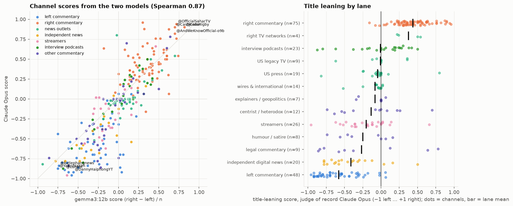
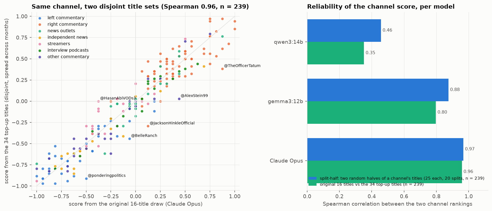
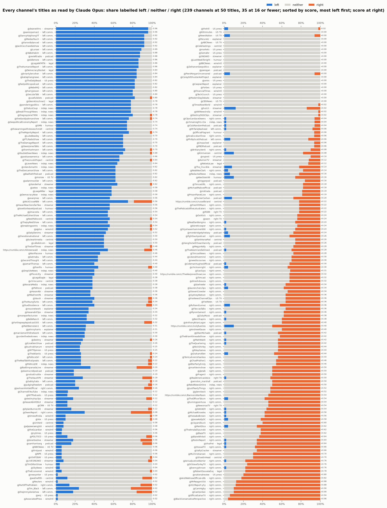
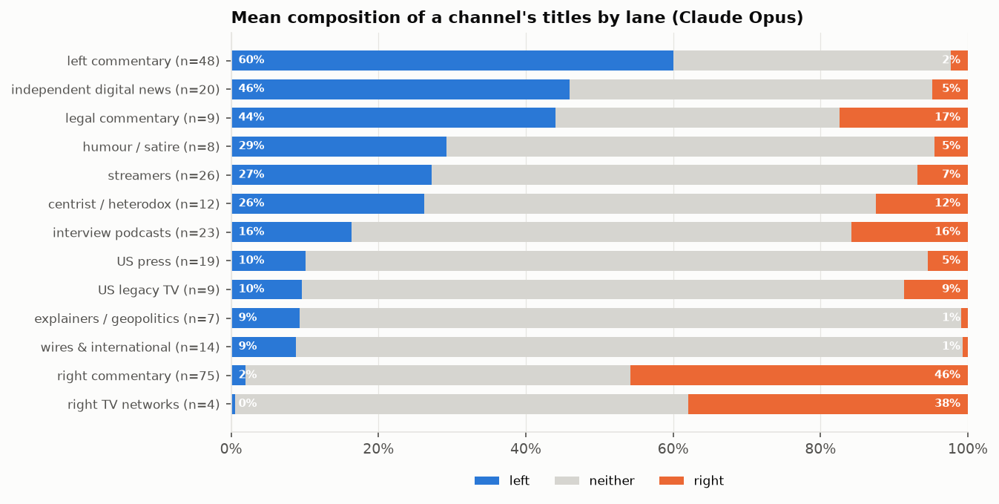
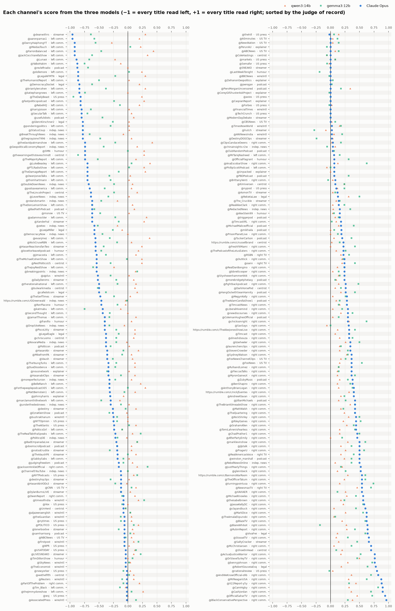
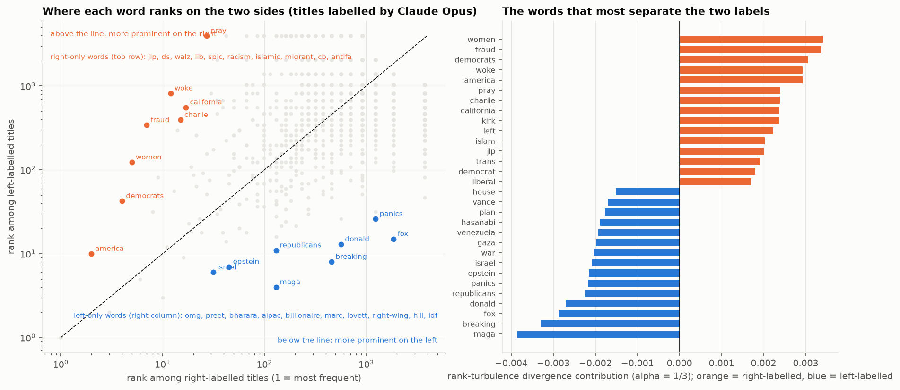

# 14. Political leaning from titles alone

**The question.** Can a channel's political leaning be read off its titles, and what does a model actually react to when it reads one? Three models of different families label each sampled title as left, right or neither; a channel's score is the balance of right over left labels. Everything here is *model-perceived* leaning: how a careful, reader-like model reads the wording of a title, with the disagreement between models as the uncertainty. This is the second pass: the first labelled 16 titles per channel; this one keeps those 16 and adds 34 more, spread evenly across the months, for every channel with at least 50 edited uploads (239 of 274 channels; the other 35 stay at their base draw).

## The finding in one paragraph

A frontier model reads stance; the small local models mostly read subject. With 50 titles per ranked channel the frontier model's channel score is reliable: two random halves of a channel's titles rank the 239 channels with 50 titles the same way (split-half Spearman 0.97), and the score from the original 16-title draw ranks them the same way as the score from the 34 titles drawn afterwards from other months (Spearman 0.96); the 16-title result of the first pass was already the right ordering, and the top-up bought resolution, not a different answer. Claude Opus labels 58 % of titles neither, 24 % left and 18 % right, and its channel score matches the channels' own words: of the 36 channels whose YouTube description declares a leaning ("conservative political commentator", "populist left perspective"), it puts 97 % on the declared side (the one miss is @PartOfTheProblem at -0.02, one title's worth from zero). Against the lane proposal, a weaker yardstick because the lanes are themselves a model's assignment, it reaches an AUC of 0.996 and 96 % of the 123 commentary channels. Gemma-3-12B gets most channels right and gained the most from the extra titles, but still misreads hostile coverage as the target's side; Qwen3-14B calls seven in ten titles neither and leans right on the rest, and more titles did not help it. The three agree on 51 % of titles, almost all of them "neither". The words behind the frontier model's labels are stance words: its *right* vocabulary is fraud, democrats, women, woke, kirk, charlie, california, america; its *left* vocabulary is trump, maga, war, iran, israel, breaking, epstein, donald, and "Trump PANICS" is left, as it should be, where the small models had it right.

*Left: each channel's score from the two best models (−1 = every title read as left, +1 = every title read as right). Right: the judge-of-record score by lane, dots = channels.*

## How much a channel's score depends on which titles were drawn

Two checks, both on the 239 channels with 50 labelled titles. Split-half: a channel's titles are split at random into two halves of 25, each half scored, and the two channel rankings correlated (Spearman; mean and SD over 20 random splits). Base vs top-up: the score from the original 16-title draw against the score from the disjoint top-up titles, which were drawn from other months.

| model | n_channels | median_titles_per_half | split_half_spearman_mean | split_half_spearman_sd |
|---|---|---|---|---|
| qwen3:14b | 239 | 25 | 0.457 | 0.046 |
| gemma3:12b | 239 | 25 | 0.875 | 0.010 |
| Claude Opus | 239 | 25 | 0.967 | 0.003 |

| model | n_channels | spearman_base_vs_topup | spearman_base_vs_all | lane_auc_base | lane_auc_all | mean_abs_change | side_changed | sign_flipped |
|---|---|---|---|---|---|---|---|---|
| qwen3:14b | 239 | 0.352 | 0.694 | 0.529 | 0.594 | 0.091 | 65 | 9 |
| gemma3:12b | 239 | 0.797 | 0.909 | 0.922 | 0.980 | 0.125 | 36 | 9 |
| Claude Opus | 239 | 0.958 | 0.981 | 0.990 | 0.997 | 0.075 | 18 | 2 |

*`lane_auc_base` / `lane_auc_all`: how well the score separates the left- and right-commentary lanes (same 109 channels) from the 16 base titles alone and from all 50. `side_changed`: channels whose call (right above +0.05, left below −0.05, else neither) differs between the 16-title and the 50-title score; `sign_flipped`: the subset that went from left to right or the reverse.*

*Left: every ranked channel's score from the original 16 titles against its score from the 34 top-up titles (Claude Opus); the labelled points are the largest movers. Right: the two reliability figures per model.*

The three models fail the same test differently. For Claude Opus, the rankings from the two disjoint title sets agree at 0.96 and the split halves at 0.97: 18 of 239 channels changed their call between 16 and 50 titles, all of them channels near zero crossing the ±0.05 line, and 2 went from one side to the other. For gemma3:12b the extra titles mattered: its lane AUC on the same channels rose from 0.92 to 0.98, so part of what looked like misreading at 16 titles was sampling noise on a noisy judge; its split-half reliability (0.88) is still well below the frontier model's, and its systematic error (below) did not go away. Qwen3-14B's score is close to unrepeatable (split-half 0.46): its problem is not too few titles but what it reads in them.

The largest movers under Claude Opus between the 16-title and the 50-title score:

| creator | lane | score_base | score_topup | score_all | side_base | side_all |
|---|---|---|---|---|---|---|
| @TheOfficerTatum | right commentary | 0.88 | 0.38 | 0.54 | right | right |
| @JacksonHinkleOfficial | right commentary | 0.12 | -0.29 | -0.16 | right | left |
| @ponderingpolitics | left commentary | -0.50 | -0.91 | -0.78 | left | left |
| @AlexStein99 | humour / satire | 0.44 | 0.03 | 0.16 | right | right |
| @BelleRanch | left commentary | -0.06 | -0.44 | -0.32 | left | left |
| @HasanAbiVODs3 | streamers | -0.38 | 0.00 | -0.12 | left | left |
| @cafedotcom | legal commentary | -0.25 | -0.62 | -0.50 | left | left |
| @FleccasTalks | right commentary | 0.12 | 0.47 | 0.36 | right | right |

Nothing moved by more than 0.34, and the movers are the channels whose 16 titles happened to be their loudest or quietest: Officer Tatum's base draw was almost all attack titles, Jackson Hinkle's base draw missed the anti-war titles that dominate his month-spread top-up.

## What each model sees

Label shares over the 12,437 titles all three labelled:

| model | left | neither | right |
|---|---|---|---|
| qwen3:14b | 0.085 | 0.710 | 0.205 |
| gemma3:12b | 0.255 | 0.465 | 0.280 |
| Claude Opus | 0.240 | 0.577 | 0.183 |

Agreement between models (Cohen's kappa; the last column restricts to titles both called partisan):

| models | kappa (3 labels) | exact agreement | kappa (partisan titles only) |
|---|---|---|---|
| qwen3:14b vs gemma3:12b | 0.37 | 0.63 | 0.32 |
| qwen3:14b vs Claude Opus | 0.34 | 0.65 | 0.13 |
| gemma3:12b vs Claude Opus | 0.51 | 0.70 | 0.57 |

All three agree on 51 % of titles; of those, 78 % are neither. Channel scores: Spearman 0.26 with qwen3:14b, 0.87 with gemma3:12b against Claude Opus.

Five MeidasTouch and five PTL Radio titles with all three labels, the case that separates the judges (both are left channels whose titles attack Trump; Claude Opus reads the wording, Gemma reads the name):

| creator | title_raw | qwen3:14b | gemma3:12b | Claude Opus |
|---|---|---|---|---|
| @MeidasTouch | 🚨SCOTUS makes MAJOR RULING on Election… | neither | right | neither |
| @MeidasTouch | 🚨Trump MIDTERM PLOT EXPOSED… | right | right | left |
| @MeidasTouch | 🚨Melania and Barron’s WORST NIGHTMARE is HERE… | neither | right | left |
| @MeidasTouch | Trump & Blanche INSTANTLY COUNTERED as Blanche Takes Over DOJ!!! | right | right | left |
| @MeidasTouch | Fox News PANICS ON LIVE TV as Trump CRASH ACCELERATES!!! | right | right | left |
| @PTLRadioShow | MAGA Supporters WALK OFF After This Question | right | right | left |
| @PTLRadioShow | CNN commentator reveals what Scott Jennings is REALLY like | neither | neither | neither |
| @PTLRadioShow | Joe Walsh UNLOADS on Trump's Iran War... | right | right | left |
| @PTLRadioShow | Fox News CUTS OFF Trump mid-speech... it's BAD | right | right | left |
| @PTLRadioShow | "YOU'RE WRONG!" - MAGA Caller Gets SHUT DOWN | right | right | left |

## Channel scores against two yardsticks

**The channels' own descriptions** (lane-independent: 36 channels with a leaning word in their YouTube description, 19 right, 17 left; rule and hand corrections in `leaning.py`):

| score | n_self_declared | agreement_with_self_description |
|---|---|---|
| qwen3:14b | 36 | 0.528 |
| gemma3:12b | 36 | 0.889 |
| Claude Opus | 36 | 0.972 |
| mean_score | 36 | 0.972 |
| judge_score | 36 | 0.972 |

Channels where the judge's sign differs from their self-description (1):

| creator | lane | self_declared | judge_side_sign | judge_score |
|---|---|---|---|---|
| @PartOfTheProblem | right commentary | right | left | -0.02 |

**The lane proposal** (consistency check only: `left_commentary` vs `right_commentary`):

| score | n_creators | auc_right_vs_left_lane | accuracy_sign_vs_lane | n_nonzero | mean_score_left_lane | mean_score_right_lane |
|---|---|---|---|---|---|---|
| qwen3:14b | 123 | 0.626 | 0.678 | 118 | 0.114 | 0.188 |
| gemma3:12b | 123 | 0.976 | 0.908 | 120 | -0.294 | 0.355 |
| Claude Opus | 123 | 0.996 | 0.959 | 123 | -0.577 | 0.438 |
| consensus_score | 123 | 0.985 | 0.973 | 110 | -0.331 | 0.341 |
| mean_score | 123 | 0.996 | 0.967 | 122 | -0.253 | 0.327 |

The judge of record is the model with the highest lane AUC (Claude Opus); the mean and consensus scores are shown for transparency. The mean of the three models now matches the judge on both yardsticks, which is what averaging a good judge with two noisy ones should do; it is not evidence that the small models add information.

Where every channel lands under the judge of record (score above +0.05 = right, below −0.05 = left):

| lane | left | neither / unclear | right |
|---|---|---|---|
| centrist / heterodox | 6 | 2 | 4 |
| explainers / geopolitics | 2 | 4 | 1 |
| humour / satire | 4 | 2 | 2 |
| independent digital news | 17 | 1 | 2 |
| interview podcasts | 8 | 3 | 12 |
| left commentary | 44 | 2 | 2 |
| legal commentary | 6 | 0 | 3 |
| right commentary | 2 | 2 | 71 |
| right TV networks | 0 | 0 | 4 |
| streamers | 18 | 5 | 3 |
| US legacy TV | 3 | 4 | 2 |
| US press | 8 | 9 | 2 |
| wires & international | 6 | 8 | 0 |

*Every channel: the share of its sampled titles the judge of record labels left (blue), neither (grey) and right (orange), sorted from most left-reading to most right-reading, lane after the handle, score at the right.*

*Mean composition by lane.*

*The same channels with all three models' scores: circles = judge of record, squares = Gemma, triangles = Qwen. Where the small models' markers sit far from the circle is where they misread the channel.*

Two things in that table deserve a look. The news lanes are mostly *neither*, as they should be, but their partisan-read titles tilt left (17 channels left vs 4 right across the wires, the press and legacy TV): the judge reads a title hostile to the administration as left even in a news headline, so part of that tilt is the target-versus-stance ambiguity that no model fully escapes. And the interview podcasts lean right as a lane (12 right, 8 left), which the lane proposal, built on format rather than politics, did not encode; Rogan sits at exactly +0.00 over 50 titles.

Lane means (all models; the 'neither' columns are the mean share of a channel's titles labelled neither):

| lane | n_creators | qwen3:14b score | gemma3:12b score | Claude Opus score | qwen3:14b 'neither' | gemma3:12b 'neither' | Claude Opus 'neither' |
|---|---|---|---|---|---|---|---|
| left commentary | 48 | 0.11 | -0.29 | -0.58 | 0.58 | 0.29 | 0.38 |
| independent digital news | 20 | 0.01 | -0.23 | -0.41 | 0.69 | 0.43 | 0.49 |
| humour / satire | 8 | 0.07 | -0.10 | -0.25 | 0.78 | 0.56 | 0.66 |
| streamers | 26 | 0.10 | -0.12 | -0.20 | 0.76 | 0.52 | 0.66 |
| explainers / geopolitics | 7 | -0.01 | -0.09 | -0.08 | 0.99 | 0.84 | 0.90 |
| centrist / heterodox | 12 | 0.12 | -0.13 | -0.14 | 0.77 | 0.52 | 0.61 |
| legal commentary | 9 | 0.15 | -0.02 | -0.27 | 0.56 | 0.33 | 0.39 |
| US press | 19 | 0.07 | -0.04 | -0.05 | 0.86 | 0.69 | 0.84 |
| wires & international | 14 | 0.05 | 0.02 | -0.08 | 0.92 | 0.72 | 0.90 |
| interview podcasts | 23 | 0.09 | 0.03 | -0.01 | 0.79 | 0.55 | 0.68 |
| US legacy TV | 9 | 0.08 | 0.09 | -0.01 | 0.82 | 0.62 | 0.82 |
| right commentary | 75 | 0.19 | 0.36 | 0.44 | 0.69 | 0.42 | 0.52 |
| right TV networks | 4 | 0.26 | 0.46 | 0.38 | 0.71 | 0.47 | 0.61 |

The most left-reading and most right-reading channels under the judge of record:

| creator | lane | n_titles | judge_score | judge_side |
|---|---|---|---|---|
| @deanwithrs | streamers | 50 | -0.96 | left |
| @aaronparnas1 | left commentary | 50 | -0.96 | left |
| @DannyHaiphongYT | left commentary | 50 | -0.92 | left |
| @MeidasTouch | left commentary | 50 | -0.92 | left |
| @FarronBalanced | left commentary | 50 | -0.92 | left |
| @JackCocchiarellaShow | left commentary | 50 | -0.92 | left |
| @Lunaoi | left commentary | 9 | -0.89 | left |
| @YaBoiHakim | left commentary | 16 | -0.88 | left |
| @revleftradio | interview podcasts | 16 | -0.88 | left |
| @dollemore | left commentary | 50 | -0.86 | left |
| @LegalAFMTN | legal commentary | 50 | -0.86 | left |
| @TheHumanistReport | left commentary | 50 | -0.86 | left |

| creator | lane | n_titles | judge_score | judge_side |
|---|---|---|---|---|
| @BlackConservativePerspective | right commentary | 50 | 0.96 | right |
| @OfficialSaharTV | right commentary | 50 | 0.94 | right |
| @CashJordan | right commentary | 50 | 0.90 | right |
| @CamHigby | right commentary | 50 | 0.90 | right |
| @X22Report-y5y | right commentary | 50 | 0.88 | right |
| @MrReaganUSA | right commentary | 16 | 0.88 | right |
| @AndWeKnowOfficial-o9b | right commentary | 50 | 0.82 | right |
| @nationalreview | US press | 50 | 0.80 | right |
| @RobertGouveiaEsq | legal commentary | 50 | 0.78 | right |
| @bennyjohnson | right commentary | 50 | 0.76 | right |
| @DrSteveTurleyTV | right commentary | 50 | 0.76 | right |
| @ActualJusticeWarrior | right commentary | 50 | 0.76 | right |

With 50 titles no channel scores ±1 any more (10 sit at or beyond ±0.90): even the most one-sided channels title one video in twenty as plain news.

Commentary channels whose title-leaning contradicts their lane under the judge of record (5 of 123):

| creator | lane | value | implied_side | n_titles |
|---|---|---|---|---|
| @OwenReport | right commentary | -0.08 | left | 50 |
| @PhillipScottPodcast | left commentary | 0.06 | right | 16 |
| @PartOfTheProblem | right commentary | -0.02 | left | 50 |
| @MrTariqNasheed | left commentary | 0.06 | right | 50 |
| @JacksonHinkleOfficial | right commentary | -0.16 | left | 50 |

These are not labelling accidents. The right-lane channels that read left or tie are the anti-war, anti-establishment right: Owen Shroyer, Jackson Hinkle and Dave Smith's Part of the Problem, whose titles attack the administration's wars and the Republican establishment in the vocabulary the left uses. Tariq Nasheed's and Phillip Scott's read right on the titles that attack Democrats. Tim Black and Jimmy Dore, contradictions at 16 titles, sit at -0.02 and -0.02 with 50: split evenly, which is what their politics looks like on a left/right axis. They are the channels the axis fits worst, and a reason to treat the lane proposal as provisional.

## Does perceived leaning move over the year?

The top-up titles were spread evenly across months, so the sample supports a lane-level look at whether the balance of partisan titles moved between January and September (Claude Opus score, lanes with at least 50 sampled titles in every month; a channel contributes about five titles a month, so channel-level months are not readable):

| lane | titles / month | 2026-01 | 2026-02 | 2026-03 | 2026-04 | 2026-05 | 2026-06 | 2026-07 | 2026-08 | 2026-09 |
|---|---|---|---|---|---|---|---|---|---|---|
| left commentary | 236 | -0.64 | -0.69 | -0.55 | -0.60 | -0.53 | -0.60 | -0.57 | -0.52 | -0.59 |
| independent digital news | 107 | -0.42 | -0.40 | -0.51 | -0.44 | -0.35 | -0.42 | -0.41 | -0.48 | -0.37 |
| streamers | 132 | -0.16 | -0.25 | -0.14 | -0.29 | -0.27 | -0.24 | -0.26 | -0.15 | -0.18 |
| wires & international | 66 | -0.05 | -0.04 | -0.07 | -0.08 | -0.09 | -0.08 | -0.08 | -0.10 | -0.10 |
| US press | 102 | -0.06 | -0.06 | +0.01 | -0.02 | +0.00 | -0.05 | -0.04 | -0.06 | -0.12 |
| interview podcasts | 113 | +0.02 | -0.02 | +0.00 | +0.05 | +0.06 | +0.02 | +0.02 | +0.06 | -0.05 |
| right commentary | 393 | +0.47 | +0.51 | +0.42 | +0.43 | +0.42 | +0.42 | +0.41 | +0.45 | +0.42 |

It did not move: left commentary ranges from -0.69 to -0.52; independent digital news from -0.51 to -0.35; right commentary from +0.41 to +0.51; the share of all sampled titles read as partisan stays between 40 % and 45 % every month. Whatever the news did over the year, the channels' title stance is a fixed property of the channel, which is also what document 6 found for style.

## What the frontier model calls right and what it calls left

Titles Claude Opus labelled right (2,293) vs left (2,992), scored by weighted log-odds (which words are over-used on one side) and rank-turbulence divergence (which words move most between the two frequency rankings).

*Left: rank of each word among right-labelled titles against its rank among left-labelled titles (log axes); words far from the diagonal belong to one side. Right: the largest rank-turbulence-divergence contributions, signed by side.*

Right-labelled vocabulary (top 20):

| word | log_odds_right_vs_left | z | count_right | count_left | rtd_contribution |
|---|---|---|---|---|---|
| fraud | 2.02 | 6.24 | 67 | 10 | 0.00 |
| democrats | 1.23 | 6.12 | 92 | 32 | 0.00 |
| women | 1.56 | 6.09 | 73 | 18 | 0.00 |
| woke | 2.43 | 5.57 | 53 | 5 | 0.00 |
| kirk | 1.64 | 5.08 | 49 | 11 | 0.00 |
| charlie | 1.77 | 5.04 | 46 | 9 | 0.00 |
| california | 1.96 | 5.04 | 44 | 7 | 0.00 |
| america | 0.77 | 5.00 | 114 | 64 | 0.00 |
| left | 1.18 | 4.95 | 63 | 23 | 0.00 |
| democrat | 1.34 | 4.17 | 39 | 12 | 0.00 |
| trans | 1.92 | 4.14 | 30 | 5 | 0.00 |
| islam | 2.67 | 3.99 | 28 | 2 | 0.00 |
| pray | 3.30 | 3.91 | 32 | 1 | 0.00 |
| black | 0.79 | 3.90 | 66 | 36 | 0.00 |
| liberal | 1.69 | 3.87 | 28 | 6 | 0.00 |
| newsom | 1.62 | 3.68 | 26 | 6 | 0.00 |
| biden | 1.41 | 3.62 | 28 | 8 | 0.00 |
| viral | 1.47 | 3.55 | 26 | 7 | 0.00 |
| somali | 2.42 | 3.51 | 21 | 2 | 0.00 |
| mamdani | 0.95 | 3.49 | 41 | 19 | 0.00 |

Left-labelled vocabulary (top 20):

| word | log_odds_right_vs_left | z | count_right | count_left | rtd_contribution |
|---|---|---|---|---|---|
| trump | -1.33 | -21.27 | 288 | 1353 | -0.00 |
| maga | -2.18 | -9.09 | 16 | 201 | -0.00 |
| war | -1.07 | -7.49 | 59 | 219 | -0.00 |
| iran | -0.72 | -6.29 | 100 | 259 | -0.00 |
| israel | -1.23 | -6.17 | 29 | 128 | -0.00 |
| breaking | -2.13 | -5.86 | 7 | 84 | -0.00 |
| epstein | -1.25 | -5.71 | 24 | 108 | -0.00 |
| donald | -1.86 | -4.59 | 6 | 53 | -0.00 |
| fox | -2.70 | -4.34 | 2 | 49 | -0.00 |
| panics | -2.20 | -3.99 | 3 | 39 | -0.00 |
| republicans | -1.06 | -3.85 | 16 | 59 | -0.00 |
| gaza | -2.13 | -3.83 | 3 | 36 | -0.00 |
| venezuela | -1.58 | -3.78 | 6 | 39 | -0.00 |
| vance | -1.07 | -3.39 | 12 | 45 | -0.00 |
| hasanabi | -2.85 | -3.34 | 1 | 30 | -0.00 |
| israeli | -1.68 | -3.32 | 4 | 29 | -0.00 |
| noem | -1.58 | -3.09 | 4 | 26 | -0.00 |
| jd | -1.06 | -3.05 | 10 | 37 | -0.00 |
| plan | -0.86 | -3.05 | 16 | 48 | -0.00 |
| house | -0.86 | -2.95 | 15 | 45 | -0.00 |

Read as a map of the two grammars of attack: the right's titles are about Democrats, fraud, women and trans issues, the woke, Charlie Kirk, California and Newsom, Islam and Mamdani; the left's are about Trump, MAGA, the wars (Iran, Israel, Gaza, Venezuela), Epstein, Vance and Noem, and they carry the outrage furniture (breaking, panics). With three times the titles of the first pass the lists are the same lists with steadier counts: every word in the first pass's top eight is still in the top twenty on its side. The same lists per model, and for the titles all three agree on (n = 814 right, 552 left):

| model | right | left |
|---|---|---|
| qwen3:14b | trump, gop, fox, republican, right, goes, mark, charlie, islam, candace, kirk, noem | hasan, left, aoc, piker, lies, black, fascism, violence, gaza, democratic, progressive, democracy |
| gemma3:12b | kirk, charlie, candace, fraud, tucker, owens, nick, carlson, islam, pray, myron, hegseth | trump, ice, hasan, war, gaza, breaking, democratic, hasanabi, piker, zohran, disaster, marc |
| Claude Opus | fraud, democrats, women, woke, kirk, charlie, california, america, left, democrat, trans, islam | trump, maga, war, iran, israel, breaking, epstein, donald, fox, panics, republicans, gaza |
| all three agree | democrats, democrat, woke, fraud, women, kirk, islam, charlie, tucker, mark, liberal, pray | trump, war, maga, israel, iran, ice, gaza, donald, breaking, congress, lies, israeli |

The small models' lists are subject maps (Trump, GOP and Fox on Qwen's "right"; Hasan, Gaza and racism on its "left"; the named right personalities on Gemma's "right"); the frontier model's list is closer to a stance map. That difference is the whole story of this document.

## Method

1. **Sample.** Every creator gets a base draw of 16 unique edited-upload titles (seed 20260914; creators with fewer than 16 uploads topped up from live VODs). Creators with at least 50 unique uploads are then topped up to 50 with further uploads spread evenly across months (round-robin over the months, random within month, its own random stream), so the extra titles never depend on which month a creator posted most in: 12,478 titles, 239 creators at 50, 35 at their base. The base draw is unchanged from the first pass, so its labels were reused; only the top-up was labelled.
2. **Labelling.** The same prompt for all three judges (in `leaning.py` and the methods appendix): label the viewpoint the title's own wording signals as left, right or neither, with three anchoring examples; temperature 0, batches of 20, every response cached. Qwen3-14B and Gemma-3-12B run locally through Ollama (1,443 calls over both passes, 113 minutes, no cost); Claude Opus runs through the Claude Code CLI in print mode on a Claude Max subscription (625 calls over both passes, 133 minutes; the CLI reported an equivalent API cost of $55.27, not charged). Qwen returned no parseable label for 41 titles after three batch sizes; those rows are excluded from the three-way agreement figures only.
3. **Scores.** Per channel and model: shares of left / right / neither and score = (right − left) / n; a consensus score on titles all models labelled the same way; the mean of the models. The judge of record is the model whose score best separates the two commentary lanes; a channel is called right above +0.05, left below −0.05.
4. **Yardsticks.** Self-description: a channel counts as self-declared right or left when its YouTube description contains leaning words (conservative, MAGA, libertarian, right-wing ... vs progressive, leftist, socialist, liberal ...), with nine hand corrections for phrases like "liberal democracy" or "former liberal"; agreement is the share of those channels whose score has the declared sign. Lanes: AUC and sign accuracy over the two commentary lanes only.
5. **Reliability.** Split-half: channels with at least 32 labelled titles, two random halves, Spearman between the two channel rankings, 20 splits. Base vs top-up: the base-draw score against the top-up score per channel (disjoint titles), plus the lane AUC from each; `leaning_stability.csv`, per-channel values for the judge in `leaning_stability_channels.csv`.
6. **Words.** Right vs left titles per model and for the all-agree set: weighted log-odds with an informative Dirichlet prior (alpha0 = 500; Monroe, Colaresi and Quinn 2008) and rank-turbulence divergence (alpha = 1/3; Dodds et al. 2020) on the vocabulary tokens of document 11.
7. **Months.** The judge's labels by lane x month (`leaning_by_lane_month.csv`): titles, creators, partisan share, left and right shares, score.

## Limitations

- **This is perceived leaning.** A model reads a title the way an attentive reader would, and readers disagree; the three-way agreement figures are the honest width of that disagreement. No human panel was used, by choice: one reader cannot supply political ground truth, and a balanced panel is a study of its own. A blind 200-title sheet exists (`leaning_human_sheet.csv`, still unfilled) for anyone who wants a single-reader reliability check.
- **Ten words carry little stance.** Six in ten titles are neither even for the best judge, so a channel's score rests on a minority of its titles. At 50 titles the score moves in steps of 0.02 and the split-half reliability is 0.97, so the ranking is settled; the 35 channels with fewer than 50 uploads still sit at 16 titles or fewer and move in steps of 1/16.
- **Target and stance still blur at the margin.** Hostile-to-Trump wording reads left even when it is a wire headline or an anti-war right channel; the news-lane tilt and the Shroyer / Hinkle cases are that residue. Prompt v2 (which also asks for the target) exists in `leaning.py` and was not run at scale.
- **The yardsticks are weak.** Self-descriptions cover 36 channels and say what a channel claims; the lane proposal is my own model-made assignment. Agreement with either is consistency, not accuracy.
- **The small models' failure is a model property, not a corpus property**, and it comes in two kinds: Gemma's is partly noise (more titles helped) and partly a systematic target-for-stance error (more titles did not help); Qwen's is systematic. Their word lists show what a 12-14B model uses as a partisan cue.
- **Month-level reading is lane-level only.** Five titles per channel-month is not a monthly channel score; the base 16 were drawn without regard to month, so the monthly table leans on the top-up.

Files: `leaning_labels.csv`, `leaning_agreement.json`, `leaning_summary.json`, `leaning_by_creator.csv`, `leaning_lane_validation.csv`, `leaning_lane_contradictions.csv`, `leaning_by_lane.csv`, `leaning_self_description.csv`, `leaning_self_description_channels.csv`, `leaning_words.csv`, `leaning_split_half.csv`, `leaning_stability.csv`, `leaning_stability_channels.csv`, `leaning_by_lane_month.csv`.
