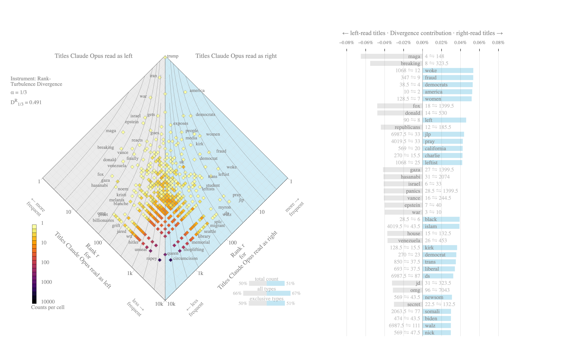
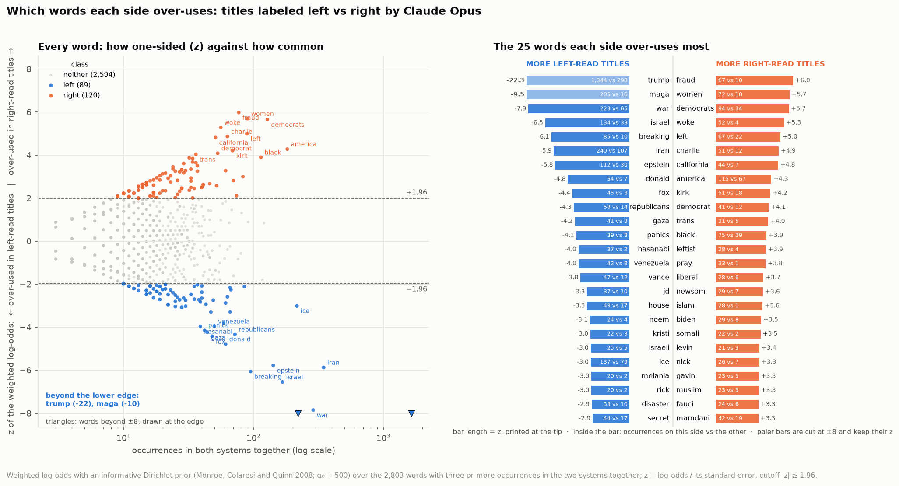
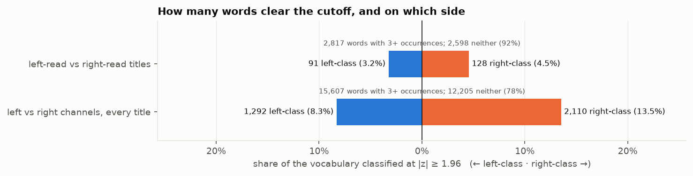
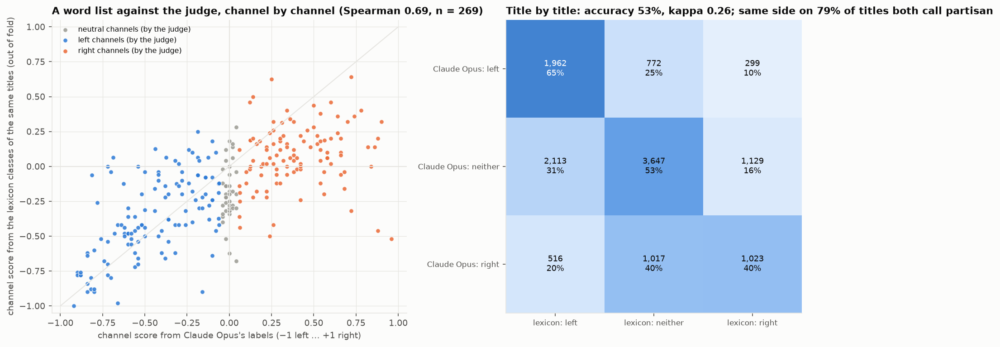
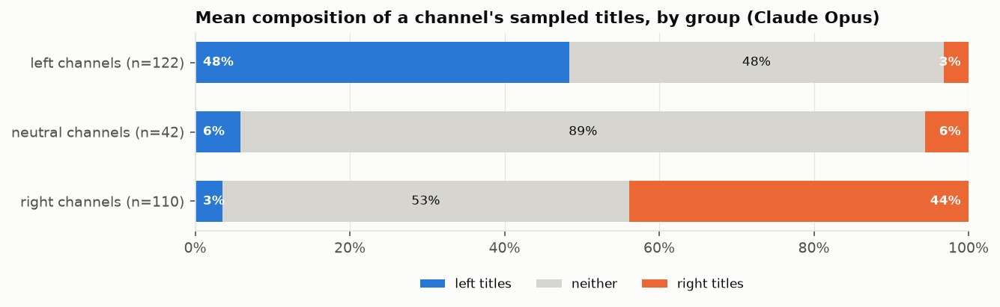
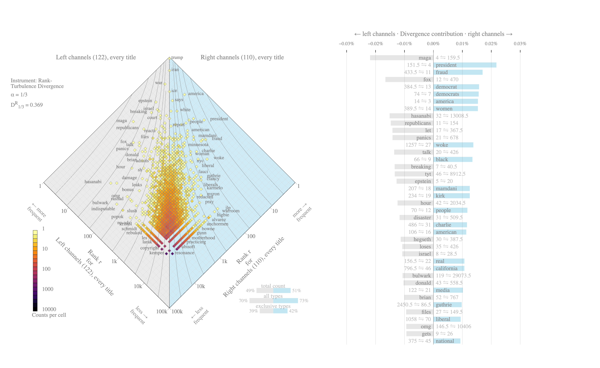
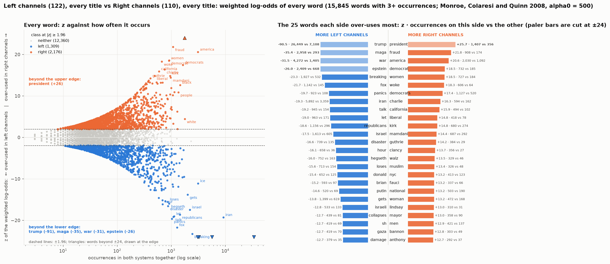

# 14. Political leaning from titles alone

**The question and the design.** Can a channel's political leaning be read off its titles? The analysis has two levels, and everything in this document belongs to one of them.

1. **Titles.** A frontier model (Claude Opus, through the Claude Code CLI) reads each sampled title on its own, never the channel name, and labels it *left*, *right* or *neither* by the viewpoint the wording signals. Level 1 analyses those labels: how many titles read each way, and which words carry each reading.
2. **Channels.** Each channel's sampled titles give it a score, (titles read right − titles read left) / titles sampled, from −1 (every title read left) to +1 (every title read right). The score sorts the channels into three groups: **left** below −0.05, **right** above +0.05, **neutral** between. Level 2 analyses the groups: how many channels land in each, how reliable the score is, and what the groups' whole output looks like when their titles are compared as bodies of text.

Everything here is *model-perceived* leaning: how a careful, reader-like model reads the wording of a title. The sample is 16 titles per channel plus a top-up to 50, spread evenly across the months, for every channel with at least 50 edited uploads (239 of 274 channels; the other 35 stay at their base draw): 12,478 titles in all. Every title was read three times by the judge: once in a batch of its channel's other titles, then twice in shuffled batches with different seeds. The first shuffled reading is the one used; the other two are kept for comparison (Level 1, "The same title read three times"; Level 2, check 3).

## The finding in one paragraph

Claude Opus reads 55 % of titles as neither, 24 % as left and 20 % as right. Sorted by their scores, 122 channels are left, 110 right and 42 neutral. The score does not depend on which titles were drawn: two random halves of a channel's titles rank the 239 channels with 50 titles the same way (Spearman 0.96), and so do the first 16 titles and the 34 drawn later (0.96). Read again by the same judge in fresh shuffled batches, 91 % of titles kept their label (kappa 0.84) and the channels came out in the same order (Spearman 0.99); an earlier reading with the titles batched by channel agreed at 88 %. The words behind the labels are stance words rather than subjects: the *right* vocabulary is fraud, women, democrats, woke, left, charlie, california, america; the *left* vocabulary is trump, maga, war, israel, breaking, iran, epstein, donald. Applied to everything the left and right channels published, the same words separate the two groups' whole output, with the year's shared subjects (Trump, Iran, the war) at the top of both.

## Level 1: titles

### What the judge labeled

Over the 12,478 labeled titles:

| label | titles | share |
|---|---|---|
| left | 3033 | 0.243 |
| neither | 6889 | 0.552 |
| right | 2556 | 0.205 |

Four titles of each label, drawn at random:

| creator | title_raw | label |
|---|---|---|
| @HasanAbi | MORE PSYCHOTIC TAKES FROM ASMONGOLD | left |
| @usefulidiots | CNN's Dana Bash EXPOSED For Hasan Piker Lie After Video Resurfaces | left |
| @MeidasTouch | Trump DOJ Suddenly APOLOGIZES to COURT and BEGS FOR MERCY!!!! | left |
| @LukeBeasley | OMG KAROLINE, THIS IS SO HUMILIATING! | left |
| https://rumble.com/c/BannonsWarRoom | BANNON: These Tech Oligarchs Are Some Of The Worst People In The History Of This Planet. They're Totally Self-Centere... | right |
| @RileyGaines | My Kids Will NOT Be Watching Ms. Rachel! | right |
| @MrTariqNasheed | Somali Man Admits His People Are Here To Undermine FBAs | right |
| @RobertGouveiaEsq | Swalwell Career CRUSHED after Panicking Democrats Call for CRIMINAL INVESTIGATION! | right |
| @thewarningwithsteveschmidt | Is Donald Trump a Socialist? \| Steve Schmidt and  ⁨@I've Had It | neither |
| @RubinReport | ‘I Play Rocky’: Dave Rubin’s Brutally Honest Reaction | neither |
| @judgingfreedom | Putin's Next Move: How the 2024 US Election Changes Everything in Ukraine | neither |
| @lonerboxlive | This Destiny vs Jay Shapiro Debate Was EXHAUSTING | neither |

Six in ten titles carry no readable stance: plain news headlines, non-political titles, or political titles whose wording does not tip either way. The labels live on the other four in ten, and the rest of this level asks what those titles have in their words.

### The same title read three times

Every title went to the judge three times, with the same prompt at temperature 0. The first reading (runs 1 and 2: the base draw, then the top-up) sent the titles in sample order, so a call held one or two channels' titles and a title was read in the company of its channel's other titles. The second reading (run 3) sent every title again in a seeded random order, so a call mixes channels and the judge sees nothing but the title. The second is the reading of record; the first is kept in `leaning_labels_channel_batched.csv.gz`.

The two readings agree on 88 % of the 12,478 titles (kappa 0.80); on the base draw 89 % (run 1 against run 3), on the top-up 88 % (run 2 against run 3). Where both call a title partisan they agree on the side 99 % of the time: 53 titles switched from left to right or back. The disagreement is almost all a title moving between partisan and neither, and it has a direction: 539 titles read as partisan in company and as neither alone, 843 the other way, so the shuffled reading calls 45 % of titles partisan against 42 % the first time.

| first reading | shuffled: left | shuffled: neither | shuffled: right |
|---|---|---|---|
| left | 2624 | 335 | 33 |
| neither | 389 | 6350 | 454 |
| right | 20 | 204 | 2069 |

Titles whose label changed, six drawn at random from the 1,435:

| channel | title | first reading | shuffled |
|---|---|---|---|
| @DestinyDGGClips | Reddit Is Truly Rotting The Minds Of Society | neither | right |
| @ClipsCandaceOwens | The Timeline of Lies \| The Charlie Kirk Case | neither | right |
| @DrSteveTurleyTV | Tucker’s Trump Meltdown Just Took a DARK TURN!!! | right | left |
| @TimDillonShow | Bonus Episode #330 - Canvassing For Katie Porter (ft Ray Kump) - The Tim Dillon Show | left | neither |
| @bennyjohnson | 🚨Trump Announces US Military Has KILLED The Leader of ISIS, The Footage is INSANE… | neither | right |
| @BadFaithPodcast | Peter Thiel's Secret Society, The Left's Favorite CONSPIRACIES (w/ Tonery Rose & Aaron Good) | neither | right |

A clean repeat then settles how much of that is the judge. Run 4 sent every title again in shuffled batches with a fresh seed: the same method run twice. The repeat, three days after the others, recorded the model the CLI's alias resolved to (claude-opus-5); the earlier runs did not record it. The two shuffled readings agree on 90.7 % of titles (kappa 0.84), so the judge on its own changes about one label in 11 between two runs, nearly all between partisan and neither (48 titles switched side; where both readings call a title partisan they agree on the side 99 % of the time), and with no drift in the balance (44.8 % of titles partisan in the reading of record, 44.4 % in the repeat). The channel-batched reading agrees with either shuffled reading at 88.5 % and 89.3 %, so a title's company cost about 2 points more, and its effect had a direction that noise does not: 42.4 % of titles read as partisan in company against 44.8 % and 44.4 % alone. All three readings agree on 84.4 % of titles; 47 titles got three different labels.

| reading of record | repeat: left | repeat: neither | repeat: right |
|---|---|---|---|
| left | 2714 | 290 | 29 |
| neither | 292 | 6360 | 237 |
| right | 19 | 293 | 2244 |

So a single title's label is about one in 11 fragile on the judge's own account, one in 9 once its batch-mates are allowed to vary too. The channel scores, which average fifty of them, are steadier (Level 2, check 3).

### The vocabulary of left-read and right-read titles

Titles Claude Opus labeled left (3,033) vs right (2,556), compared two ways: weighted log-odds (which words are over-used on one side, given how often they appear at all) and rank-turbulence divergence, read off an allotaxonograph (Dodds et al. 2023), the instrument built for exactly this comparison of two Zipfian systems.

*Allotaxonograph of the titles Claude Opus read as left (system 1, left flank) against the titles it read as right (system 2, right flank); drawn by the Computational Story Lab's own renderer (allotaxonometer-ui), rank-turbulence divergence with α = 1/3. Diamond: every word placed by its rank in each system on log axes, the rank-rank plane rotated so that words used equally sit on the vertical center line; color = how many words share a cell; the words named along the flanks are the furthest from the center line at each frequency, i.e. the most one-sided. Contour lines join equal contributions to the divergence. Right: the 40 largest contributions, each with its two ranks (system 1 ⇋ system 2), gray bars pulling left, blue bars pulling right. Below the diamond: the balance of tokens, types and exclusive types between the two systems.*

How to read it. The two vocabularies overlap less than the label shares suggest: DR1/3 = 0.492, with 50 % of the left-read words never appearing in a right-read title and 51 % the other way. The apex is shared (the year's subjects), and the divergence is carried by the flanks: on the left maga, breaking, fox, donald, republicans, gaza, hasanabi, panics; on the right fraud, democrats, america, woke, women, left, jlp, pray. The bottom edges of the diamond, where the dark cells run, are the words used once on one side and never on the other, which is where the labeled sample's smallness shows (5,545 and 5,622 word types from 3,033 and 2,556 titles).

The two instruments disagree about one word, and the disagreement is instructive: "trump" is the most over-used word on the left by log-odds (1,344 occurrences in left-read titles against 298 in right-read ones), but it sits at the apex of the diamond, because it is the top-ranked word on both sides; rank turbulence measures who *changes* the ordering, not who wins the count.

For reference, the fifteen most one-sided words each way with their z and their occurrences on each side (the full table, with the raw log-odds, the ranks and each word's contribution to the divergence, is `leaning_words.csv`):

| word | z | count_right | count_left |
|---|---|---|---|
| fraud | 6.0 | 67 | 10 |
| women | 5.7 | 72 | 18 |
| democrats | 5.7 | 94 | 34 |
| woke | 5.3 | 52 | 4 |
| left | 5.0 | 67 | 22 |
| charlie | 4.9 | 51 | 12 |
| california | 4.8 | 44 | 7 |
| america | 4.3 | 115 | 67 |
| kirk | 4.2 | 51 | 18 |
| democrat | 4.1 | 41 | 12 |
| trans | 4.0 | 31 | 5 |
| black | 3.9 | 75 | 39 |
| leftist | 3.9 | 28 | 4 |
| pray | 3.8 | 33 | 1 |
| liberal | 3.7 | 28 | 6 |

| word | z | count_left | count_right |
|---|---|---|---|
| trump | -22.3 | 1344 | 298 |
| maga | -9.5 | 205 | 16 |
| war | -7.8 | 223 | 65 |
| israel | -6.5 | 134 | 33 |
| breaking | -6.1 | 85 | 10 |
| iran | -5.9 | 240 | 107 |
| epstein | -5.8 | 112 | 30 |
| donald | -4.8 | 54 | 7 |
| fox | -4.4 | 45 | 3 |
| republicans | -4.3 | 58 | 14 |
| gaza | -4.2 | 41 | 3 |
| panics | -4.1 | 39 | 3 |
| hasanabi | -4.0 | 37 | 2 |
| venezuela | -4.0 | 42 | 8 |
| vance | -3.8 | 47 | 12 |

Read as a map of the two grammars of attack: the right's titles are about Democrats, fraud, women and trans issues, the woke, Charlie Kirk, California and Newsom, Islam and Mamdani; the left's are about Trump, MAGA, the wars (Iran, Israel, Gaza, Venezuela), Epstein, Vance and Noem, and they carry the outrage furniture (breaking, panics).

### A left / right / neither lexicon, and what a word list can and cannot do

The allotaxonograph ranks words by how far they move between the two rankings; weighted log-odds asks a different question, whether a word is over-used on one side *given how common it is overall*, and gives every word a z-score, so a cutoff turns the vocabulary into a three-way lexicon: right at z ≥ 1.96, left at z ≤ −1.96, neither otherwise (the two-sided 5 % level; words with fewer than 3 occurrences are not classified).

*Weighted log-odds (Monroe, Colaresi and Quinn 2008). Left: every word by its z (vertical) and its frequency (horizontal, log scale) for the titles Claude Opus read as left against those it read as right; blue = left-class, orange = right-class, gray = neither. Right: the 25 words each side over-uses most, mirrored about the spine, the word beside the spine and its z at the bar's end; bars beyond the axis cap are cut, drawn paler, and keep their value.*

How many words clear the cutoff, for the labeled titles and for the channel groups' whole output (level 2):

*Left-class and right-class words as shares of each vocabulary, counts printed; the rest are neither.*

Over the labeled titles the two classes are close in size (89 left-class words, 120 right-class, of 2,803 words with three or more occurrences). Over the channels' whole output, with ten times the titles, 22 % of the vocabulary clears the cutoff and the right classifies far more words (2,176 against 1,309 of 15,845): the right channels' vocabulary is the more varied one, and its stance words are spread over more distinct terms.

The two lexicons agree: of the 197 words that both the labeled titles and the groups' whole output classify as partisan, 99 % point the same way (kappa 0.12 over three classes, low only because the groups' output, with ten times the titles, classifies many more words). The words that switch sides between the two are rubio, trapped, topic and show-name words rather than stance words.

**What a word list can do on its own.** The lexicon answers a specific question: how much of the judge's reading is vocabulary? If Claude Opus decided a title's leaning from the words in it, a plain word list built from its own labels should be able to reproduce those labels. So the list is built from the classes above (every word at |z| ≥ 1.96 is a left-class or a right-class word); a title is called left when it holds more left-class than right-class words, right the other way, neither on a tie or with no classified word; and the list is built out of fold, on four fifths of the channels and applied to the remaining fifth, so no channel's titles help classify themselves.

*Left: each channel's score from the word list's labels against its score from Claude Opus's labels, colored by the judge's group. Right: the word list's class against Claude Opus's label, title by title, with the share of each row.*

Title by title (the right panel; rows are what Claude Opus said, columns what the word list said):

- The list agrees with Claude Opus on 53 % of titles (kappa 0.26), which is weak. Where both call a title partisan they agree on the side 79 % of the time, so the direction is mostly right; the failure is in deciding whether a title is partisan at all.
- The list finds left-class words in 31 % of the titles Claude Opus called neither and right-class words in another 16 %: a plain headline that mentions MAGA, Epstein or Iran carries left-coded words without a left stance, and a list cannot tell the difference.
- It also misses partisan titles: it recovers 65 % of the judge's left titles but only 40 % of its right ones, because the right's stance words (woke, fraud, women) are rarer than the left's subject words.

Channel by channel (the left panel; each dot is a channel, its score from the judge's labels across and from the list's labels up), the list does much better: Spearman 0.69, and 62 % of channels land in the same group. Fifty titles average out the noise of single titles, so the ordering of channels is largely a matter of vocabulary even though the title-level call is not.

In one line: vocabulary says roughly where a channel sits, not how any single title reads. The judge reacts to framing, to how the words are put together, and that is the evidence that the labels measure stance rather than subject.

| judge | n_titles | coverage | accuracy | kappa | partisan_titles_lexicon_neither | side_agreement_when_both_partisan | recall_left | recall_right | channel_spearman | channel_group_agreement |
|---|---|---|---|---|---|---|---|---|---|---|
| Claude Opus | 12478 | 0.62 | 0.53 | 0.26 | 0.32 | 0.79 | 0.65 | 0.40 | 0.69 | 0.62 |

## Level 2: channels

### From titles to channel groups

A channel's score is the balance of its sampled titles, and the groups follow from the score alone; no other information about the channel enters. The 274 channels sort as:

| group | n_channels | n_titles | mean_score | min_score | max_score | mean_left | mean_neither | mean_right |
|---|---|---|---|---|---|---|---|---|
| left channels | 122 | 5512 | -0.45 | -0.92 | -0.06 | 0.48 | 0.48 | 0.03 |
| neutral channels | 42 | 1953 | -0.00 | -0.04 | 0.04 | 0.06 | 0.89 | 0.06 |
| right channels | 110 | 5013 | 0.40 | 0.06 | 0.96 | 0.03 | 0.53 | 0.44 |

*Left: each channel's score against the share of its titles read as neither; the dashed lines are the group thresholds at ±0.05. Right: the distribution of scores, colored by group.*

*Every channel's sampled titles: the share labeled left (blue), neither (gray) and right (orange), sorted by score, most left-reading first; the score at the right is colored by group.*

*Mean composition of a channel's titles in each group.*

With 50 titles no channel scores ±1 (5 sit at or beyond ±0.90): even the most one-sided channels title one video in twenty as plain news. The 42 neutral channels, whose sampled titles balance or read mostly as neither: @JacksonHinkleOfficial, @Forbes, @POLITICO, @USATODAY, @NBCNews, @newyorker, @Firstpost, @TimesNowWorld, @destinyhqclips, @BrittanyVenti, @Reuters, @KimIversen, @AssociatedPress, @thejimmydoreshow, @LIVESNEAKO, @markets, @BBCNews, @CaspianReport, @ANINewsIndia, @ABCNews, @SNEAKO, @CBSNews, @FinancialTimes, @TechCrunch, @TimDillonShow, @joerogan, @axios, @bushrakhanum, @chinainsights-r2w, @wsj, @60minutes, @ClubRandomPodcast, @wethefifth, @ZeihanonGeopolitics, @CoreyGilShusterAskProject, @hutch, @Semafor, @PiersMorganUncensored, @NewsNation, @TuckerCarlson, @ClipsCandaceOwens, @thehill.

### Would a different draw of titles, or a second reading, give a different score?

A channel's score comes from 50 sampled titles out of the hundreds or thousands it published, so the first thing to check is whether the draw matters: had the sample been different, would the channel's score, and its group, be different? Two checks, both on the 239 channels with 50 labeled titles; then the second reading.

1. **Split-half.** Each channel's 50 titles are split at random into two halves of 25 and each half is scored on its own, so every channel gets two scores from disjoint sets of titles. The two sets of scores rank the channels at Spearman 0.96 (mean of 20 random splits, SD 0.004): whichever half you look at, the channels come out in nearly the same order.
2. **First draw against second draw.** The sample was drawn in two steps, 16 titles per channel first and 34 more afterwards from other months, so the two draws are independent samples of the same channel. Scored separately they rank the channels at Spearman 0.96. Going from the 16-title score to the 50-title score moves a channel by 0.07 on average; 23 of 239 channels change group, all of them with a final score between −0.10 and +0.10, and none crosses from left to right or back.
3. **Second and third readings.** The other two readings of every title (Level 1) score the channels too. The clean repeat ranks the 269 channels with at least 16 labeled titles at Spearman 0.99 and moves a channel's score by 0.04 on average; 15 channels change group, and @Unpacked crosses from right to left (+0.06 to −0.06, 16 titles); @NYTOpinion crosses from left to right (−0.19 to +0.06, 16 titles). The channel-batched reading ranks them at 0.98, moves a score by 0.06 and changes 19 groups, and @lonerboxlive crosses from left to right (−0.06 to +0.06).

*Each channel's score from its first 16 titles against its score from the 34 drawn later, colored by its final group. Points on the diagonal would mean identical scores; the labeled points are the channels that moved most.*

The channels that moved most between the two draws, for a sense of what "moved" means:

| channel | score, first 16 titles | score, next 34 titles | score, all 50 | group at 16 | group at 50 |
|---|---|---|---|---|---|
| @TheOfficerTatum | +0.88 | +0.35 | +0.52 | right | right |
| @ChadPrather1 | +0.19 | +0.62 | +0.48 | right | right |
| @TheHumanistReport | -0.50 | -0.91 | -0.78 | left | left |
| @TheDonLemonShow | -0.88 | -0.47 | -0.60 | left | left |
| @MarkDice | +0.81 | +0.41 | +0.54 | right | right |
| @TheDamageReport | -0.88 | -0.53 | -0.64 | left | left |

So the score is a property of the channel, not of the draw, and not of the reading either. With 50 titles it moves in steps of 0.02, and the only channels whose group is in doubt are the ones sitting within a few titles of a threshold.

### The groups' whole output

The groups were defined from 50 sampled titles per channel; the channels published far more. Comparing everything the 122 left channels published with everything the 110 right channels published (every unique edited upload in the creator-balanced subset, 65,432 vs 51,899 titles) asks whether the vocabulary that separated the labeled titles separates the groups' bodies of work, with no label on any individual title.

*Left channels (system 1) against right channels (system 2), every title; same instrument and α as above.*

DR1/3 = 0.369: the groups' whole outputs are closer to each other than the left-read and right-read titles are, as they should be, since most of what either group publishes is the shared news of the year. The words that separate them are the words the labels found, now over every title the channels published rather than the labeled sample: the left channels' flank is maga, fox, hasanabi, republicans, let, panics, talk, breaking, tyt, epstein; the right channels' is president, fraud, democrat, democrats, america, women, woke, black, mamdani, kirk. Show furniture shows up here too (segment names, hosts' first names, the words of a title template), which is the price of comparing channels rather than labeled titles; 42 % of the right channels' words never appear in a left channel's title, against 39 % the other way.

*Weighted log-odds of every word in the left channels' titles against the right channels', same construction as the titles figure.*

### Does perceived leaning move over the year?

The top-up titles were spread evenly across months, so the sample supports a group-level look at whether the balance of partisan titles moved between January and September (a channel contributes about five titles a month, so channel-level months are not readable):

| group | titles / month | 2026-01 | 2026-02 | 2026-03 | 2026-04 | 2026-05 | 2026-06 | 2026-07 | 2026-08 | 2026-09 |
|---|---|---|---|---|---|---|---|---|---|---|
| left channels | 612 | -0.47 | -0.49 | -0.50 | -0.45 | -0.43 | -0.49 | -0.44 | -0.44 | -0.46 |
| neutral channels | 217 | +0.00 | +0.03 | +0.01 | -0.04 | -0.02 | -0.02 | +0.01 | +0.02 | -0.04 |
| right channels | 557 | +0.42 | +0.43 | +0.43 | +0.40 | +0.40 | +0.41 | +0.41 | +0.46 | +0.37 |

It did not move: left channels ranges from -0.50 to -0.43; neutral channels from -0.04 to +0.03; right channels from +0.37 to +0.46; the share of all sampled titles read as partisan stays between 42 % and 47 % every month. Whatever the news did over the year, a channel's title stance is a fixed property of the channel, which is also what document 6 found for style.

## Method

1. **Sample.** Every creator gets a base draw of 16 unique edited-upload titles (seed 20260914; creators with fewer than 16 uploads topped up from live VODs). Creators with at least 50 unique uploads are then topped up to 50 with further uploads spread evenly across months (round-robin over the months, random within month, its own random stream), so the extra titles never depend on which month a creator posted most in: 12,478 titles, 239 creators at 50, 35 at their base.
2. **Labeling.** One prompt (in `leaning.py` and the methods appendix): label the viewpoint the title's own wording signals as left, right or neither, with three anchoring examples; temperature 0; the judge sees the title text only, numbered 1 to 20, never the channel name; every response cached. Claude Opus runs through the Claude Code CLI in print mode on a Claude Max subscription, in four runs: the base draw and the top-up with the titles in sample order (a call held one or two channels' titles), then every title again in a seeded random order (a call mixes channels), which is the labeling of record, and once more with a fresh seed, the repeat kept for the reliability check.

   | run | what | titles | batches | calls | minutes | reported cost | date (UTC) |
   |---|---|---|---|---|---|---|---|
   | 1 | the base draw | 4,352 | sample order (one or two channels a call) | 218 | 52 | $18.86 | 2026-09-15 14:13 |
   | 2 | the top-up | 8,126 | sample order (one or two channels a call) | 407 | 81 | $36.41 | 2026-09-15 16:32 |
   | 3 | every title again | 12,478 | shuffled (a call mixes channels) | 624 | 135 | $56.54 | 2026-09-15 23:53 |
   | 4 | every title again, a fresh shuffle | 12,478 | shuffled (a call mixes channels) | 624 | 133 | $75.01 | 2026-09-18 13:44 |

   1,873 calls and 401 minutes in all; the CLI reported an equivalent API cost of $186.83, not charged.
3. **Scores and groups.** Per channel: shares of left / right / neither and score = (right − left) / n over its sampled titles; left below −0.05, right above +0.05, neutral between.
4. **Reliability.** Split-half: channels with at least 32 labeled titles, two random halves, Spearman between the two channel rankings, 20 splits. Base vs top-up: the base-draw score against the top-up score per channel (disjoint titles), and the group at 16 titles against the group at 50. Readings: the labels of record against the first reading (channel-batched) and against the repeat (the same method, a fresh shuffle seed, `--repeat`), title by title (exact agreement, Cohen's kappa, the confusion table) and channel by channel (channels with at least 16 labeled titles: Spearman between the two scores, mean absolute change, groups changed), and the three readings together (`leaning_repeat.json`).
5. **Words.** Weighted log-odds with an informative Dirichlet prior (alpha0 = 500; Monroe, Colaresi and Quinn 2008) and rank-turbulence divergence (alpha = 1/3; Dodds et al. 2023) on the vocabulary tokens of document 11, for the left-read vs right-read titles and for the left vs right channels' whole output. The divergence follows the allotaxonometer's conventions exactly (tied ranks over the union of both vocabularies, absent words at the last tied rank, the sum normalized so that two vocabularies with no word in common give D = 1); `textstats.rank_turbulence_divergence` reproduces the library's per-word contributions to machine precision.
6. **Log-odds lexicon.** Every word with 3+ occurrences in the two systems together, right against left; right at z ≥ 1.96, left at z ≤ −1.96, neither otherwise; the same for the channel groups, and Cohen's kappa of the classes between the two over their shared words. The lexicon check: the labeled titles split into five folds by channel, the lexicon built on four folds and applied to the fifth (a title is left when it holds more left-class than right-class words, right the other way, neither on a tie or no classified word), then agreement with the judge's labels title by title and channel by channel (`leaning_lexicon.py`).
7. **Allotaxonographs.** Drawn by allotaxonometer-ui 0.2.2 (the Computational Story Lab's Svelte renderer, the same code behind the lab's web app and py-allotax) through Node and Puppeteer (`pipeline_titles/allotax.py`, `pipeline_titles/allotax_js/`), from the same word counts as the tables (`allotax_summary.csv`, top contributions in `allotax_contributions.csv`).
8. **Months.** The labels by channel group x month (`leaning_by_group_month.csv`): titles, creators, partisan share, left and right shares, score.

## Limitations

- **This is perceived leaning.** A model reads a title the way an attentive reader would, and readers disagree. No human panel was used, by choice: one reader cannot supply political ground truth, and a balanced panel is a study of its own. A blind 200-title sheet exists (`leaning_human_sheet.csv`, still unfilled) for anyone who wants a single-reader reliability check.
- **One judge.** Every number here is one model's reading, and a model reads a title the way it was trained to; a second frontier model of a different family would be the natural robustness check (`--models <alias>` takes any Claude Code model alias). Its repeatability is measured: a clean repeat of the method agrees with the labels of record on 91 % of titles (kappa 0.84) and ranks the channels at 0.99, so about one title label in 11 is the judge's own noise, which the channel scores absorb.
- **The groups are a cut on a continuous score.** ±0.05 is one title in twenty; a channel at −0.06 and one at −0.04 differ by one label. The score is the measurement, the group is a convenience for comparing bodies of text, and the neutral group mixes channels whose titles balance with channels whose titles are mostly plain news.
- **Ten words carry little stance.** Six in ten titles are neither, so a channel's score rests on a minority of its titles. At 50 titles the score moves in steps of 0.02 and the split-half reliability is 0.96; the 35 channels with fewer than 50 uploads still sit at 16 titles or fewer and move in steps of 1/16.
- **Target and stance blur at the margin.** Hostile-to-Trump wording reads left even when it is a wire headline or an anti-war right channel's; the neutral group and the left tail hold both kinds. Prompt v2 (which also asks for the target) exists in `leaning.py` and was not run at scale.
- **Month-level reading is group-level only.** Five titles per channel-month is not a monthly channel score; the base 16 were drawn without regard to month, so the monthly table leans on the top-up.

Files: `leaning_labels.csv.gz`, `leaning_labels_channel_batched.csv.gz`, `leaning_runs.json`, `leaning_two_readings.json`, `leaning_two_readings_channels.csv`, `leaning_two_readings_changed_titles.csv`, `leaning_labels_repeat.csv.gz`, `leaning_repeat.json`, `leaning_repeat_channels.csv`, `leaning_repeat_changed_titles.csv`, `leaning_label_shares.json`, `leaning_summary.json`, `leaning_by_creator.csv`, `leaning_groups.csv`, `leaning_words.csv`, `leaning_split_half.csv`, `leaning_stability.csv`, `leaning_stability_channels.csv`, `leaning_by_group_month.csv`, `leaning_logodds.csv`, `leaning_logodds_summary.csv`, `leaning_logodds_agreement.csv`, `leaning_lexicon_validation.csv`, `leaning_lexicon_channels.csv`, `leaning_lexicon_titles.csv`, `allotax_summary.csv`, `allotax_contributions.csv`.
